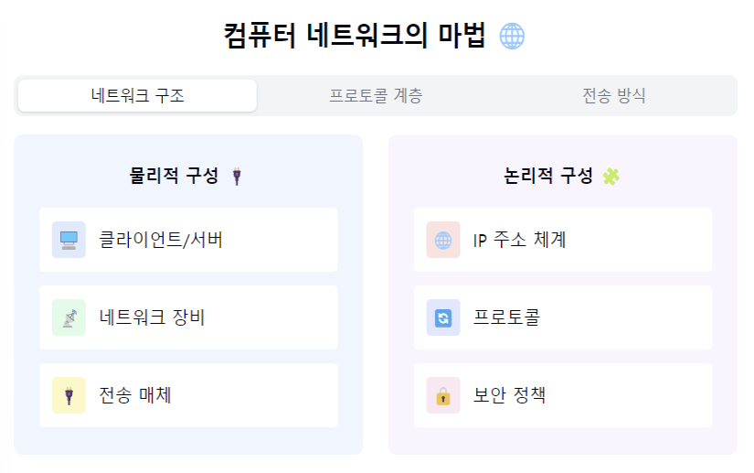
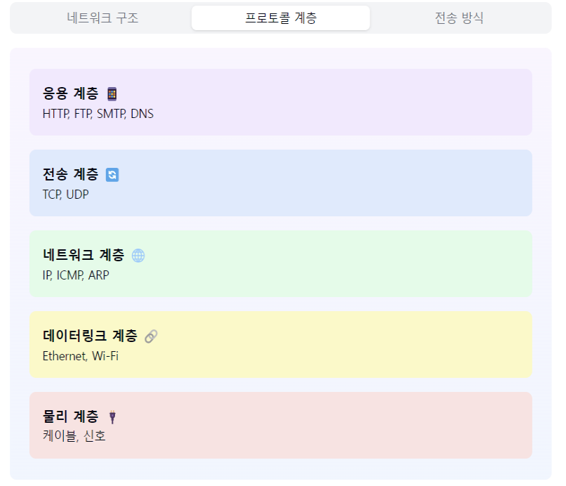
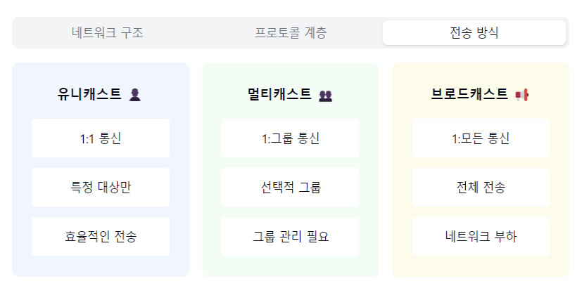

"컴퓨터 네트워크의 세계로 떠나볼까요? 🌐"

1. 컴퓨터 네트워크란?
- 리소스를 공유하는 컴퓨터들의 모임
- 데이터 통신이 가능한 시스템
- 프로토콜 기반의 통신 인프라
- 현대 인터넷의 근간! 🏗️

2. 구성 요소:
   하드웨어 장비 🔧
- 라우터: 경로 설정
- 스위치: 데이터 전송
- 허브: 신호 증폭
- NIC: 네트워크 연결

소프트웨어 💻
- 프로토콜: 통신 규칙
- 드라이버: 장치 제어
- 앱: 서비스 제공

3. 네트워크 유형:
   거리 기준:
- LAN: 근거리 통신망
- MAN: 도시권 통신망
- WAN: 광역 통신망

연결 형태:
- 버스형: 하나의 통신 선로
- 성형: 중앙 집중형
- 링형: 순환 구조
- 메시형: 그물망 구조

4. 프로토콜 계층:
   상위 계층:
- 응용: HTTP, FTP, SMTP
- 전송: TCP, UDP
- 네트워크: IP, ICMP

하위 계층:
- 데이터링크: Ethernet
- 물리: 케이블, 신호

5. 주요 특징:
   장점 👍
- 자원 공유 가능
- 높은 신뢰성
- 유연한 확장성
- 중앙 관리 용이

단점 👎
- 보안 위험
- 초기 비용
- 관리 필요
- 복잡성

6. 데이터 전송 방식:
   유니캐스트:
- 1:1 통신
- 특정 대상만

브로드캐스트:
- 1:모든
- 전체 전송

멀티캐스트:
- 1:그룹
- 선택적 전송

7. 실무 활용 예시! 💡
- 기업 인트라넷
- 인터넷 서비스
- 클라우드 시스템
- IoT 네트워크
- 게임 서버

요약: 컴퓨터 네트워크는 디지털 세상의 '혈관 시스템'이에요! 🩺
데이터라는 피를 온몸(전세계)에 전달하고,
모든 디지털 기기들이 서로 소통할 수 있게 해주는
놀라운 기술이랍니다!

핵심 포인트! 🎯
1. "통신 프로토콜이 기본!"
2. "계층별 역할 분담 중요"
3. "보안과 효율성 균형"
4. "확장성 고려한 설계"
5. "지속적인 모니터링 필수"

