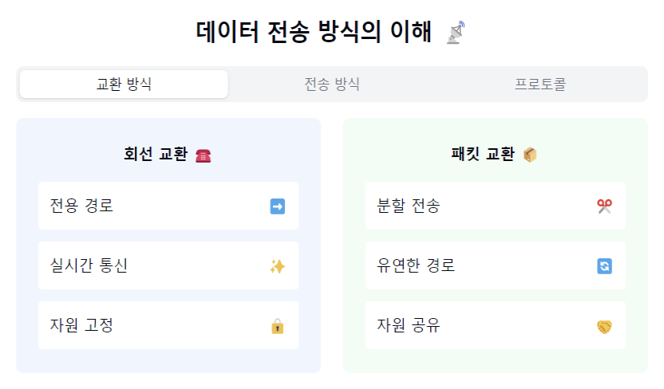
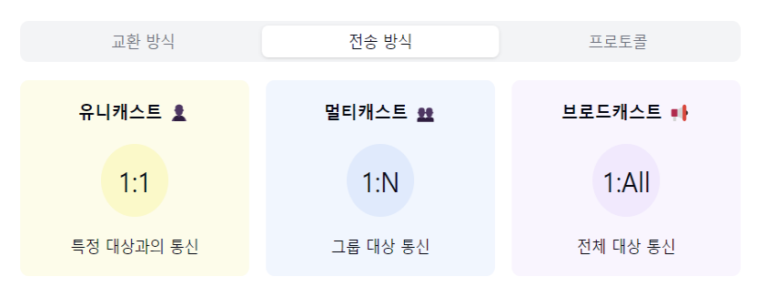
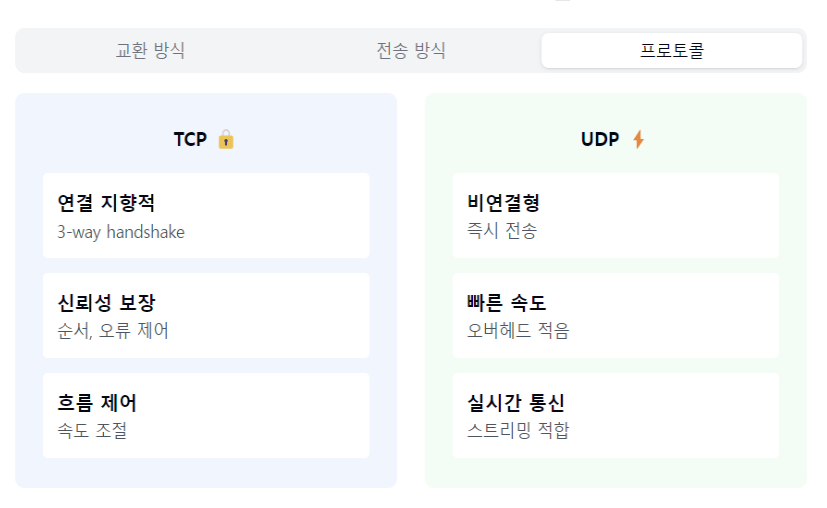

"데이터 전송 방식의 세계로 들어가볼까요? 📡"

1. 연결 방식에 따른 분류:
   "데이터를 전송할 때 통신 경로를 어떻게 설정하고 관리할까요?"

회선 교환 방식:
- 전용 통신 경로 할당
- 실시간 통신에 적합
- 전화망이 대표적

패킷 교환 방식:
- 데이터를 패킷으로 분할
- 각각 독립적 전송
- 현대 인터넷의 기반

2. 전송 방식:
   "데이터를 누구에게, 어떻게 보낼까요?"

유니캐스트:
- 1:1 통신
- 특정 대상만 수신
- 효율적인 자원 사용

브로드캐스트:
- 1:모든
- 네트워크 전체 전송
- ARP, DHCP에서 사용

멀티캐스트:
- 1:그룹
- 특정 그룹에만 전송
- 스트리밍 서비스에 활용

3. 데이터 전달 특성:
   "전송의 안정성과 속도, 어떤 걸 선택할까요?"

신뢰성 기반:
- TCP 프로토콜 사용
- 순서 보장
- 오류 제어
- 흐름/혼잡 제어

비신뢰성 기반:
- UDP 프로토콜 사용
- 빠른 전송 속도
- 실시간 스트리밍에 적합

4. 전송 모드:
   "데이터의 이동 방향을 어떻게 결정할까요?"

심플렉스:
- 단방향 통신
- TV 방송

하프 듀플렉스:
- 양방향 교대 통신
- 무전기

풀 듀플렉스:
- 동시 양방향 통신
- 전화

5. 주요 고려사항! 🎯
   "전송 품질을 어떻게 보장할까요?"

QoS(서비스 품질):
- 지연시간
- 처리량
- 패킷 손실률
- 대역폭

6. 실제 활용 예시:
   "실생활에서는 어떻게 사용되고 있나요?"

- 웹 브라우징 (HTTP)
- 파일 전송 (FTP)
- 이메일 (SMTP)
- 스트리밍 (RTSP)
- VoIP (음성통화)

자주 나오는 꼬리 질문! 🤔

Q1: "TCP와 UDP의 차이점을 설명해주세요."
A1: TCP는 연결지향적이고 신뢰성 있는 전송을 보장하지만,
UDP는 비연결형으로 빠른 전송이 가능해요.
TCP는 웹, 이메일에, UDP는 실시간 스트리밍에 주로 사용됩니다!

Q2: "패킷 교환 방식이 회선 교환 방식보다 좋은 이유는?"
A2: 네트워크 자원을 효율적으로 사용할 수 있고,
한 회선에 장애가 발생해도 우회 경로로 전송이 가능하며,
다중 접속이 용이하답니다!

핵심 포인트! 💡
1. "목적에 맞는 전송 방식 선택"
2. "신뢰성과 속도의 트레이드오프"
3. "네트워크 자원의 효율적 활용"
4. "QoS 고려한 설계"
5. "보안과 안정성 고려"

