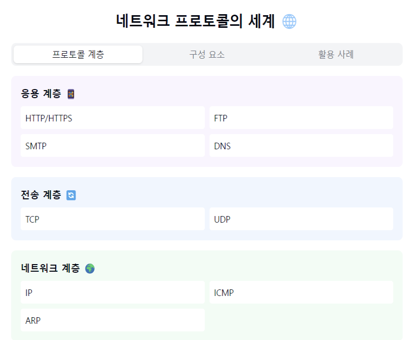
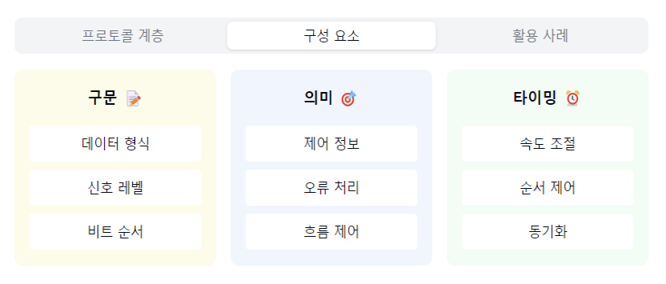
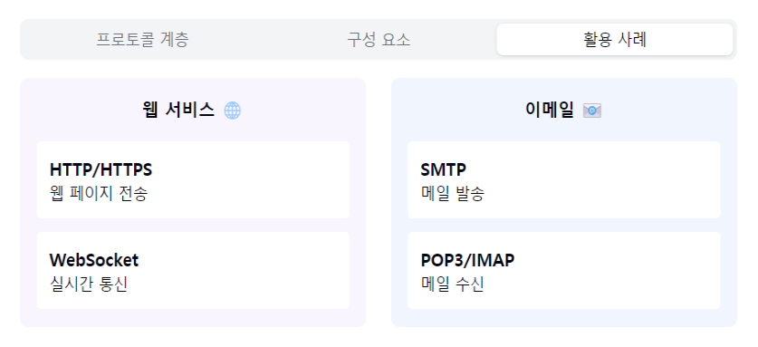

"네트워크 프로토콜의 세계로 들어가볼까요? 📞"

1. 프로토콜이란?
   "통신을 위한 약속과 규칙을 어떻게 정의할까요?"
- 데이터 교환을 위한 규칙의 집합
- 통신 주체 간의 약속
- 표준화된 통신 방식
- 효율적인 통신의 기본! 🤝

2. 주요 프로토콜:
   "각 계층별로 어떤 프로토콜이 있을까요?"

응용 계층:
- HTTP: 웹 통신
- FTP: 파일 전송
- SMTP: 이메일 전송
- DNS: 도메인 해석

전송 계층:
- TCP: 신뢰성 있는 전송
- UDP: 빠른 전송

네트워크 계층:
- IP: 주소 지정, 라우팅
- ICMP: 오류 제어
- ARP: 주소 변환

3. 프로토콜의 구성요소:
   "프로토콜은 어떤 요소들로 이루어질까요?"

구문(Syntax):
- 데이터 형식
- 신호 레벨
- 비트 순서

의미(Semantics):
- 제어 정보
- 오류 처리
- 흐름 제어

타이밍(Timing):
- 속도 조절
- 순서 제어
- 동기화

4. 프로토콜의 특징:
   "좋은 프로토콜의 조건은 무엇일까요?"

장점 👍
- 표준화된 통신
- 호환성 보장
- 확장성 제공
- 유지보수 용이

고려사항 ⚠️
- 오버헤드
- 복잡성
- 버전 관리
- 보안 이슈

5. 실제 활용 사례:
   "우리 주변에서는 어떻게 사용될까요?"

웹 서비스:
- HTTP/HTTPS
- WebSocket

이메일:
- SMTP
- POP3/IMAP

파일 공유:
- FTP
- P2P

6. 프로토콜 설계 원칙:
   "어떻게 하면 좋은 프로토콜을 만들 수 있을까요?"
- 단순성
- 효율성
- 확장성
- 신뢰성
- 보안성

자주 나오는 꼬리 질문! 🤔

Q1: "TCP/IP 프로토콜 스택의 각 계층을 설명해주세요."
A1: 응용 계층은 사용자 서비스를, 전송 계층은 종단간 전송을,
네트워크 계층은 라우팅을, 데이터링크/물리 계층은
실제 데이터 전송을 담당해요!

Q2: "HTTP와 HTTPS의 차이점은 무엇인가요?"
A2: HTTPS는 HTTP에 보안 계층(SSL/TLS)을 추가한 것으로,
데이터 암호화를 통해 안전한 통신을 제공합니다.
중요한 정보 전송 시 반드시 필요해요!

핵심 포인트! 💡
1. "계층별 적절한 프로토콜 선택"
2. "표준화된 통신 규약 준수"
3. "효율성과 보안성 균형"
4. "확장 가능한 설계"
5. "호환성 고려 필수"

