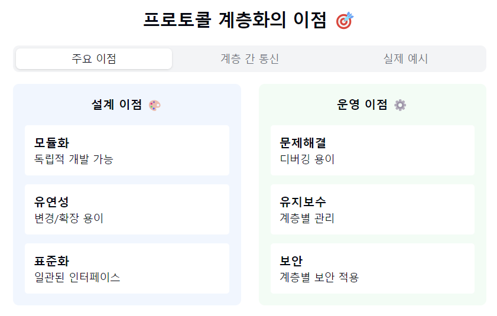
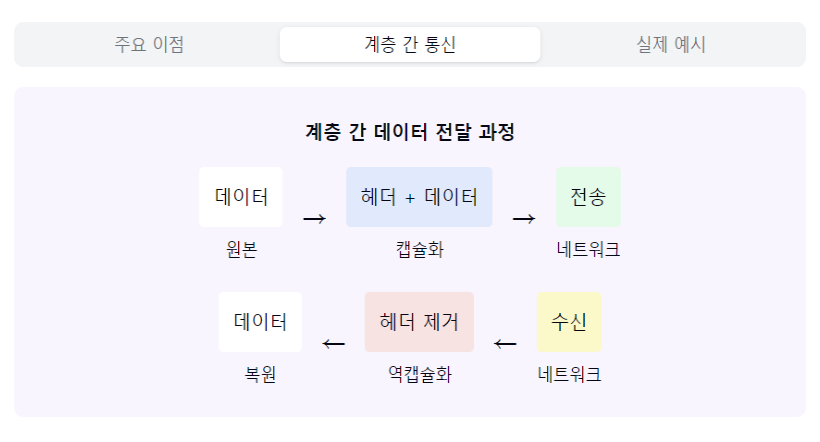
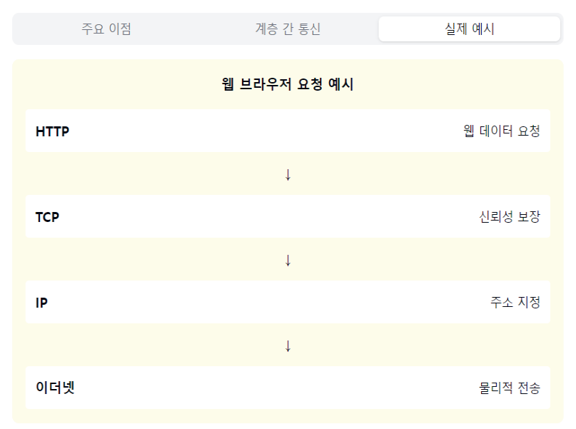

"프로토콜 계층화의 비밀을 파헤쳐볼까요? 🎯"

1. 계층화의 주요 목적:
   "복잡한 통신 과정을 왜 나누는 걸까요?"
- 복잡한 통신 과정 단순화
- 계층별 독립적 개발 가능
- 유지보수 용이성 확보
- 표준화된 인터페이스 제공

2. 계층화의 장점:
   모듈화 🧩
- 각 계층 독립적 동작
- 내부 구현 변경 자유로움
- 다른 계층 영향 최소화

유연성 🌊
- 기능 수정/개선 용이
- 새로운 프로토콜 도입 쉬움
- 호환성 유지 가능

문제해결 🔍
- 오류 발견 쉬움
- 계층별 디버깅 가능
- 책임 소재 명확

3. 계층 간 통신:
   "계층들은 어떻게 협력할까요?"

인터페이스:
- 상/하위 계층과 통신
- 표준화된 방식
- 캡슐화/역캡슐화

데이터 흐름:
- 상위→하위: 캡슐화
- 하위→상위: 역캡슐화
- 계층별 헤더 추가/제거

4. 실제 활용 예시:
   "우리가 웹사이트 접속할 때는?"

브라우저 요청:
- HTTP (응용 계층)
- TCP (전송 계층)
- IP (네트워크 계층)
- 이더넷 (데이터링크 계층)

각 계층 역할:
- 웹 데이터 처리
- 신뢰성 보장
- 주소 지정
- 물리적 전송

5. 계층화의 효과:
   개발 측면 👨‍💻
- 분업 용이
- 재사용성 증가
- 표준화 용이

관리 측면 📊
- 트러블슈팅 용이
- 성능 최적화
- 보안 강화

자주 나오는 꼬리 질문! 🤔

Q1: "계층화의 단점은 없나요?"
A1: 계층 간 통신 오버헤드가 발생하고,
각 계층마다 헤더가 추가되어 데이터 크기가 커지며,
때로는 불필요한 계층을 거쳐야 하는 단점이 있어요.

Q2: "왜 OSI는 7계층, TCP/IP는 4계층인가요?"
A2: OSI는 이론적 모델로 더 세분화되어 있고,
TCP/IP는 실제 구현을 위해 효율성을 고려해
비슷한 기능을 통합했답니다!

핵심 포인트! 💡
1. "모듈화로 복잡성 감소"
2. "유연한 확장과 수정"
3. "표준화된 인터페이스"
4. "효율적인 문제 해결"
5. "체계적인 개발 가능"

