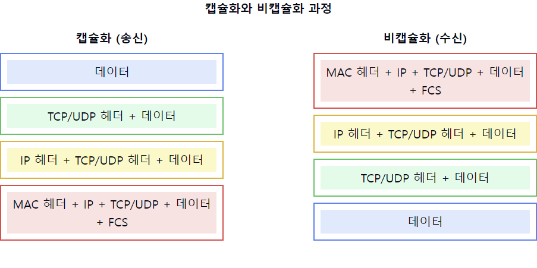

# 컴퓨터 네트워크에서 캡슐화와 비캡슐화에 대해서 설명해주세요.

1. 캡슐화와 비캡슐화의 정의:
    - 캡슐화: 상위 계층의 데이터에 각 계층의 헤더를 추가하는 과정
    - 비캡슐화: 각 계층에서 해당 계층의 헤더를 제거하여 원래 데이터를 복원하는 과정

2. OSI 7계층에서의 캡슐화:
    - 응용 계층: 데이터
    - 표현 계층: 데이터 + 표현 계층 헤더
    - 세션 계층: 데이터 + 세션 계층 헤더
    - 전송 계층: 세그먼트/데이터그램 (TCP/UDP 헤더 추가)
    - 네트워크 계층: 패킷 (IP 헤더 추가)
    - 데이터링크 계층: 프레임 (MAC 헤더, 트레일러 추가)
    - 물리 계층: 비트 스트림으로 변환

3. 캡슐화의 목적:
    - 데이터의 안전한 전송 보장
    - 계층별 독립성 유지
    - 네트워크 통신의 신뢰성 향상
    - 에러 제어 및 흐름 제어 지원

4. 비캡슐화의 특징:
    - 수신 측에서 역순으로 진행
    - 각 계층에서 해당 헤더 정보를 확인하고 제거
    - 최종적으로 원본 데이터 복원
    - 데이터 무결성 검증 수행

5. 각 계층별 주요 헤더 정보:
    - TCP/UDP 헤더: 포트 번호, 시퀀스 번호, 체크섬
    - IP 헤더: 출발지/목적지 IP 주소, TTL, 프로토콜
    - MAC 헤더: 출발지/목적지 MAC 주소
    - 트레일러: 에러 검출 코드

6. 캡슐화/비캡슐화의 장점:
    - 데이터 전송의 신뢰성 보장
    - 계층별 독립적인 프로토콜 동작
    - 네트워크 문제 해결 용이
    - 보안성 강화

7. 관련 주요 개념:
    - PDU(Protocol Data Unit): 각 계층의 데이터 단위
    - MTU(Maximum Transmission Unit): 최대 전송 단위
    - 프래그먼테이션: 큰 데이터의 분할 전송

요약: 캡슐화와 비캡슐화는 컴퓨터 네트워크에서 데이터 전송의 기본 메커니즘입니다. 캡슐화는 데이터에 각 계층의 헤더를 추가하는 과정이고, 비캡슐화는 이를 역순으로 제거하여 원본 데이터를 복원하는 과정입니다. 이러한 과정을 통해 신뢰성 있는 데이터 전송과 효율적인 네트워크 통신이 가능해집니다.

이러한 개념을 같이 설명하면 좋은 내용:

1. 프로토콜별 특징:
   "각 계층의 프로토콜은 특정 기능을 담당합니다. 예를 들어, TCP는 신뢰성 있는 전송을, IP는 라우팅을, MAC은 물리적 주소 지정을 담당합니다."

2. 헤더 정보의 중요성:
   "각 계층의 헤더는 해당 계층의 주요 제어 정보를 포함합니다. TCP 헤더의 시퀀스 번호는 데이터의 순서를 보장하고, IP 헤더의 TTL은 무한 루프를 방지합니다."

3. MTU와 프래그먼테이션:
   "네트워크의 MTU보다 큰 데이터는 프래그먼테이션되어 전송되며, 수신측에서 재조립됩니다. 이 과정은 IP 계층에서 처리됩니다."

4. 오버헤드 고려사항:
   "각 계층의 헤더 추가는 전송해야 할 총 데이터량을 증가시킵니다. 효율적인 네트워크 사용을 위해서는 이러한 오버헤드를 고려해야 합니다."

5. 보안 측면:
   "캡슐화는 데이터 보안에도 중요한 역할을 합니다. IPSec과 같은 보안 프로토콜은 특정 계층에서 암호화를 제공합니다."

6. 오류 검출과 처리:
   "각 계층은 자체적인 오류 검출 메커니즘을 가지고 있습니다. 예를 들어, 이더넷의 FCS나 TCP의 체크섬은 데이터 무결성을 검증합니다."

7. 네트워크 문제 해결:
   "계층별 캡슐화/비캡슐화 구조는 네트워크 문제의 원인을 파악하고 해결하는 데 도움이 됩니다. 각 계층별로 독립적인 문제 해결이 가능합니다."

이러한 개념들을 함께 설명하면, 캡슐화와 비캡슐화에 대한 깊이 있는 이해를 보여줄 수 있으며, 네트워크 프로토콜의 동작 원리, 각 계층의 역할, 그리고 실제 네트워크 운영에서의 중요성에 대한 종합적인 지식을 드러낼 수 있습니다. 또한, 네트워크 보안, 성능 최적화, 문제 해결 등 실무적인 측면에서의 인사이트도 제공할 수 있습니다.