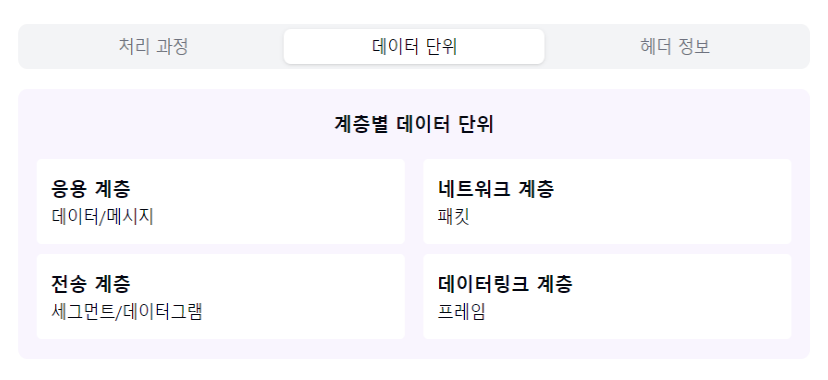

"데이터의 여행, 캡슐화와 비캡슐화에 대해 알아볼까요? 📦"

1. 캡슐화/비캡슐화란?
   "데이터가 어떻게 포장되고 풀리는 걸까요?"

캡슐화 (Encapsulation):
- 상위계층 → 하위계층으로 전달
- 각 계층별 헤더 추가
- 데이터 포장 과정

비캡슐화 (Decapsulation):
- 하위계층 → 상위계층으로 전달
- 각 계층별 헤더 제거
- 데이터 포장 해체 과정

2. 계층별 데이터 단위:
   "각 계층마다 데이터를 어떻게 부르나요?"

응용 계층:
- 데이터/메시지
- 순수 데이터

전송 계층:
- 세그먼트(TCP)
- 데이터그램(UDP)

네트워크 계층:
- 패킷
- IP 헤더 추가

데이터링크 계층:
- 프레임
- MAC 주소 추가

3. 캡슐화 과정:
   "데이터가 어떻게 포장되나요?"

1단계: 응용 계층
- 순수 데이터 생성
- HTTP 등 헤더 추가

2단계: 전송 계층
- TCP/UDP 헤더 추가
- 포트 번호 정보

3단계: 네트워크 계층
- IP 헤더 추가
- 주소 정보 포함

4단계: 데이터링크 계층
- MAC 헤더/트레일러 추가
- 물리 주소 정보

4. 비캡슐화 과정:
   "포장된 데이터를 어떻게 풀까요?"

1단계: 데이터링크 계층
- MAC 주소 확인
- 프레임 → 패킷

2단계: 네트워크 계층
- IP 주소 확인
- 패킷 → 세그먼트

3단계: 전송 계층
- 포트 번호 확인
- 세그먼트 → 데이터

4단계: 응용 계층
- 최종 데이터 처리
- 응용프로그램에 전달

5. 주요 포함 정보:
   "각 계층의 헤더에는 뭐가 들어있나요?"

TCP/UDP 헤더:
- 포트 번호
- 시퀀스 번호
- 체크섬

IP 헤더:
- 출발/도착 IP
- TTL
- 프로토콜 정보

MAC 헤더:
- 출발/도착 MAC
- 프레임 타입

자주 나오는 꼬리 질문! 🤔

Q1: "캡슐화가 필요한 이유는 무엇인가요?"
A1: 각 계층의 독립성을 보장하고, 계층별로 필요한
제어 정보를 추가할 수 있으며, 데이터의 안전한
전송을 보장하기 위해서입니다!

Q2: "오버헤드는 발생하지 않나요?"
A2: 네, 각 계층마다 헤더가 추가되어 전체 데이터 크기가
증가하는 오버헤드가 발생합니다. 하지만 이는 안전하고
체계적인 통신을 위한 필수적인 과정이에요!

핵심 포인트! 💡
1. "계층별 역할 분담"
2. "체계적인 데이터 관리"
3. "효율적인 오류 처리"
4. "유연한 프로토콜 적용"
5. "안전한 데이터 전송"

