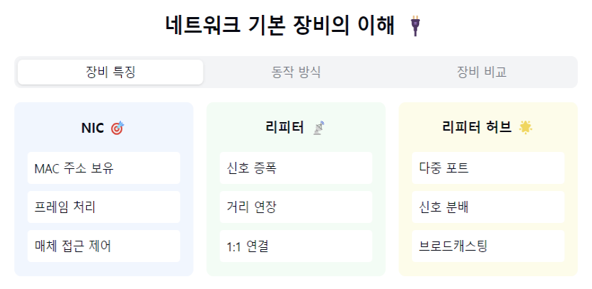
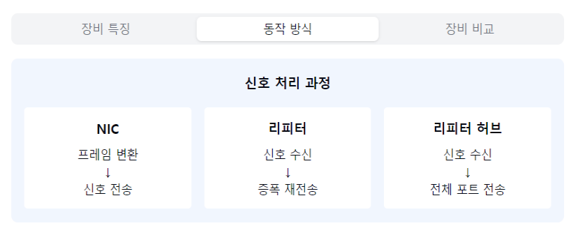
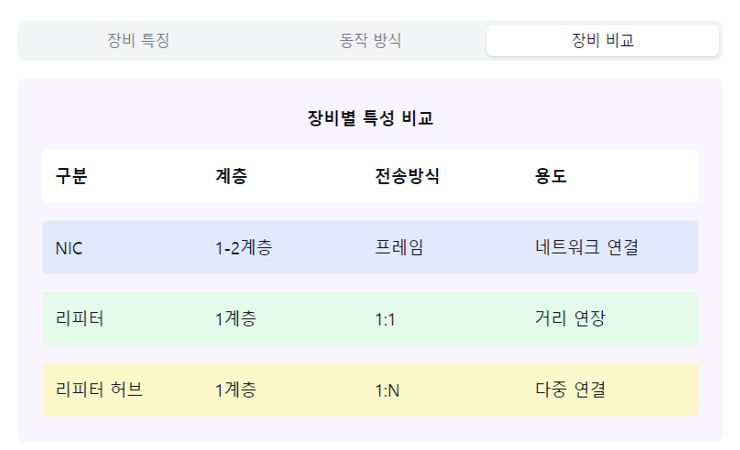

"네트워크 기본 장비의 세계로 들어가볼까요? 🔌"

1. NIC (Network Interface Card):
   "컴퓨터와 네트워크를 연결하는 핵심 장치란?"

기본 기능:
- 네트워크 연결 인터페이스
- MAC 주소 보유
- 데이터 송수신
- 물리/데이터링크 계층 담당

주요 특징:
- 고유 MAC 주소
- 프레임 생성/해석
- 매체 접근 제어
- 충돌 감지

2. 리피터 (Repeater):
   "신호가 약해지면 어떻게 할까요?"

기본 기능:
- 신호 증폭
- 전송 거리 연장
- 물리 계층 장비

작동 원리:
- 디지털 신호 재생성
- 신호 왜곡 보정
- 단방향/양방향 전송
- 1:1 연결

3. 리피터 허브 (Repeater Hub):
   "여러 장치를 어떻게 연결할까요?"

기본 기능:
- 다중 포트 제공
- 신호 증폭/재생성
- 스타형 토폴로지
- 브로드캐스팅

특징:
- 더미 허브라고도 불림
- 모든 포트로 전송
- 충돌 도메인 공유
- 대역폭 공유

4. 주요 차이점:
   "각 장비의 특징을 비교해볼까요?"

처리 방식:
- NIC: 프레임 처리
- 리피터: 신호 증폭
- 허브: 신호 분배

네트워크 계층:
- NIC: 물리/데이터링크
- 리피터: 물리
- 허브: 물리

5. 실제 활용:
   "어디서 어떻게 사용될까요?"

NIC:
- 모든 네트워크 장비
- 서버/PC/노트북

리피터:
- 장거리 케이블
- 신호 감쇄 구간

리피터 허브:
- 소규모 네트워크
- 비용 중시 환경

자주 나오는 꼬리 질문! 🤔

Q1: "리피터 허브와 스위칭 허브의 차이점은?"
A1: 리피터 허브는 모든 포트로 데이터를 전송하지만,
스위칭 허브는 MAC 주소를 학습하여 특정 포트로만
전송하므로 더 효율적이에요!

Q2: "현대에도 리피터 허브를 사용하나요?"
A2: 대부분 스위치로 대체되었지만, 매우 단순한
네트워크나 비용이 중요한 환경에서는
여전히 사용될 수 있답니다!

핵심 포인트! 💡
1. "계층별 역할 구분"
2. "신호 품질 유지"
3. "네트워크 확장성"
4. "비용 대비 효율"
5. "적절한 장비 선택"

