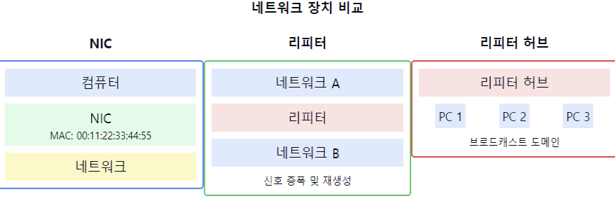

# NIC, 리피터, 리피터 허브에 대해서 설명해주세요.

1. NIC (Network Interface Card)의 정의와 특징:
    - 컴퓨터를 네트워크에 연결하는 하드웨어 장치
    - MAC 주소를 가지고 있어 네트워크 상에서 식별 가능
    - 데이터의 물리적 전송을 담당
    - OSI 모델의 물리 계층과 데이터 링크 계층에서 동작

2. NIC의 주요 기능:
    - 데이터의 직렬화/역직렬화
    - 신호의 부호화/복호화
    - MAC 주소 기반 프레임 필터링
    - 데이터 버퍼링
    - 에러 체크 및 처리

3. 리피터(Repeater)의 정의와 특징:
    - 신호를 증폭하여 전송 거리를 연장하는 장치
    - OSI 모델의 물리 계층에서 동작
    - 단순히 신호를 재생성하여 전달
    - 1:1 연결만 가능

4. 리피터의 주요 기능:
    - 신호 증폭
    - 신호 왜곡 보정
    - 전송 거리 연장
    - 신호 타이밍 복원

5. 리피터 허브의 정의와 특징:
    - 여러 개의 리피터를 하나로 통합한 장치
    - 한 포트로 들어온 신호를 모든 포트로 브로드캐스팅
    - OSI 모델의 물리 계층에서 동작
    - 다중 포트 연결 지원

6. 리피터 허브의 주요 기능:
    - 다중 포트 연결 제공
    - 신호 증폭 및 재생성
    - 네트워크 확장
    - 중앙 집중식 연결 지원

7. 각 장치의 한계점:
    - NIC: 속도 제한, 하드웨어 호환성 문제
    - 리피터: 신호 지연, 노이즈 누적
    - 리피터 허브: 충돌 도메인 확장, 대역폭 공유

요약: NIC는 컴퓨터와 네트워크를 연결하는 인터페이스 카드이며, 리피터는 신호를 증폭하여 전송 거리를 연장하는 장치입니다. 리피터 허브는 여러 리피터 기능을 통합하여 다중 포트 연결을 제공하는 장치입니다. 이들은 모두 물리 계층에서 동작하며, 네트워크의 기본적인 연결성을 제공하는 중요한 역할을 합니다.

이러한 개념을 같이 설명하면 좋은 내용:

1. 신호 처리 방식:
   "NIC는 디지털 데이터를 전기 신호로 변환하고, 리피터는 이 신호를 증폭합니다. 리피터 허브는 이러한 기능을 다중 포트에서 수행합니다."

2. 네트워크 토폴로지:
   "리피터 허브는 스타형 토폴로지를 구현할 수 있으며, 이는 중앙 집중식 관리를 가능하게 합니다. 하지만 단일 충돌 도메인을 형성한다는 단점이 있습니다."

3. 성능 고려사항:
   "리피터와 리피터 허브는 신호를 단순히 증폭하므로, 네트워크 트래픽이 증가할수록 충돌 가능성이 높아집니다. 이는 네트워크 성능 저하의 원인이 될 수 있습니다."

4. 현대 네트워크에서의 역할:
   "현대 네트워크에서는 리피터와 리피터 허브 대신 스위치를 주로 사용합니다. 스위치는 MAC 주소 학습과 포트별 충돌 도메인 분리를 통해 더 나은 성능을 제공합니다."

5. 장애 관리:
   "리피터 허브는 한 포트의 문제가 전체 네트워크에 영향을 미칠 수 있습니다. 이는 네트워크 관리와 문제 해결을 어렵게 만드는 요인입니다."

6. 설치 및 구성:
   "NIC는 드라이버 설치와 구성이 필요하지만, 리피터와 리피터 허브는 플러그 앤 플레이 방식으로 동작합니다. 이는 설치와 유지보수를 단순화합니다."

7. 확장성:
   "리피터와 리피터 허브는 5-4-3 규칙(최대 5개 세그먼트, 4개 리피터, 3개 호스트 세그먼트)을 따라야 하며, 이는 네트워크 확장성을 제한합니다."
