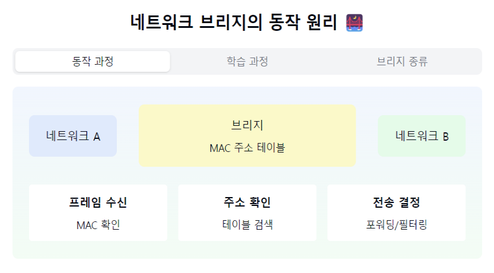
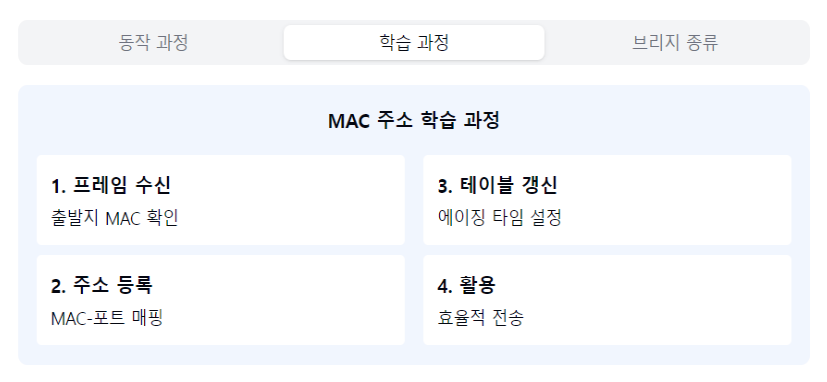
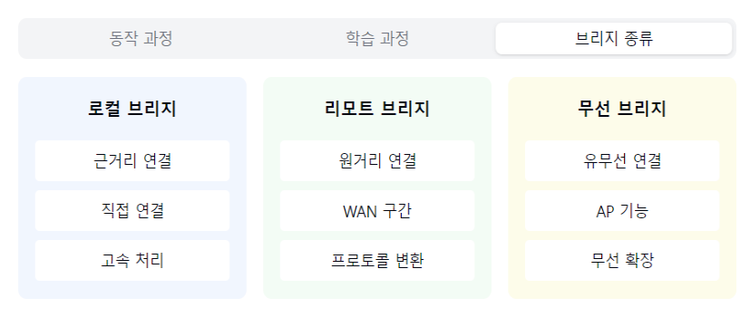

"네트워크 브리지의 지능적인 세계로 들어가볼까요? 🌉"

1. 브리지란?
   "단순 신호 증폭을 넘어선 지능적 장비란?"
- 데이터링크 계층(L2) 장비
- MAC 주소 기반 필터링
- 네트워크 분할 가능
- 트래픽 관리의 시작! 🚦

2. 주요 기능:
   MAC 주소 학습:
- 출발지 MAC 주소 저장
- 포트 정보 기록
- 주소 테이블 관리

트래픽 필터링:
- 불필요한 트래픽 차단
- 목적지 MAC 확인
- 충돌 도메인 분리

포워딩/필터링:
- 필요한 포트로만 전송
- 브로드캐스트 처리
- 루프 방지

3. 브리지의 종류:
   로컬 브리지:
- 근거리 네트워크 연결
- 직접 연결 방식
- 고속 처리 가능

리모트 브리지:
- 원거리 네트워크 연결
- WAN 구간 연결
- 프로토콜 변환 기능

무선 브리지:
- 유/무선 네트워크 연결
- AP 기능 포함
- 무선 구간 확장

4. 학습 과정:
   "어떻게 MAC 주소를 배울까요?"

초기 상태:
- 주소 테이블 비어있음
- 모든 포트로 전송

학습 단계:
- 프레임 수신 시 확인
- 출발지 MAC 주소 저장
- 포트 정보와 매핑

활용 단계:
- 목적지 확인
- 특정 포트로만 전송
- 효율적 통신

5. 장단점:
   장점 👍
- 트래픽 감소
- 네트워크 분할
- 성능 향상
- 보안성 증가

단점 👎
- 처리 지연
- 비용 증가
- 관리 필요
- 확장성 제한

자주 나오는 꼬리 질문! 🤔

Q1: "브리지와 스위치의 차이점은?"
A1: 기본 원리는 같지만, 스위치가 더 발전된 형태예요.
스위치는 하드웨어 기반으로 더 빠르고,
더 많은 포트와 기능을 제공합니다!

Q2: "브리지의 루프 문제는 어떻게 해결하나요?"
A2: STP(Spanning Tree Protocol)를 사용해서
물리적 루프가 있어도 논리적 루프가 생기지 않도록
중복 경로를 차단합니다!

핵심 포인트! 💡
1. "MAC 주소 기반 동작"
2. "트래픽 효율성 증가"
3. "네트워크 세그먼트 분리"
4. "자동 학습 능력"
5. "충돌 도메인 분할"

> https://chn1000.tistory.com/56