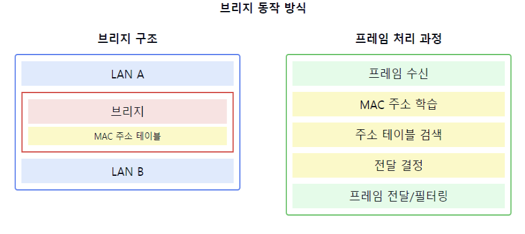

# 브리지에 대해서 설명해주세요.

1. 브리지의 정의:
    - 두 개의 LAN을 연결하는 네트워크 장치
    - OSI 모델의 데이터링크 계층(2계층)에서 동작
    - MAC 주소를 기반으로 프레임을 필터링하고 전달

2. 브리지의 주요 기능:
    - 프레임 필터링
    - MAC 주소 학습
    - 충돌 도메인 분리
    - 브로드캐스트 도메인 확장
    - 서로 다른 네트워크 연결

3. 브리지의 동작 방식:
   a) MAC 주소 학습:
    - 출발지 MAC 주소와 포트 정보 저장
    - 주소 테이블(브리지 테이블) 자동 갱신

   b) 프레임 전달:
    - 목적지 MAC 주소 확인
    - 주소 테이블 참조
    - 적절한 포트로 프레임 전달

4. 브리지의 종류:
    - 로컬 브리지: 직접 연결된 LAN 간 연결
    - 원격 브리지: 원거리 LAN 연결
    - 투명 브리지: 자동으로 MAC 주소 학습
    - 소스 라우팅 브리지: 출발지에서 경로 결정

5. 브리지의 장점:
    - 네트워크 세그먼트 분리
    - 트래픽 필터링으로 성능 향상
    - 서로 다른 물리적 매체 연결 가능
    - 간단한 구성과 관리

6. 브리지의 단점:
    - 브로드캐스트 스톰 가능성
    - 확장성 제한
    - 루프 발생 가능성
    - 처리 지연 발생

7. 브리지 관련 주요 개념:
    - 스패닝 트리 프로토콜(STP)
    - 포워딩(Forwarding)
    - 필터링(Filtering)
    - 플러딩(Flooding)

요약: 브리지는 데이터링크 계층에서 동작하며, MAC 주소를 기반으로 네트워크 세그먼트를 연결하는 장치입니다. MAC 주소 학습과 프레임 필터링을 통해 네트워크 효율성을 높이며, 충돌 도메인을 분리하여 네트워크 성능을 향상시킵니다. 하지만 브로드캐스트 스톰이나 루프 발생 같은 잠재적인 문제점도 있습니다.

이러한 개념을 같이 설명하면 좋은 내용:

1. 브리지와 스위치의 관계:
   "브리지는 현대의 스위치의 전신이라고 할 수 있습니다. 스위치는 브리지의 기본 개념을 확장하여 더 많은 포트와 더 빠른 처리 속도를 제공합니다."

2. MAC 주소 학습 프로세스:
   "브리지는 프레임의 출발지 MAC 주소를 보고 자동으로 학습합니다. 이를 통해 효율적인 프레임 전달이 가능해지며, 불필요한 트래픽을 줄일 수 있습니다."

3. 스패닝 트리 프로토콜:
   "브리지 네트워크에서 루프를 방지하기 위해 STP를 사용합니다. STP는 중복 경로를 자동으로 차단하여 브로드캐스트 스톰을 예방합니다."

4. 네트워크 세그멘테이션:
   "브리지를 사용한 네트워크 세그멘테이션은 충돌 도메인을 분리하여 네트워크 성능을 향상시킵니다. 각 세그먼트는 독립적인 대역폭을 가질 수 있습니다."

5. 성능 고려사항:
   "브리지는 모든 프레임을 소프트웨어적으로 처리하므로 일정 수준의 지연이 발생할 수 있습니다. 이는 고속 네트워크에서 병목현상의 원인이 될 수 있습니다."

6. 브리지의 확장성:
   "브리지 네트워크를 확장할 때는 네트워크 지름과 홉 수를 고려해야 합니다. 너무 많은 브리지를 연결하면 지연이 증가하고 관리가 복잡해질 수 있습니다."

7. 문제 해결 및 디버깅:
   "브리지는 프레임 필터링 결정을 로깅할 수 있어 네트워크 문제 해결에 도움이 됩니다. MAC 주소 테이블을 통해 네트워크 토폴로지를 파악할 수도 있습니다."
