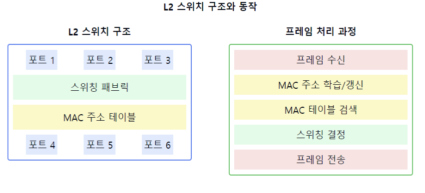

# L2 스위치에 대해서 설명해주세요.

1. L2 스위치의 정의:
    - 데이터링크 계층(2계층)에서 동작하는 네트워크 장비
    - MAC 주소 기반으로 프레임을 전달하는 고성능 브리지
    - 하드웨어 기반의 패킷 스위칭 수행

2. L2 스위치의 주요 기능:
    - MAC 주소 학습 및 관리
    - 프레임 필터링과 포워딩
    - 충돌 도메인 분리
    - VLAN 지원
    - 루프 방지(STP/RSTP)

3. L2 스위치의 동작 방식:
   a) MAC 주소 학습:
    - 출발지 MAC 주소를 MAC 주소 테이블에 저장
    - 포트 번호와 MAC 주소 매핑
    - 에이징 타임 적용

   b) 프레임 전달:
    - MAC 주소 테이블 검색
    - 유니캐스트/멀티캐스트/브로드캐스트 처리
    - Cut-through 또는 Store-and-forward 방식

4. L2 스위치의 장점:
    - 고속 패킷 처리
    - 포트별 충돌 도메인 분리
    - 높은 포트 밀도
    - 자동 MAC 주소 학습
    - 네트워크 세그멘테이션

5. L2 스위치의 주요 특징:
    - 하드웨어 기반 스위칭
    - 와이어 스피드(Wire-speed) 성능
    - 전이중 통신(Full-duplex) 지원
    - QoS 기능 지원
    - 포트 미러링 기능

6. L2 스위치의 고급 기능:
    - 포트 보안
    - 스패닝 트리 프로토콜
    - 링크 어그리게이션
    - VLAN 트렁킹
    - MAC 기반 접근 제어

7. L2 스위치 관련 중요 개념:
    - CAM 테이블 관리
    - 백프레셔(Backpressure)
    - HOL(Head of Line) 블로킹
    - 스위치 패브릭

요약: L2 스위치는 데이터링크 계층에서 동작하며, MAC 주소 기반으로 프레임을 고속으로 전달하는 네트워크 장비입니다. 하드웨어 기반의 스위칭으로 고성능을 제공하며, VLAN, QoS 등 다양한 기능을 지원합니다. 네트워크의 성능과 보안을 향상시키는 핵심 장비로서 현대 네트워크의 기반이 되고 있습니다.

이러한 개념을 같이 설명하면 좋은 내용:

1. 스위칭 방식:
   "L2 스위치는 Store-and-forward나 Cut-through 방식으로 프레임을 처리할 수 있습니다. Store-and-forward는 에러 체크가 가능하고, Cut-through는 더 빠른 전송이 가능합니다."

2. VLAN 동작 원리:
   "VLAN을 통해 물리적인 스위치를 여러 개의 논리적 네트워크로 분할할 수 있습니다. 이는 브로드캐스트 도메인을 분리하고 보안을 강화하는 데 도움이 됩니다."

3. STP/RSTP:
   "스패닝 트리 프로토콜은 네트워크의 루프를 방지하며, RSTP는 더 빠른 컨버전스 타임을 제공합니다."

4. QoS 기능:
   "L2 스위치는 프레임의 우선순위를 인식하고 처리할 수 있어, VoIP나 비디오 스트리밍과 같은 시간에 민감한 트래픽을 효과적으로 처리할 수 있습니다."

5. MAC 주소 테이블 관리:
   "CAM 테이블의 에이징 타임과 크기는 스위치 성능에 영향을 미칩니다. 적절한 설정이 중요합니다."

6. 보안 기능:
   "포트 보안, MAC 주소 필터링, 스톰 컨트롤 등의 기능을 통해 네트워크 보안을 강화할 수 있습니다."

7. 성능 모니터링:
   "포트 미러링, SNMP 모니터링 등을 통해 네트워크 트래픽을 분석하고 문제를 진단할 수 있습니다."
