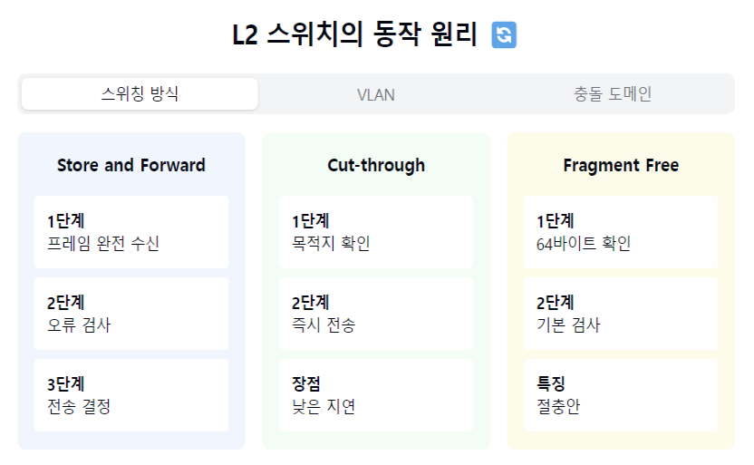

"L2 스위치의 똑똑한 세계로 들어가볼까요? 🔄"

1. L2 스위치란?
   "브리지의 진화된 형태란?"
- 데이터링크 계층(L2) 장비
- MAC 주소 기반 스위칭
- 하드웨어 기반 처리
- 고성능 네트워크의 핵심! 🚀

2. 주요 기능:
   MAC 주소 학습:
- MAC 주소 테이블 관리
- 자동 학습/갱신
- 에이징 타임 적용

스위칭:
- Cut-through
- Store and Forward
- Fragment Free

충돌 도메인 분리:
- 포트별 독립 도메인
- CSMA/CD 불필요
- 전이중 통신 지원

3. 스위칭 방식:
   "프레임을 어떻게 처리할까요?"

Store and Forward:
- 완전 수신 후 전송
- 오류 검사 가능
- 안정적이나 지연 큼

Cut-through:
- 목적지만 확인하고 전송
- 빠른 전송 속도
- 오류 체크 없음

Fragment Free:
- 64바이트 확인 후 전송
- 절충안
- 일부 오류 체크

4. VLAN 지원:
   "논리적 네트워크 분할이란?"
- 물리적 구성 독립
- 브로드캐스트 도메인 분리
- 보안성 강화
- 유연한 네트워크 구성

5. 특징 및 장점:
   장점 👍
- 높은 포트 밀도
- 빠른 처리 속도
- 낮은 지연시간
- 쉬운 관리

고려사항 ⚠️
- STP 필요
- 브로드캐스트 스톰
- 초기 비용
- 설정 복잡성

자주 나오는 꼬리 질문! 🤔

Q1: "브리지와 L2 스위치의 차이점은?"
A1: 동작 원리는 비슷하지만, L2 스위치는 하드웨어 기반으로
더 빠른 처리가 가능하고, 더 많은 포트와 기능을 제공해요.
현대 네트워크에서는 대부분 스위치를 사용합니다!

Q2: "VLAN은 왜 필요한가요?"
A2: 물리적 구성 변경 없이 논리적 네트워크 분할이 가능하여
보안성 강화, 트래픽 관리, 비용 절감 등의
장점을 제공할 수 있어요!

핵심 포인트! 💡
1. "하드웨어 기반 고성능"
2. "지능적 트래픽 관리"
3. "VLAN 기능 지원"
4. "포트별 충돌 도메인"
5. "유연한 네트워크 구성"

```markdown
L2 스위치의 기본 개념:
이것은 마치 우체국 집배원과 비슷합니다. 편지(데이터)가 오면, 주소(MAC 주소)를 보고 정확한 목적지로 전달하는 역할을 합니다. 브리지보다 더 발전된 형태로, 여러 장치들을 더 빠르고 효율적으로 연결해줍니다. 하드웨어로 처리하기 때문에 매우 빠르게 작동합니다.
MAC 주소 학습 과정:
컴퓨터마다 고유한 주소(MAC 주소)가 있는데, L2 스위치는 이를 자동으로 기억합니다. 마치 새로운 이웃이 이사왔을 때 자동으로 주소를 기억하는 것처럼요. 일정 시간이 지나면 사용하지 않는 주소는 자동으로 잊어버립니다(에이징 타임).
스위칭 방식의 세 가지 유형:


Store and Forward: 택배기사가 물건을 꼼꼼히 확인하고 배달하는 것처럼, 데이터를 완전히 받아서 확인한 후 전송합니다.
Cut-through: 급한 택배처럼 목적지만 확인하고 바로 전송합니다. 빠르지만 오류 확인을 못합니다.
Fragment Free: 위 두 방식의 중간으로, 기본적인 확인만 하고 전송합니다.


VLAN(Virtual LAN):
하나의 건물을 여러 개의 독립된 사무실로 나누는 것과 비슷합니다. 물리적으로는 하나의 네트워크지만, 논리적으로 여러 개의 별도 네트워크로 나눌 수 있습니다. 이렇게 하면:


보안이 강화됨 (다른 부서의 네트워크에 접근할 수 없음)
네트워크 관리가 쉬워짐
불필요한 트래픽이 줄어듦


장점과 주의사항:
장점:


많은 기기를 연결할 수 있음
매우 빠른 속도
관리하기 쉬움

주의할 점:

루프(순환) 방지를 위한 STP 설정 필요
브로드캐스트 스톰(네트워크 과부하) 가능성
처음 설치할 때 비용이 있음
고급 기능을 사용하려면 설정이 복잡할 수 있음
```





