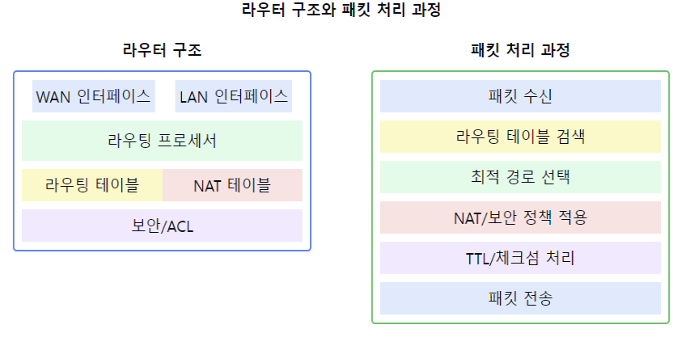

# 라우터에 대해서 설명해주세요.

1. 라우터의 정의:
    - 네트워크 계층(3계층)에서 동작하는 네트워크 장비
    - 서로 다른 네트워크를 연결하고 패킷을 전달하는 장치
    - IP 주소를 기반으로 최적의 경로를 결정하는 장비

2. 라우터의 주요 기능:
    - 패킷 라우팅: 최적 경로 선택 및 패킷 전달
    - 라우팅 테이블 관리
    - 브로드캐스트 도메인 분리
    - NAT(Network Address Translation)
    - 패킷 필터링 및 방화벽

3. 라우터의 동작 방식:
   a) 라우팅 테이블 구성:
    - 정적 라우팅: 수동으로 경로 설정
    - 동적 라우팅: 라우팅 프로토콜을 통한 자동 경로 학습

   b) 패킷 처리:
    - 목적지 IP 주소 확인
    - 라우팅 테이블 검색
    - 최적 경로 선택
    - TTL 감소 및 체크섬 재계산

4. 라우팅 프로토콜:
    - 내부 라우팅 프로토콜(IGP)
        - RIP, OSPF, EIGRP
    - 외부 라우팅 프로토콜(EGP)
        - BGP

5. 라우터의 주요 특징:
    - 네트워크 세그먼테이션
    - 로드 밸런싱
    - QoS(Quality of Service) 지원
    - ACL(Access Control List) 기능
    - VPN 지원

6. 라우터의 장점:
    - 효율적인 네트워크 구성
    - 보안성 강화
    - 트래픽 제어 가능
    - 네트워크 확장성 제공

7. 라우터의 고급 기능:
    - DHCP 서버 기능
    - DNS 캐싱
    - 트래픽 모니터링
    - 대역폭 관리
    - 이중화 구성

요약: 라우터는 IP 주소를 기반으로 서로 다른 네트워크를 연결하고 최적의 경로를 통해 패킷을 전달하는 3계층 네트워크 장비입니다. 다양한 라우팅 프로토콜을 지원하며, NAT, 방화벽 등의 부가 기능도 제공합니다. 현대 네트워크에서 핵심적인 역할을 수행하며, 네트워크의 효율성, 보안성, 확장성을 높이는데 기여합니다.

이러한 개념을 같이 설명하면 좋은 내용:

1. 라우팅 알고리즘:
   "라우터는 다익스트라 알고리즘과 같은 최단 경로 알고리즘을 사용하여 최적의 경로를 결정합니다. 각 라우팅 프로토콜은 서로 다른 메트릭을 사용하여 경로를 평가합니다."

2. NAT와 보안:
   "NAT는 내부 네트워크의 IP 주소를 숨기고 보안을 강화하는 동시에 IPv4 주소 부족 문제를 해결하는 데 도움을 줍니다."

3. 라우터의 성능 요소:
   "라우터의 성능은 패킷 처리 능력(PPS), 메모리 크기, 인터페이스 속도 등 여러 요소에 의해 결정됩니다."

4. 고가용성 구성:
   "VRRP나 HSRP와 같은 프로토콜을 사용하여 라우터의 이중화 구성이 가능하며, 이는 네트워크의 안정성을 높입니다."

5. QoS 구현:
   "라우터는 트래픽을 분류하고 우선순위를 부여하여 중요한 애플리케이션의 성능을 보장할 수 있습니다."

6. 라우팅 정책:
   "정책 기반 라우팅(PBR)을 통해 특정 트래픽에 대해 라우팅 테이블과 다른 경로를 선택할 수 있습니다."

7. 문제 해결:
   "라우터는 로깅, SNMP, NetFlow 등 다양한 모니터링 도구를 제공하여 네트워크 문제 해결을 지원합니다."
