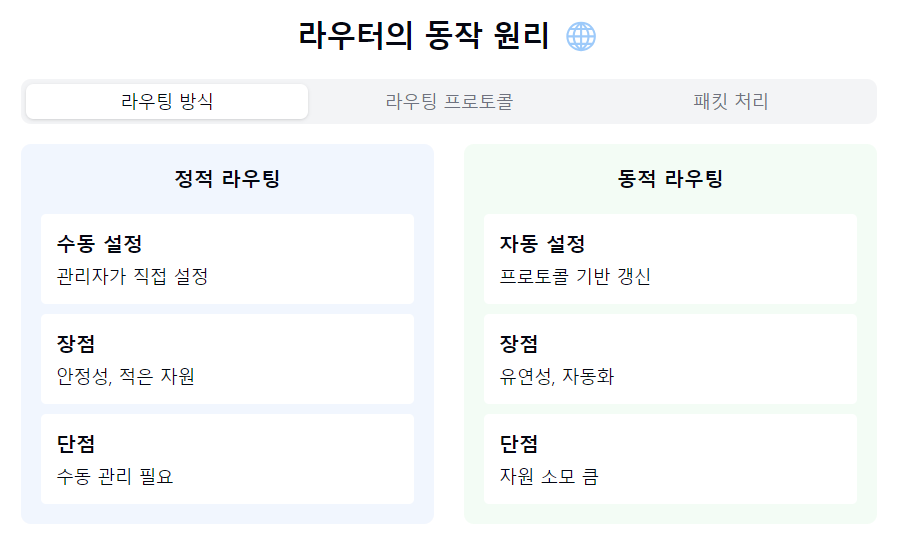
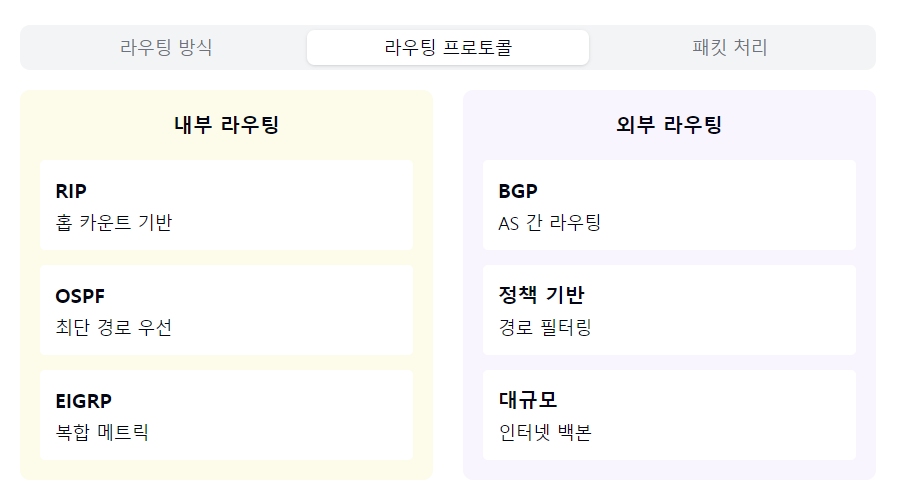

"라우터의 지능적인 세계로 들어가볼까요? 🌐"

1. 라우터란?
   "네트워크의 길잡이란?"
- 네트워크 계층(L3) 장비
- IP 주소 기반 라우팅
- 서로 다른 네트워크 연결
- 네트워크의 핵심 장비! 🚦

2. 주요 기능:
   라우팅:
- 최적 경로 결정
- 라우팅 테이블 관리
- 프로토콜 변환

패킷 포워딩:
- IP 헤더 분석
- TTL 감소
- 체크섬 재계산

브로드캐스트 제어:
- 도메인 분리
- 트래픽 제어
- 네트워크 분할

3. 라우팅 방식:
   정적 라우팅:
- 수동 경로 설정
- 안정적 운영
- 적은 자원 사용
- 소규모 네트워크

동적 라우팅:
- 자동 경로 설정
- RIP, OSPF, BGP
- 유연한 경로 변경
- 대규모 네트워크

4. 주요 프로토콜:
   내부 라우팅:
- RIP: 거리 벡터
- OSPF: 링크 상태
- EIGRP: 하이브리드

외부 라우팅:
- BGP: 자율 시스템
- EGP: 레거시 프로토콜

5. 라우터 구성요소:
   하드웨어:
- CPU/메모리
- 인터페이스
- 전원 공급 장치

소프트웨어:
- 라우팅 테이블
- 프로토콜 스택
- 보안 기능

자주 나오는 꼬리 질문! 🤔

Q1: "라우터와 L3 스위치의 차이점은?"
A1: 기본적인 라우팅 기능은 동일하지만, L3 스위치는
하드웨어 기반으로 더 빠른 스위칭이 가능하며
일반적으로 LAN 환경에 최적화되어 있어요!

Q2: "라우팅 프로토콜은 어떻게 선택하나요?"
A2: 네트워크 규모, 토폴로지, 대역폭, 관리 용이성 등을
종합적으로 고려해야 해요. 소규모는 정적 라우팅,
대규모는 OSPF/BGP가 일반적이죠!

핵심 포인트! 💡
1. "지능적인 경로 선택"
2. "네트워크 간 연결"
3. "프로토콜 변환 가능"
4. "보안 기능 제공"
5. "트래픽 제어 가능"


```markdown
라우터의 기본 개념:
이것은 마치 교통 경찰과 같습니다. 여러 도로(네트워크)가 만나는 교차로에서 차(데이터)를 목적지까지 가장 좋은 길로 안내합니다. IP 주소를 보고 서로 다른 네트워크 간에 데이터를 전달하는 핵심 장비입니다.
주요 기능:


라우팅: 내비게이션처럼 데이터가 갈 수 있는 최적의 경로를 찾아줍니다. 이 경로들은 라우팅 테이블에 저장되어 관리됩니다.
패킷 포워딩: 데이터 패킷을 받으면 목적지 확인, 수명(TTL) 확인, 오류 검사 등을 수행하고 다음 경로로 전달합니다.
브로드캐스트 제어: 불필요한 네트워크 트래픽이 전체 네트워크로 퍼지는 것을 막아줍니다.


라우팅 방식:


정적 라우팅: 관리자가 직접 경로를 설정하는 방식입니다. 마치 고정된 버스 노선과 같습니다. 작은 네트워크에서 안정적이지만, 경로 변경이 필요할 때마다 수동으로 해야 합니다.
동적 라우팅: 라우터가 자동으로 최적 경로를 찾는 방식입니다. 실시간 내비게이션처럼 상황에 따라 더 좋은 경로로 바꿀 수 있습니다.


주요 프로토콜:
내부 라우팅(한 조직 내부):


RIP: 가장 단순한 프로토콜로, 목적지까지의 거리만 고려합니다
OSPF: 더 복잡하지만 네트워크 상태를 전체적으로 파악해 더 좋은 경로를 찾습니다
EIGRP: 시스코의 프로토콜로, 위 두 방식의 장점을 합친 것입니다

외부 라우팅(조직 간):

BGP: 인터넷 서비스 제공자(ISP) 간의 라우팅에 사용되는 표준 프로토콜
EGP: 예전에 사용하던 프로토콜


라우터 구성요소:
하드웨어:


CPU와 메모리: 라우터의 두뇌 역할
인터페이스: 네트워크와 연결되는 포트들
전원 공급 장치: 안정적인 전원 공급

소프트웨어:

라우팅 테이블: 경로 정보 저장소
프로토콜 스택: 다양한 네트워크 프로토콜 처리
보안 기능: 방화벽 등 보안 관련 기능
```








