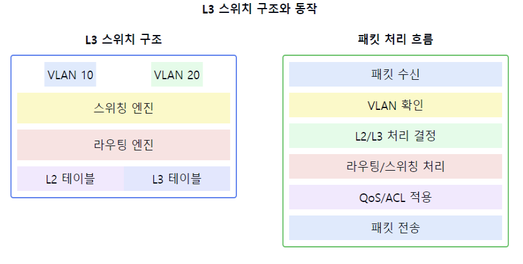

# L3 스위치에 대해서 설명해주세요.

1. L3 스위치의 정의:
    - 2계층 스위칭과 3계층 라우팅 기능을 결합한 네트워크 장비
    - IP 주소 기반의 패킷 forwarding 가능
    - 하드웨어 기반의 라우팅 수행

2. L3 스위치의 주요 기능:
    - Wire-speed 라우팅
    - VLAN 간 라우팅
    - 정적/동적 라우팅 프로토콜 지원
    - ACL(Access Control List) 기능
    - QoS(Quality of Service)
    - 멀티캐스트 라우팅

3. L3 스위치 vs 라우터:
   장점:
    - 더 빠른 패킷 처리 속도
    - 하드웨어 기반 라우팅
    - 비용 효율성
      단점:
    - 라우터 대비 제한된 라우팅 기능
    - WAN 연결 제한적

4. L3 스위치의 동작 방식:
   a) 패킷 처리:
    - MAC 주소 및 IP 주소 기반 forwarding
    - 하드웨어 기반 라우팅 테이블 참조
    - VLAN 간 라우팅

   b) 라우팅 기능:
    - 정적 라우팅
    - RIP, OSPF 등 동적 라우팅 프로토콜
    - ECMP(Equal Cost Multi-Path)

5. L3 스위치의 장점:
    - 높은 패킷 처리 성능
    - 낮은 지연시간
    - VLAN 간 효율적인 통신
    - 유연한 네트워크 구성
    - 관리의 용이성

6. L3 스위치의 주요 특징:
    - 하드웨어 기반 라우팅
    - 고성능 백플레인
    - 다수의 고속 포트 제공
    - 풍부한 Layer 2 기능 지원
    - 향상된 보안 기능

7. 주요 적용 분야:
    - 기업 네트워크 코어
    - 데이터센터
    - 캠퍼스 네트워크
    - 부서 간 라우팅

요약: L3 스위치는 Layer 2 스위칭과 Layer 3 라우팅 기능을 결합한 장비로, 하드웨어 기반의 고속 패킷 처리가 가능합니다. VLAN 간 라우팅, 다양한 라우팅 프로토콜 지원, QoS 등 풍부한 기능을 제공하며, 특히 기업 네트워크나 데이터센터에서 중요한 역할을 수행합니다.

이러한 개념을 같이 설명하면 좋은 내용:

1. ASIC 기반 처리:
   "L3 스위치는 ASIC(Application-Specific Integrated Circuit)을 사용하여 라우팅을 하드웨어적으로 처리합니다. 이를 통해 소프트웨어 라우팅보다 훨씬 빠른 처리가 가능합니다."

2. VLAN 간 라우팅:
   "L3 스위치는 서로 다른 VLAN 간의 통신을 라우터 없이도 효율적으로 처리할 수 있습니다. 이는 네트워크 구성을 단순화하고 성능을 향상시킵니다."

3. 라우팅 프로토콜:
   "기업 네트워크에서 주로 사용되는 OSPF, RIP 등의 라우팅 프로토콜을 지원하여 동적 라우팅이 가능합니다."

4. 고가용성 기능:
   "VRRP나 HSRP와 같은 이중화 프로토콜을 지원하여 네트워크의 안정성을 높일 수 있습니다."

5. 백플레인 성능:
   "고성능 백플레인을 통해 모든 포트 간의 와이어 스피드 통신이 가능하며, 이는 대규모 데이터 처리에 적합합니다."

6. 멀티캐스트 지원:
   "하드웨어 기반의 멀티캐스트 라우팅을 지원하여 비디오 스트리밍 등의 애플리케이션에 효율적입니다."

7. 관리 기능:
   "SNMP, RMON 등의 관리 프로토콜을 지원하여 네트워크 모니터링과 관리가 용이합니다."
