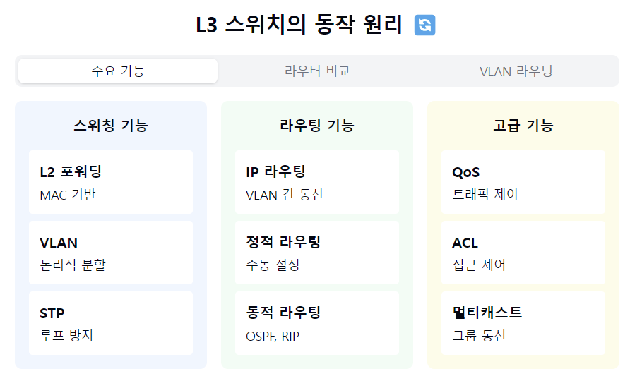
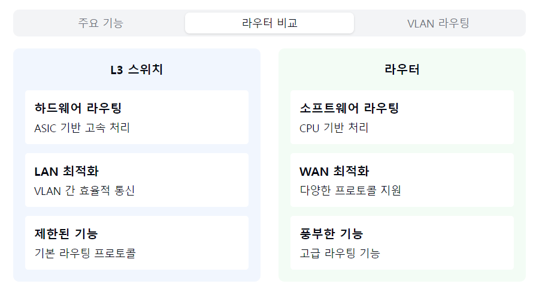
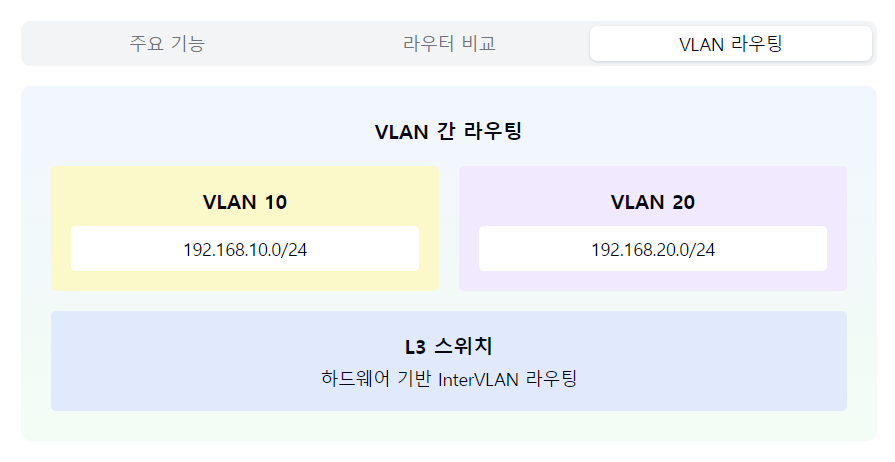

"L3 스위치의 하이브리드 세계로 들어가볼까요? 🔄"

1. L3 스위치란?
   "라우터와 L2 스위치의 장점을 합친다면?"

정리: L3 스위치는 L2 스위치의 고속 스위칭과 라우터의 라우팅 기능을 결합한 하이브리드 네트워크 장비입니다.

- L2 스위치 + 라우팅 기능
- 하드웨어 기반 라우팅
- VLAN 간 라우팅 가능
- 고성능 네트워킹의 핵심! 🚀

2. 주요 기능:

"스위칭과 라우팅, 두 마리 토끼를 잡아보자!"

정리: L3 스위치는 MAC 주소 기반의 스위칭과 IP 주소 기반의 라우팅을 동시에 수행하며, QoS나 ACL 같은 고급 기능도 제공합니다.

   스위칭:
- MAC 주소 기반
- 포트별 충돌 도메인
- VLAN 지원

라우팅:
- IP 주소 기반
- VLAN 간 라우팅
- 라우팅 프로토콜 지원

고급 기능:
- QoS 지원
- ACL 구현
- 멀티캐스팅

3. 라우터와의 차이점:

"같은 듯 다른 두 장비의 특징은?"

정리: L3 스위치는 하드웨어 기반 처리로 고속 성능을 제공하지만, 라우터에 비해 라우팅 기능이 제한적입니다.

   성능 면:
- ASIC 기반 처리
- 고속 패킷 포워딩
- 낮은 지연시간

기능 면:
- LAN 최적화
- 제한된 라우팅
- 특화된 기능

4. 활용 사례:

"어디서 활용되고 있을까?"

정리: L3 스위치는 기업 내부 네트워크, 데이터센터, 캠퍼스 네트워크 등 고성능 LAN 환경에서 주로 활용됩니다.

   엔터프라이즈:
- 부서별 VLAN
- 내부 라우팅
- 트래픽 관리

데이터센터:
- 서버팜 구성
- 고속 백본
- 이중화 구성

캠퍼스:
- 건물간 연결
- 사용자 분리
- QoS 적용

5. 주요 특징:

"장단점을 살펴보자!"

정리: L3 스위치는 고성능과 비용 효율성이 장점이지만, 초기 투자 비용과 설정의 복잡성을 고려해야 합니다.

   장점 👍
- 고성능
- 비용 효율
- 관리 용이
- 안정성

고려사항 ⚠️
- 초기 비용
- 설정 복잡성
- 기능 제한
- 확장성

자주 나오는 꼬리 질문! 🤔

Q1: "L3 스위치를 사용하는 이유는?"
A1: 하드웨어 기반 고속 라우팅이 가능하고,
VLAN 간 통신이 효율적이며, 비용 대비
성능이 우수하기 때문입니다!

Q2: "어떤 상황에서 라우터 대신 L3 스위치를 써야 할까요?"
A2: LAN 환경에서 VLAN 간 라우팅이 주로 필요하고,
고성능이 요구될 때 L3 스위치가 적합해요.
하지만 WAN 연결은 라우터가 더 적합하죠!

핵심 포인트! 💡
1. "하드웨어 기반 고성능"
2. "VLAN 간 효율적 라우팅"
3. "LAN 환경 최적화"
4. "통합 관리 용이"
5. "비용 효율적 구성"

```markdown

```







