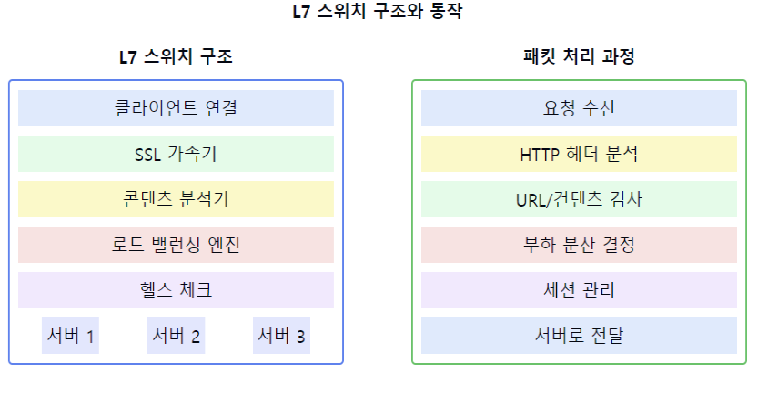

# L7 스위치에 대해서 설명해주세요.

1. L7 스위치의 정의:
    - 응용 계층(7계층)에서 동작하는 로드 밸런서
    - 콘텐츠 기반의 스위칭을 수행하는 네트워크 장비
    - URL, HTTP 헤더, 쿠키 등을 기반으로 트래픽을 분산

2. L7 스위치의 주요 기능:
    - 서버 로드 밸런싱
    - URL 기반 스위칭
    - 콘텐츠 기반 라우팅
    - 애플리케이션 가속화
    - SSL 오프로딩
    - 세션 유지(Persistence)

3. L7 스위치의 동작 방식:
   a) 패킷 분석:
    - HTTP 헤더 검사
    - URL 패턴 매칭
    - 쿠키 정보 확인
    - 컨텐츠 타입 식별

   b) 부하 분산 방식:
    - 라운드 로빈
    - 최소 연결 수
    - 응답 시간
    - 해시 기반

4. L7 스위치의 장점:
    - 지능적인 로드 밸런싱
    - 높은 수준의 보안 제공
    - 애플리케이션 가속화
    - 세션 관리 기능
    - 상세한 트래픽 제어

5. 주요 활용 분야:
    - 웹 서버 부하 분산
    - 보안 게이트웨이
    - CDN 서비스
    - 캐시 서버
    - 애플리케이션 전송 최적화

6. 보안 기능:
    - DDoS 방어
    - 웹 방화벽 기능
    - SSL/TLS 처리
    - 애플리케이션 레벨 보안

7. 고급 기능:
    - 헬스 체크
    - 글로벌 서버 로드 밸런싱
    - 콘텐츠 캐싱
    - TCP 최적화
    - 압축 기능

요약: L7 스위치는 애플리케이션 계층에서 동작하며, URL, HTTP 헤더, 쿠키 등을 기반으로 지능적인 로드 밸런싱을 수행합니다. 서버 부하 분산, 보안 강화, 애플리케이션 가속화 등 다양한 기능을 제공하며, 현대 웹 서비스의 성능과 가용성 향상에 중요한 역할을 합니다.

이러한 개념을 같이 설명하면 좋은 내용:

1. 세션 관리:
   "L7 스위치는 세션 지속성(Persistence)을 유지할 수 있어, 동일한 클라이언트의 요청을 항상 같은 서버로 전달할 수 있습니다. 이는 쇼핑몰의 장바구니와 같은 세션 기반 서비스에 중요합니다."

2. 보안 기능:
   "SSL 오프로딩을 통해 서버의 부하를 줄이고, 애플리케이션 레벨의 보안 정책을 적용할 수 있습니다. WAF(Web Application Firewall) 기능도 제공합니다."

3. 고가용성:
   "서버의 상태를 지속적으로 모니터링하여 장애 발생 시 자동으로 트래픽을 다른 서버로 전환합니다. 이를 통해 서비스의 연속성을 보장합니다."

4. 성능 최적화:
   "콘텐츠 압축, 캐싱, TCP 최적화 등을 통해 애플리케이션 성능을 향상시킬 수 있습니다."

5. 트래픽 관리:
   "URL, 쿠키, 헤더 정보 등을 기반으로 트래픽을 제어하고 우선순위를 부여할 수 있어, 세밀한 서비스 품질 관리가 가능합니다."

6. 글로벌 서버 로드 밸런싱:
   "지리적으로 분산된 서버들 간의 로드 밸런싱을 통해 글로벌 서비스의 성능과 가용성을 향상시킬 수 있습니다."

7. 애플리케이션 가시성:
   "애플리케이션 레벨의 모니터링과 로깅을 통해 서비스 품질과 성능을 실시간으로 파악할 수 있습니다."
