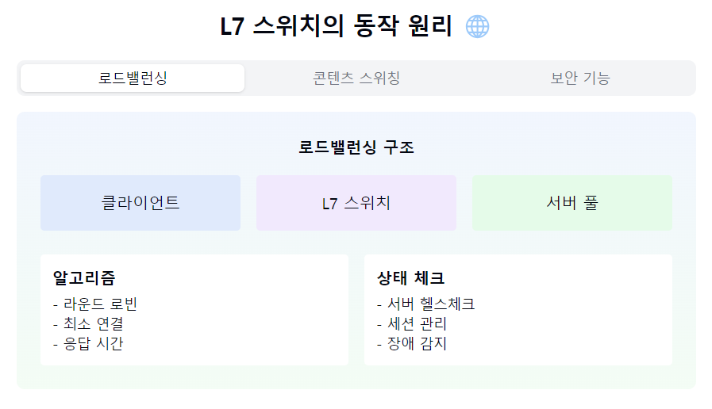
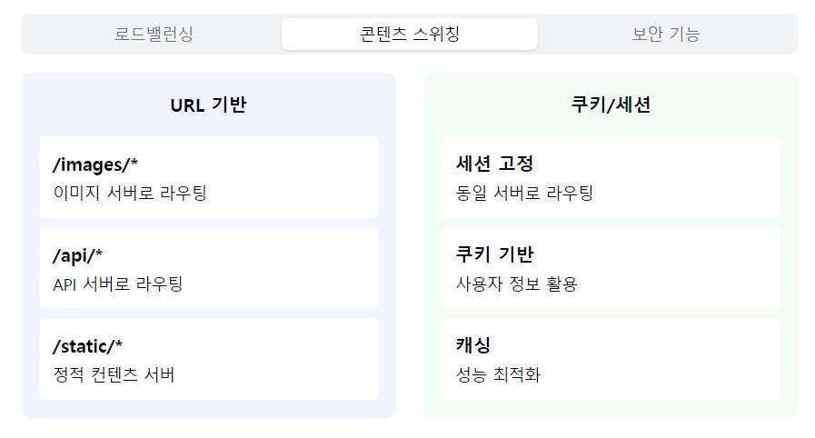
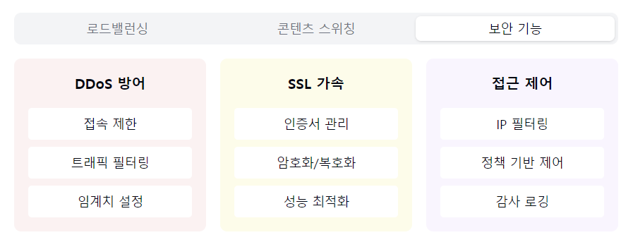

"L7 스위치의 지능적인 세계로 들어가볼까요? 🌐"

1. L7 스위치란?
   "왜 애플리케이션 계층까지 살펴보나요?"

정리: L7 스위치는 애플리케이션 계층의 데이터를 분석하여 지능적인 로드밸런싱과 트래픽 관리를 제공하는 고급 네트워크 장비입니다.

- 애플리케이션 계층 스위치
- 로드밸런서로도 불림
- 콘텐츠 기반 스위칭
- 높은 가용성 제공! 🔄

2. 주요 기능:
   "어떤 똑똑한 기능들이 있을까요?"

정리: L7 스위치는 로드밸런싱, 캐싱, 보안 기능 등을 제공하며, 애플리케이션의 특성을 고려한 지능적인 트래픽 처리가 가능합니다.

로드밸런싱:
- 서버 부하 분산
- 세션 유지
- 헬스 체크
- 실시간 모니터링

콘텐츠 스위칭:
- URL 기반 분배
- 쿠키 기반 처리
- 콘텐츠 캐싱
- SSL 오프로딩

보안 기능:
- DDoS 방어
- 방화벽 기능
- 접근 제어
- SSL 가속

3. 로드밸런싱 방식:
   "트래픽을 어떻게 분산할까요?"

정리: 다양한 알고리즘을 통해 서버의 상태와 요청의 특성을 고려한 최적의 부하 분산을 수행합니다.

알고리즘:
- 라운드 로빈
- 최소 연결
- 응답 시간
- 해시 기반

상태 체크:
- Active 모니터링
- Passive 모니터링
- 서버 헬스체크
- 장애 감지

4. 활용 사례:
   "어디서 주로 사용될까요?"

정리: 대규모 웹 서비스, 기업 애플리케이션, 클라우드 환경 등 고가용성이 요구되는 시스템에서 필수적으로 사용됩니다.

웹 서비스:
- 대형 포털
- 전자상거래
- 스트리밍 서비스

엔터프라이즈:
- 사내 시스템
- 메일 서버
- WAS 구성

5. 특징 및 장점:
   "왜 L7 스위치를 선택할까요?"

정리: 지능적인 트래픽 관리와 보안 기능을 제공하지만, 고비용과 복잡한 설정이 필요한 점을 고려해야 합니다.

장점 👍
- 지능적 분배
- 높은 보안성
- 유연한 확장
- 고가용성

고려사항 ⚠️
- 높은 비용
- 복잡한 설정
- 전문성 필요
- 성능 오버헤드

자주 나오는 꼬리 질문! 🤔

Q1: "L4 스위치와 L7 스위치의 차이점은?"
A1: L4는 포트 기반으로만 트래픽을 분산하지만,
L7은 URL, 쿠키, 컨텐츠 등 애플리케이션 레벨의
정보를 분석하여 더 지능적인 분산이 가능해요!

Q2: "언제 L7 스위치를 도입해야 할까요?"
A2: 대규모 트래픽 처리, 고가용성 필요,
콘텐츠 기반 라우팅이 필요한 경우,
보안 강화가 필요할 때 고려하면 좋아요!

핵심 포인트! 💡
1. "애플리케이션 레벨 분석"
2. "지능적 부하 분산"
3. "고급 보안 기능"
4. "콘텐츠 기반 라우팅"
5. "고가용성 보장"

