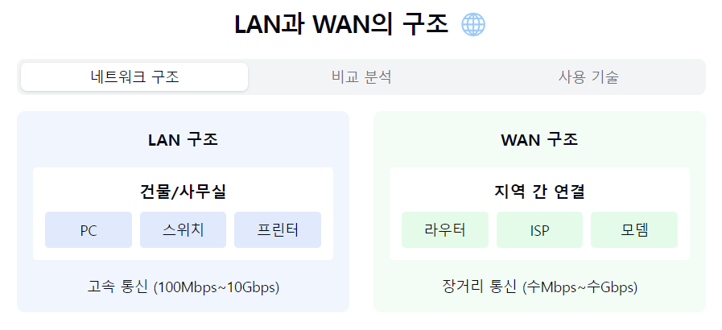
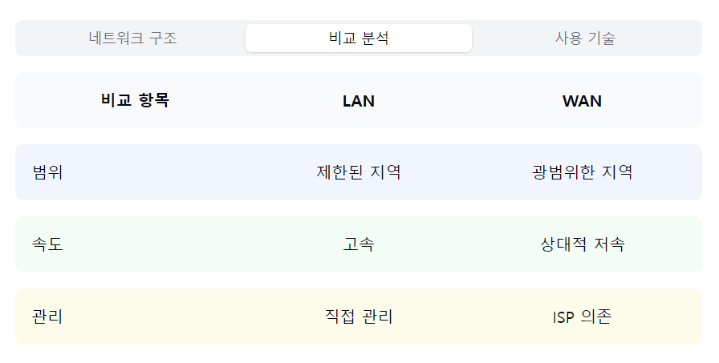
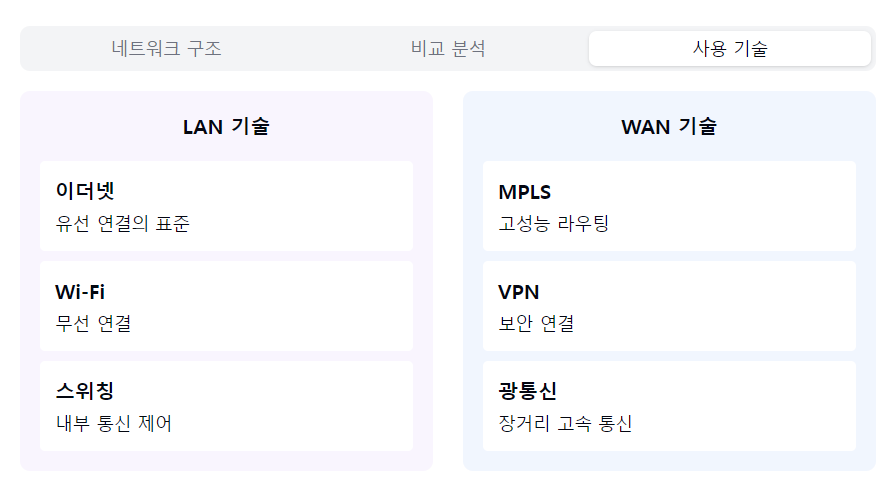

"LAN과 WAN, 네트워크의 두 가지 핵심 영역을 알아볼까요? 🌐"

1. LAN (Local Area Network):
   "건물이나 캠퍼스 단위의 네트워크란?"

정리: LAN은 제한된 지역 내에서 고속 통신을 제공하는 네트워크로, 직접적인 관리와 높은 성능이 특징입니다.

특징:
- 제한된 지리적 범위
- 고속 데이터 전송
- 낮은 지연시간
- 직접 관리 가능

구성요소:
- 스위치/허브
- 라우터
- 케이블링
- 워크스테이션

2. WAN (Wide Area Network):
   "지역과 지역을 연결하는 네트워크란?"

정리: WAN은 넓은 지역을 커버하는 네트워크로, 인터넷 서비스 제공자를 통해 여러 LAN을 연결합니다.

특징:
- 광범위한 지역 연결
- 다양한 통신 방식
- ISP 서비스 이용
- 상대적 저속

구성요소:
- 라우터
- 모뎀
- CSU/DSU
- 전용선/VPN

3. LAN vs WAN 비교:
   "두 네트워크의 차이점은?"

정리: LAN은 고속, 저비용, 직접 관리가 특징이며, WAN은 넓은 커버리지와 전문적 관리가 필요한 특징을 가집니다.

속도:
- LAN: 100Mbps~10Gbps
- WAN: 수Mbps~수Gbps

관리:
- LAN: 직접 관리
- WAN: ISP 의존

비용:
- LAN: 상대적 저비용
- WAN: 높은 운영비용

4. 활용 사례:
   "어디서 어떻게 사용될까요?"

정리: LAN은 사무실이나 건물 내부 네트워크에, WAN은 지사 간 연결이나 인터넷 서비스에 활용됩니다.

LAN 활용:
- 사무실 네트워크
- 학교 전산망
- 가정 네트워크

WAN 활용:
- 기업 지사 연결
- 인터넷 서비스
- 클라우드 접속

5. 주요 기술:
   "어떤 기술들이 사용될까요?"

정리: LAN은 이더넷과 Wi-Fi가 주로 사용되며, WAN은 다양한 통신 프로토콜과 VPN 기술이 활용됩니다.

LAN 기술:
- 이더넷
- Wi-Fi
- Token Ring

WAN 기술:
- MPLS
- Frame Relay
- VPN
- 광통신

자주 나오는 꼬리 질문! 🤔

Q1: "MAN(Metropolitan Area Network)은 무엇인가요?"
A1: MAN은 LAN과 WAN의 중간 형태로, 도시 규모의
네트워크를 의미해요. 대학 캠퍼스나 기업 단지
등에서 주로 사용됩니다!

Q2: "가정에서는 어떤 네트워크를 사용하나요?"
A2: 가정 내부는 LAN(Wi-Fi 포함), 인터넷 연결은
WAN의 형태를 가져요. 즉, 두 가지 네트워크가
모두 사용되고 있답니다!

핵심 포인트! 💡
1. "범위와 속도의 차이"
2. "관리 방식의 차이"
3. "비용 구조의 차이"
4. "사용 기술의 차이"
5. "성능과 신뢰성 차이"

