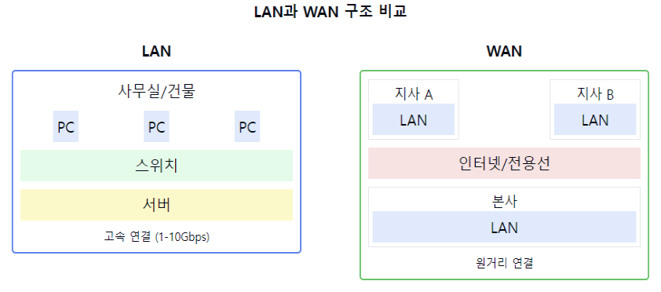

# LAN과 WAN에 대해서 설명해주세요.

1. LAN(Local Area Network)의 정의:
    - 제한된 지역 내의 네트워크
    - 하나의 건물이나 캠퍼스 내의 네트워크
    - 고속의 데이터 전송이 가능한 근거리 통신망

2. LAN의 특징:
    - 높은 데이터 전송 속도(100Mbps ~ 10Gbps)
    - 낮은 지연시간
    - 직접적인 물리적 연결
    - 제한된 지리적 범위
    - 사설 네트워크로 운영

3. WAN(Wide Area Network)의 정의:
    - 넓은 지역을 연결하는 네트워크
    - 여러 도시나 국가를 연결하는 네트워크
    - 통신사업자의 서비스를 이용한 원거리 통신망

4. WAN의 특징:
    - 상대적으로 낮은 전송 속도
    - 높은 지연시간
    - 통신사업자의 서비스 이용
    - 넓은 지리적 범위
    - 공용 네트워크 사용

5. LAN과 WAN의 주요 차이점:
   a) 범위:
    - LAN: 제한된 지역
    - WAN: 광범위한 지역

   b) 속도:
    - LAN: 고속
    - WAN: 상대적 저속

   c) 소유권:
    - LAN: 개인/조직 소유
    - WAN: 통신사업자 서비스

6. 주요 활용 분야:
   LAN:
    - 사무실 네트워크
    - 학교 캠퍼스 네트워크
    - 가정용 네트워크

   WAN:
    - 기업의 지사 간 연결
    - 인터넷 서비스
    - 글로벌 네트워크

7. 기술적 특징:
   LAN:
    - 이더넷, Wi-Fi
    - 스위치, 라우터 사용
    - 브로드캐스트 도메인

   WAN:
    - 전용선, VPN
    - 라우터 중심
    - 포인트-투-포인트 연결

요약: LAN은 제한된 지역 내의 고속 네트워크이며, WAN은 넓은 지역을 연결하는 원거리 통신망입니다. LAN은 높은 속도와 낮은 지연시간이 특징이며, WAN은 넓은 범위와 통신사업자 서비스 이용이 특징입니다. 각각의 특성에 따라 다양한 분야에서 활용되고 있습니다.

이러한 개념을 같이 설명하면 좋은 내용:

1. 네트워크 토폴로지:
   "LAN은 주로 스타형, 버스형 등의 토폴로지를 사용하며, WAN은 주로 메시형이나 계층형 토폴로지를 사용합니다."

2. 프로토콜 차이:
   "LAN은 주로 이더넷 프로토콜을 사용하고, WAN은 PPP, Frame Relay, MPLS 등 다양한 프로토콜을 사용합니다."

3. 보안 고려사항:
   "WAN은 공용 네트워크를 사용하므로 VPN 등의 추가적인 보안 메커니즘이 필요하지만, LAN은 물리적 보안에 더 중점을 둡니다."

4. 비용 구조:
   "LAN은 초기 구축 비용이 주요하고, WAN은 통신사업자에 대한 지속적인 서비스 비용이 발생합니다."

5. 관리 및 유지보수:
   "LAN은 직접적인 관리가 가능하지만, WAN은 서비스 제공자와의 협력이 필요한 경우가 많습니다."

6. 확장성:
   "LAN은 물리적 제약 내에서 비교적 쉽게 확장할 수 있으며, WAN은 서비스 제공자의 인프라에 따라 확장성이 결정됩니다."

7. 성능 최적화:
   "LAN에서는 QoS 설정이나 대역폭 관리가 상대적으로 단순하지만, WAN에서는 더 복잡한 트래픽 엔지니어링이 필요합니다."
