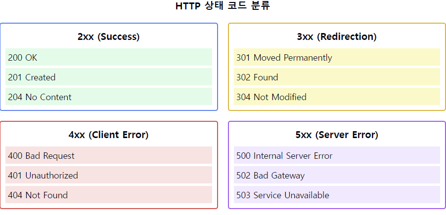

# HTTP 프로토콜에 대해서 설명해주세요.

1. HTTP 상태 코드의 정의:
    - 웹 서버가 클라이언트의 요청에 대한 처리 결과를 알려주는 3자리 숫자
    - HTTP 응답의 상태를 표준화된 방식으로 전달
    - 클라이언트에게 요청 처리 결과를 명확하게 전달하는 방법

2. 상태 코드의 분류:
    - 1xx: 정보 전달 (Informational)
    - 2xx: 성공 (Success)
    - 3xx: 리다이렉션 (Redirection)
    - 4xx: 클라이언트 오류 (Client Error)
    - 5xx: 서버 오류 (Server Error)

3. 주요 2xx 상태 코드:
    - 200: OK (요청 성공)
    - 201: Created (리소스 생성 성공)
    - 204: No Content (성공했지만 응답 본문 없음)
    - 206: Partial Content (부분적 요청 성공)

4. 주요 3xx 상태 코드:
    - 301: Moved Permanently (영구 이동)
    - 302: Found (임시 이동)
    - 304: Not Modified (캐시된 리소스 사용)
    - 307: Temporary Redirect (임시 리다이렉션)

5. 주요 4xx 상태 코드:
    - 400: Bad Request (잘못된 요청)
    - 401: Unauthorized (인증 필요)
    - 403: Forbidden (접근 권한 없음)
    - 404: Not Found (리소스 없음)
    - 409: Conflict (리소스 충돌)

6. 주요 5xx 상태 코드:
    - 500: Internal Server Error (서버 내부 오류)
    - 502: Bad Gateway (게이트웨이 오류)
    - 503: Service Unavailable (서비스 이용 불가)
    - 504: Gateway Timeout (게이트웨이 시간 초과)

7. 상태 코드의 활용:
    - API 개발 시 적절한 상태 코드 선택
    - 에러 처리와 디버깅
    - 클라이언트-서버 통신의 명확성 제공
    - 모니터링과 로깅

요약: HTTP 상태 코드는 웹 서버의 응답 상태를 표준화된 방식으로 전달하는 중요한 메커니즘입니다. 1xx부터 5xx까지 다양한 상황에 대한 코드가 정의되어 있으며, 각 코드는 특정한 의미를 가집니다. 적절한 상태 코드의 사용은 웹 애플리케이션의 견고성과 사용성을 향상시키는 데 핵심적인 역할을 합니다.

이러한 개념을 같이 설명하면 좋은 내용:

1. RESTful API 설계:
   "상태 코드는 RESTful API 설계의 중요한 부분입니다. 각 HTTP 메소드와 적절한 상태 코드를 조합하여 의미있는 API 응답을 구성할 수 있습니다."

2. 에러 처리 전략:
   "4xx와 5xx 에러를 적절히 구분하여 사용하면 클라이언트와 서버 측의 문제를 명확히 구분할 수 있습니다. 이는 문제 해결과 디버깅에 도움이 됩니다."

3. 캐싱 전략:
   "304 Not Modified 상태 코드를 활용한 효율적인 캐싱 전략을 구현할 수 있습니다. 이는 서버 부하 감소와 성능 향상에 기여합니다."

4. 보안 관련 상태 코드:
   "401(Unauthorized)과 403(Forbidden)의 차이를 이해하고 적절히 사용하는 것은 보안 설계에 중요합니다."

5. 리다이렉션 처리:
   "3xx 상태 코드를 통해 다양한 리다이렉션 시나리오를 처리할 수 있습니다. URL 변경, 로드 밸런싱 등에 활용됩니다."

6. 사용자 경험:
   "적절한 상태 코드와 에러 메시지를 제공함으로써 사용자 경험을 향상시킬 수 있습니다."

7. 모니터링과 로깅:
   "상태 코드는 시스템 모니터링과 로깅의 중요한 지표가 됩니다. 특정 상태 코드의 빈도를 통해 시스템의 건강 상태를 파악할 수 있습니다."
