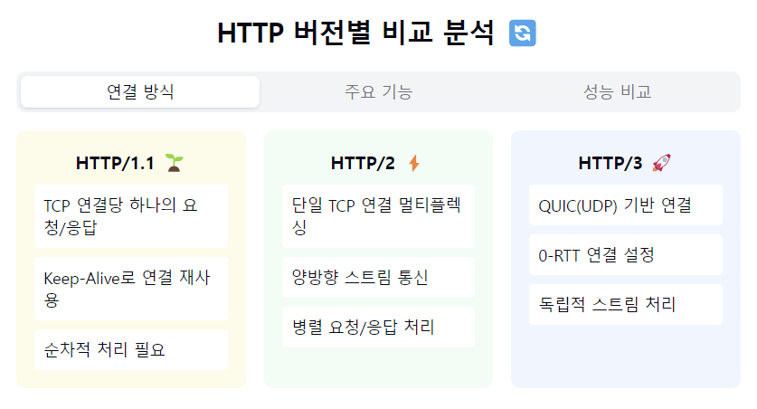

"HTTP 버전별 특징을 타임라인으로 살펴볼까요? 🚀"

1. HTTP/1.1 (1997) - 웹의 기초를 다지다! 🏗️
   주요 특징:
- Keep-Alive 기본 지원
- 파이프라이닝 도입
- 청크 전송 인코딩
- 캐시 메커니즘 개선

한계점:
- HOL(Head of Line) Blocking
- 무거운 헤더 구조
- 요청-응답 순차 처리

2. HTTP/2 (2015) - 성능의 혁신! ⚡
   주요 특징:
- 멀티플렉싱 (다중화)
- 헤더 압축 (HPACK)
- 서버 푸시
- 스트림 우선순위

개선사항:
- 단일 TCP 연결 최대 활용
- 이진 프로토콜 사용
- HOL Blocking 해결
- 지연 시간 감소

3. HTTP/3 (2022) - 신뢰성과 속도의 조화! 🎯
   주요 특징:
- QUIC 프로토콜 사용 (UDP 기반)
- 연결 설정 시간 단축
- 멀티플렉싱 개선
- 이동성 지원

혁신 포인트:
- 0-RTT 연결 설정
- TCP HOL Blocking 해결
- 패킷 손실 독립적 처리
- 네트워크 전환 지원

4. 버전별 성능 비교:
   전송 속도:
- HTTP/1.1: 기본 성능
- HTTP/2: 약 50% 향상
- HTTP/3: 최대 30% 추가 향상

지연 시간:
- HTTP/1.1: 기본 지연
- HTTP/2: ~50% 감소
- HTTP/3: 추가 20-30% 감소

5. 실무 적용 시 고려사항! 💡
   HTTP/1.1:
- "여전히 가장 널리 사용돼요"
- "구현이 단순하고 안정적"
- "디버깅이 쉬워요"

HTTP/2:
- "HTTPS가 필수에요"
- "서버 설정 변경 필요"
- "대부분의 최신 브라우저 지원"

HTTP/3:
- "아직 채택 단계에요"
- "UDP 포트 허용 필요"
- "최신 인프라 요구"

6. 미래 전망 🔮
- HTTP/3 채택 증가
- 웹 성능 지속적 개선
- 모바일 최적화 강화
- 새로운 웹 기술 등장

요약: HTTP는 계속 진화하고 있어요!
각 버전은 이전 버전의 한계를 극복하면서
더 나은 웹 경험을 제공하고자 했답니다.
현재는 세 버전이 공존하면서 각자의 장점을 살려 사용되고 있죠!

실무자가 기억할 점! 📝
1. "브라우저/서버 지원 상황 체크"
2. "적절한 버전 선택이 중요"
3. "성능 모니터링 필수"
4. "단계적 업그레이드 추천"
5. "보안 설정 꼼꼼히!"