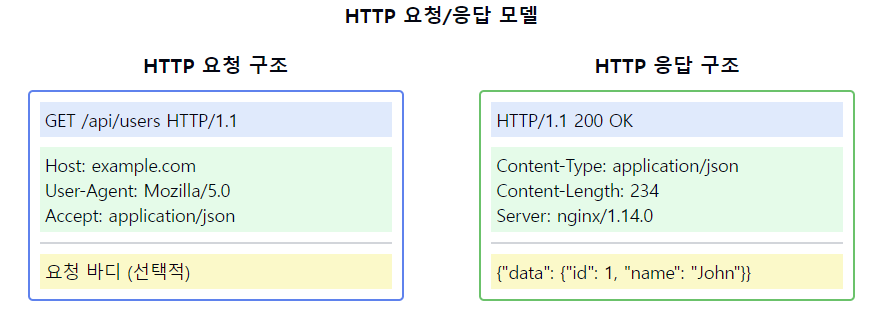

# HTTP의 요청/응답 모델에 대해 설명해주세요.

1. HTTP 요청/응답 모델의 정의:
    - 클라이언트가 서버에 요청(Request)을 보내고 서버가 응답(Response)하는 단방향 통신 모델
    - 요청과 응답이 1:1로 매칭되는 구조
    - 비연결성(Connectionless)과 무상태성(Stateless) 특징을 가짐

2. HTTP 요청(Request) 구조:
    - 요청 라인: 메소드, URL, HTTP 버전
    - 요청 헤더: 클라이언트 정보, 요청 컨텐츠 정보
    - 빈 줄: 헤더와 바디 구분
    - 요청 바디: 전송할 데이터 (선택적)

3. HTTP 응답(Response) 구조:
    - 상태 라인: HTTP 버전, 상태 코드, 상태 메시지
    - 응답 헤더: 서버 정보, 응답 컨텐츠 정보
    - 빈 줄: 헤더와 바디 구분
    - 응답 바디: 전송되는 데이터

4. 주요 요청 메소드:
    - GET: 리소스 조회
    - POST: 리소스 생성
    - PUT: 리소스 수정
    - DELETE: 리소스 삭제
    - PATCH: 리소스 부분 수정

5. 주요 헤더 필드:
   요청 헤더:
    - Host: 서버 도메인 이름
    - User-Agent: 클라이언트 정보
    - Content-Type: 요청 바디 타입

   응답 헤더:
    - Server: 서버 정보
    - Content-Length: 응답 바디 크기
    - Content-Type: 응답 바디 타입

6. 통신 과정:
    - TCP 연결 수립 (3-way handshake)
    - HTTP 요청 전송
    - 서버의 요청 처리
    - HTTP 응답 전송
    - TCP 연결 종료

7. 고려사항:
    - 보안 (HTTPS)
    - 캐싱 전략
    - 세션 관리
    - 에러 처리
    - 성능 최적화

요약: HTTP의 요청/응답 모델은 클라이언트와 서버 간의 통신을 위한 기본 구조를 제공합니다. 각각의 요청과 응답은 명확한 구조와 형식을 가지며, 다양한 메소드와 헤더를 통해 풍부한 통신 기능을 제공합니다. 이
모델을 효과적으로 활용하기 위해서는 보안, 캐싱, 성능 등 다양한 측면을 고려해야 합니다.

이러한 개념을 같이 설명하면 좋은 내용:

1. 요청/응답 구조의 중요성:
   "명확한 요청/응답 구조는 HTTP 통신의 표준화와 상호운용성을 보장합니다. 이는 다양한 클라이언트와 서버 간의 원활한 통신을 가능하게 합니다."

2. 메소드 선택의 의미:
   "각 HTTP 메소드는 특정한 의미를 가지며, RESTful API 설계에서 중요한 역할을 합니다. 메소드의 특성을 이해하고 적절히 선택하는 것이 중요합니다."

3. 헤더의 활용:
   "HTTP 헤더를 통해 캐싱, 인증, 컨텐츠 협상 등 다양한 기능을 구현할 수 있습니다. 이는 웹 애플리케이션의 성능과 기능성을 향상시킵니다."

4. 상태 관리:
   "HTTP는 기본적으로 무상태 프로토콜이지만, 쿠키와 세션을 통해 상태를 유지할 수 있습니다. 이는 사용자 인증 등에 필수적입니다."

5. 에러 처리:
   "적절한 상태 코드와 에러 메시지를 포함한 응답을 통해 클라이언트에게 명확한 피드백을 제공할 수 있습니다."

6. 성능 최적화:
   "Keep-Alive 연결, 압축, 캐싱 등의 기술을 활용하여 HTTP 통신의 성능을 최적화할 수 있습니다."

7. 보안 고려사항:
   "HTTPS, CORS, XSS 방지 등 다양한 보안 메커니즘을 통해 안전한 HTTP 통신을 구현할 수 있습니다."
