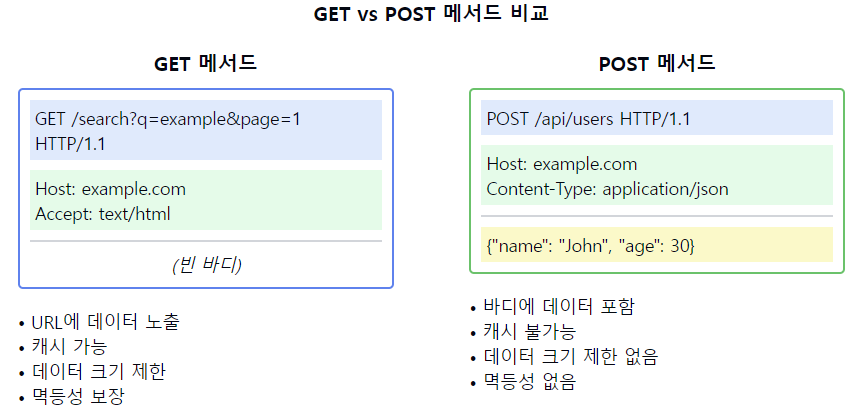

# HTTP 메서드중 GET과 POST의 차이점에 대해 설명해주세요.

1. 주요 용도의 차이:
   GET:
    - 서버로부터 데이터를 조회하는 용도
    - 리소스의 검색과 요청에 사용
    - 읽기 전용 작업에 사용

   POST:
    - 서버에 데이터를 전송하여 생성하는 용도
    - 리소스의 생성과 수정에 사용
    - 데이터 처리 작업에 사용

2. 데이터 전송 방식:
   GET:
    - URL의 쿼리 스트링으로 데이터 전송
    - URL에 데이터가 노출됨
    - URL 길이 제한으로 전송 데이터 크기 제한

   POST:
    - 요청 본문(Body)에 데이터 전송
    - URL에 데이터가 노출되지 않음
    - 전송 데이터 크기 제한 없음

3. 보안성:
   GET:
    - URL에 데이터가 노출되어 보안에 취약
    - 브라우저 히스토리에 기록됨
    - 캐시되어 저장될 수 있음

   POST:
    - 데이터가 본문에 있어 상대적으로 보안성이 높음
    - 브라우저 히스토리에 기록되지 않음
    - 캐시되지 않음

4. 멱등성(Idempotency):
   GET:
    - 멱등성을 가짐 (여러 번 호출해도 결과가 동일)
    - 서버의 상태를 변경하지 않음

   POST:
    - 멱등성을 가지지 않음
    - 서버의 상태를 변경할 수 있음

5. 캐싱:
   GET:
    - 캐시 가능
    - 브라우저가 응답을 캐시할 수 있음
    - 캐시를 통한 성능 향상 가능

   POST:
    - 기본적으로 캐시 불가능
    - 매 요청마다 서버 처리 필요
    - 캐시 제어가 어려움

6. 사용 예시:
   GET:
    - 검색 기능
    - 게시글 조회
    - 상품 목록 조회

   POST:
    - 로그인/회원가입
    - 게시글 작성
    - 파일 업로드

7. 브라우저에서의 동작:
   GET:
    - 북마크 가능
    - 뒤로 가기 안전
    - 새로고침 시 안전

   POST:
    - 북마크 불가능
    - 뒤로 가기 시 재확인 필요
    - 새로고침 시 재전송 확인

요약: GET과 POST는 HTTP에서 가장 많이 사용되는 메서드로, 각각 다른 용도와 특성을 가집니다. GET은 데이터 조회에 적합하고 멱등성을 가지며 캐시가 가능한 반면, POST는 데이터 생성과 수정에 적합하고 더 많은 데이터를 안전하게 전송할 수 있습니다.

이러한 개념을 같이 설명하면 좋은 내용:

1. RESTful API 설계:
   "GET과 POST의 적절한 사용은 RESTful API 설계의 기본입니다. GET은 리소스 조회, POST는 리소스 생성이라는 의미를 명확히 가져야 합니다."

2. 보안 고려사항:
   "중요한 데이터나 민감한 정보는 POST를 사용해야 합니다. 특히 로그인 정보나 개인정보와 같은 데이터는 GET 사용을 피해야 합니다."

3. 성능 최적화:
   "GET 요청은 캐싱이 가능하므로, 자주 변경되지 않는 데이터 조회에 적합합니다. 이를 통해 서버 부하를 줄일 수 있습니다."

4. 브라우저 동작:
   "브라우저의 뒤로 가기나 새로고침 동작이 GET과 POST에서 다르게 작동합니다. 이는 사용자 경험 설계 시 고려해야 할 중요한 부분입니다."

5. 데이터 크기 제한:
   "GET의 URL 길이 제한은 브라우저마다 다릅니다. 대용량 데이터 전송이 필요한 경우 POST를 사용해야 합니다."

6. 로깅과 모니터링:
   "GET 요청은 URL에 모든 파라미터가 포함되어 있어 로깅과 모니터링이 용이합니다. 반면 POST는 본문 내용의 로깅이 추가로 필요할 수 있습니다."

7. 에러 처리:
   "GET과 POST는 각각 다른 종류의 에러가 발생할 수 있으며, 이에 대한 적절한 에러 처리 전략이 필요합니다."
