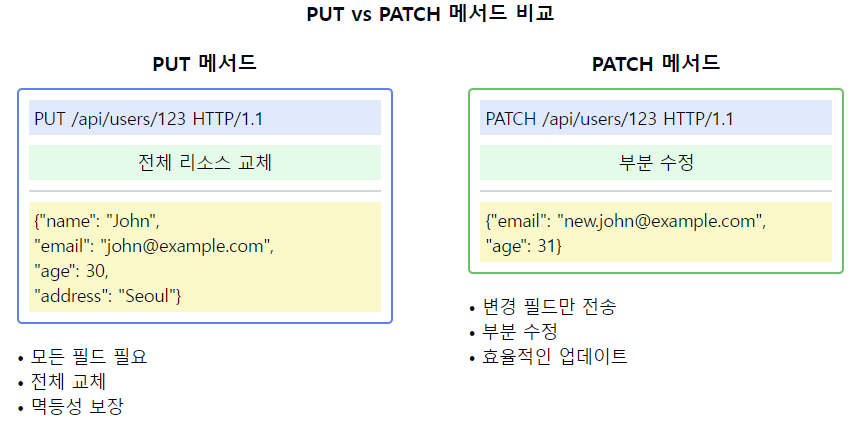

# HTTP 메서드중 PUT과 PATCH의 차이점에 대해 설명해주세요.

1. 기본 정의와 용도:
   PUT:
    - 리소스의 전체 교체를 위한 메서드
    - 기존 리소스를 새로운 리소스로 완전히 대체
    - 멱등성을 가짐

   PATCH:
    - 리소스의 부분 수정을 위한 메서드
    - 기존 리소스의 일부분만 변경
    - 멱등성을 가지지 않을 수 있음

2. 데이터 처리 방식:
   PUT:
    - 전체 리소스를 새로운 데이터로 교체
    - 요청 시 모든 필드 데이터 필요
    - 누락된 필드는 null이나 기본값으로 처리

   PATCH:
    - 변경이 필요한 필드만 전송
    - 전송되지 않은 필드는 기존 값 유지
    - 다양한 수정 방식 지원 가능

3. 멱등성(Idempotency):
   PUT:
    - 멱등성 보장
    - 여러 번 호출해도 결과가 동일
    - 예측 가능한 결과 제공

   PATCH:
    - 멱등성 보장하지 않을 수 있음
    - 연산의 종류에 따라 결과가 달라질 수 있음
    - 상태 의존적인 수정 가능

4. 사용 예시:
   PUT:
    - 사용자 프로필 전체 업데이트
    - 게시글 전체 수정
    - 리소스 전체 교체 필요 시

   PATCH:
    - 사용자 프로필 일부 수정
    - 게시글 일부 내용 수정
    - 특정 필드만 변경 필요 시

5. 데이터 형식:
   PUT:
    - 완전한 리소스 표현
    - 모든 필수 필드 포함
    - 단순한 데이터 구조

   PATCH:
    - 변경사항만 포함
    - JSON Patch 형식 사용 가능
    - 복잡한 수정 연산 지원

6. 오류 처리:
   PUT:
    - 리소스 전체가 유효해야 함
    - 일부 필드만 전송 시 오류 발생 가능
    - 모든 필드 검증 필요

   PATCH:
    - 부분 수정에 대한 유효성 검사
    - 변경 사항만 검증
    - 더 유연한 오류 처리 가능

7. RESTful API 설계 고려사항:
   PUT:
    - 리소스의 완전한 교체가 필요한 경우
    - 명확한 전체 상태 변경 시

   PATCH:
    - 부분 업데이트가 빈번한 경우
    - 네트워크 효율성 중요 시

요약: PUT과 PATCH는 리소스 수정을 위한 HTTP 메서드이지만, PUT은 전체 리소스를 교체하고 PATCH는 부분적인 수정을 수행합니다. PUT은 멱등성을 보장하며 완전한 리소스 표현이 필요한 반면, PATCH는 더 유연하고 효율적인 부분 수정을 지원합니다.

이러한 개념을 같이 설명하면 좋은 내용:

1. 리소스 상태 관리:
   "PUT은 리소스의 완전한 상태를 나타내므로 상태 관리가 명확하지만, PATCH는 변경사항만 다루므로 더 복잡한 상태 관리가 필요할 수 있습니다."

2. 성능과 네트워크 효율성:
   "PATCH는 필요한 데이터만 전송하므로 네트워크 대역폭을 절약할 수 있습니다. 특히 큰 리소스의 작은 변경에 효율적입니다."

3. JSON Patch 형식:
   "PATCH는 표준화된 JSON Patch 형식을 사용할 수 있어, 복잡한 수정 연산을 표현할 수 있습니다."

4. 유효성 검증:
   "PUT은 전체 리소스의 유효성을 검증해야 하지만, PATCH는 변경되는 부분만 검증하면 됩니다."

5. 동시성 제어:
   "PUT은 전체 리소스를 교체하므로 동시성 문제가 적지만, PATCH는 부분 수정으로 인한 충돌이 발생할 수 있습니다."

6. 캐싱 전략:
   "PUT은 멱등성이 보장되어 캐싱이 용이하지만, PATCH는 상황에 따라 캐싱 전략을 다르게 가져가야 할 수 있습니다."

7. 에러 처리:
   "PUT은 전체 리소스가 유효하지 않으면 실패하지만, PATCH는 부분 수정이 실패하더라도 다른 부분은 성공할 수 있습니다."

