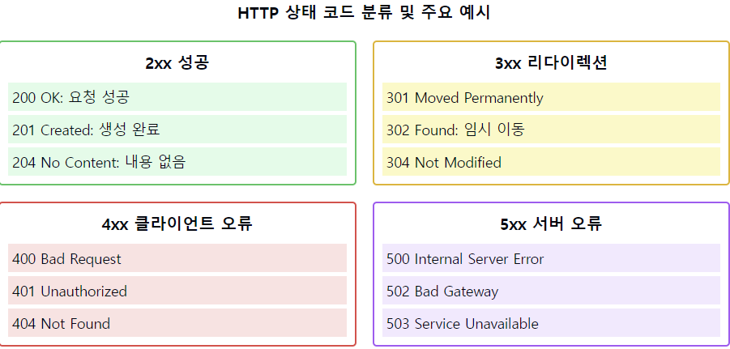

# HTTP 상태 코드가 뭔가요? 알고 있는 상태 코드 몇가지 설명해주세요.

1. HTTP 상태 코드의 정의:
    - 서버가 HTTP 요청에 대한 처리 결과를 알려주는 3자리 숫자 코드
    - 클라이언트에게 요청의 처리 상태를 전달하는 표준화된 방식
    - 응답의 성공, 실패, 추가 조치 필요성 등을 나타냄

2. 상태 코드의 5가지 분류:
   1xx: 정보 응답
    - 요청이 수신되어 처리중

   2xx: 성공
    - 요청이 성공적으로 처리됨

   3xx: 리다이렉션
    - 추가 조치 필요

   4xx: 클라이언트 오류
    - 클라이언트 측 오류

   5xx: 서버 오류
    - 서버 측 오류

3. 주요 2xx (성공) 상태 코드:
    - 200 OK: 요청 성공
    - 201 Created: 리소스 생성 성공
    - 204 No Content: 성공했지만 응답 본문 없음

4. 주요 3xx (리다이렉션) 상태 코드:
    - 301 Moved Permanently: 영구 이동
    - 302 Found: 임시 이동
    - 304 Not Modified: 캐시된 리소스 사용

5. 주요 4xx (클라이언트 오류) 상태 코드:
    - 400 Bad Request: 잘못된 요청
    - 401 Unauthorized: 인증 필요
    - 403 Forbidden: 권한 없음
    - 404 Not Found: 리소스 없음
    - 409 Conflict: 리소스 충돌

6. 주요 5xx (서버 오류) 상태 코드:
    - 500 Internal Server Error: 서버 내부 오류
    - 502 Bad Gateway: 게이트웨이 오류
    - 503 Service Unavailable: 서비스 이용 불가
    - 504 Gateway Timeout: 게이트웨이 시간 초과

7. 상태 코드의 활용:
    - API 응답 설계
    - 에러 처리
    - 디버깅
    - 모니터링

요약: HTTP 상태 코드는 서버의 응답 상태를 표준화된 방식으로 전달하는 3자리 숫자입니다. 1xx부터 5xx까지 5개의 클래스로 분류되며, 각 클래스는 특정한 종류의 응답을 나타냅니다. 상태 코드를 통해 클라이언트는 요청의 처리 결과를 명확히 파악할 수 있습니다.

이러한 개념을 같이 설명하면 좋은 내용:

1. RESTful API 설계:
   "적절한 상태 코드 사용은 RESTful API 설계의 중요한 부분입니다. 각 상황에 맞는 정확한 상태 코드를 반환하는 것이 좋은 API 설계의 기본입니다."

2. 에러 처리:
   "4xx와 5xx 상태 코드를 통해 문제의 원인을 명확히 구분할 수 있습니다. 이는 디버깅과 문제 해결에 큰 도움이 됩니다."

3. 캐싱 전략:
   "304 Not Modified는 클라이언트의 캐시를 효과적으로 활용할 수 있게 해주어 서버의 부하를 줄일 수 있습니다."

4. 보안 관련:
   "401 Unauthorized와 403 Forbidden의 차이를 이해하는 것이 중요합니다. 401은 인증이 필요한 경우, 403은 인증은 됐지만 권한이 없는 경우입니다."

5. 리다이렉션 처리:
   "301과 302의 차이를 이해하고 적절히 사용하는 것은 SEO와 사용자 경험에 영향을 미칩니다."

6. 성능 모니터링:
   "상태 코드는 시스템 모니터링의 중요한 지표가 됩니다. 특정 상태 코드의 빈도를 통해 시스템의 건강 상태를 파악할 수 있습니다."

7. 사용자 경험:
   "명확한 상태 코드와 함께 적절한 에러 메시지를 제공하면 사용자 경험을 향상시킬 수 있습니다."
