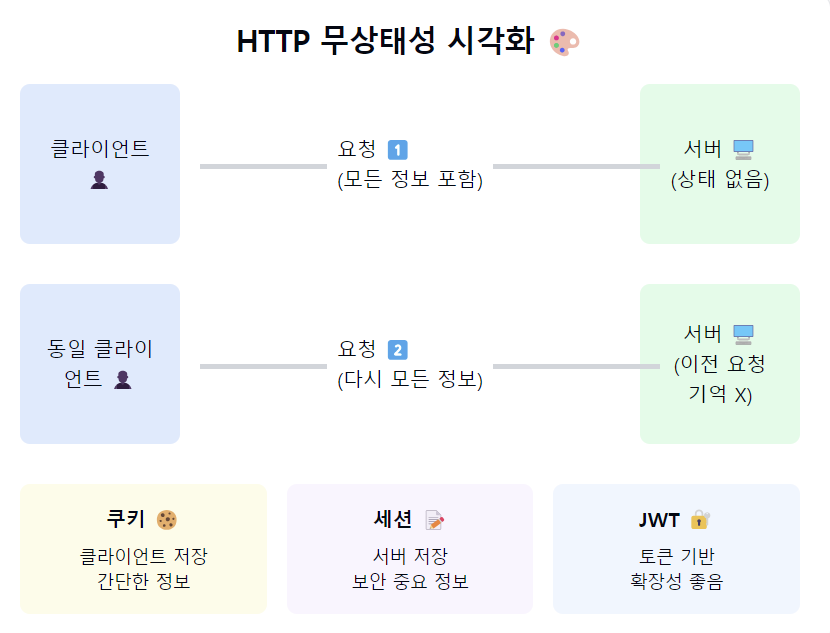

## "HTTP의 무상태성(Stateless)에 대해 알아볼까요? 🤔"

1. 무상태성(Stateless)이란?
- 각각의 HTTP 요청이 독립적이고 이전 요청과 완전히 분리된 상태
- 서버가 클라이언트의 상태를 보존하지 않음
- 마치 처음 만나는 사람처럼 매 요청을 새롭게 처리! 🆕

2. 무상태성의 특징:
- 확장성 (Scale-out이 쉬움)
- 서버 자원 효율성
- 단순한 서버 구현
- 클라이언트가 필요한 모든 정보를 전송해야 함

3. 장점과 단점:
   장점 👍
- 서버 확장이 자유로움
- 서버 리소스 절약
- 로드 밸런싱이 쉬움

단점 👎
- 매 요청마다 필요한 정보를 전부 보내야 함
- 상태 유지가 필요한 기능 구현이 까다로움
- 자원 낭비 가능성 존재

4. 상태 유지가 필요한 경우의 해결책:
   a. 쿠키 🍪
    - 클라이언트 측에 데이터 저장
    - 적은 용량, 보안에 취약할 수 있음

b. 세션 📝
- 서버 측에 데이터 저장
- 클라이언트는 세션ID만 보유

c. JWT 토큰 🔐
- 클라이언트가 토큰 형태로 상태 정보 보관
- 서명으로 위변조 방지

5. 실제 활용 사례:
- 로그인 상태 유지
- 장바구니 기능
- 사용자 설정 저장
- 실시간 채팅

6. 개발 시 고려사항:
- 보안성 vs 편의성
- 성능 vs 리소스 사용
- 확장성 vs 구현 복잡도

7. 실무에서의 팁! 💡
- "세션은 꼭 필요할 때만 사용하세요"
- "JWT는 만능이 아닙니다"
- "쿠키는 보안에 주의하세요"
- "Scale-out 고려는 필수!"

요약: HTTP의 무상태성은 마치 '금붕어의 기억력'과 비슷해요! 매 요청이 새로운 시작이죠.
이는 확장성과 단순성이라는 장점을 주지만, 상태 유지가 필요한 현대 웹 서비스에서는
쿠키, 세션, JWT 등 다양한 방법으로 이를 보완하고 있답니다. 🌊

이게 실제로 왜 중요할까요? 🤔
1. "대규모 서비스의 확장성을 보장해요"
2. "시스템 구조를 단순하게 만들어줘요"
3. "서버 리소스를 효율적으로 사용할 수 있어요"
4. "마이크로서비스 아키텍처에 찰떡이에요"
5. "클라우드 환경에서 특히 빛을 발해요!"

