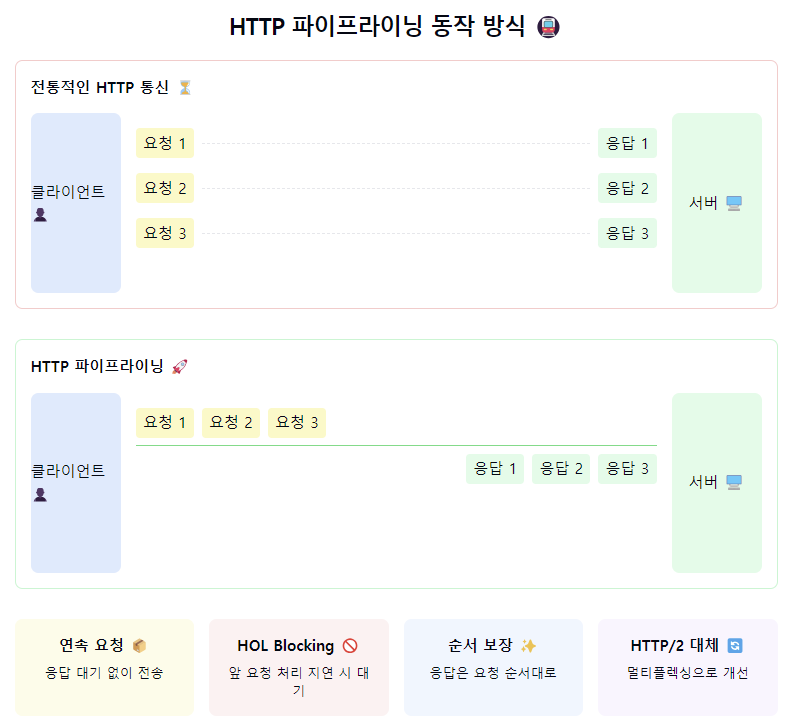

"HTTP 파이프라이닝(Pipelining)의 세계로 들어가볼까요? 🚇"

1. HTTP 파이프라이닝이란?
- 하나의 연결에서 응답을 기다리지 않고 여러 요청을 연속적으로 보내는 기술
- HTTP/1.1에서 도입된 성능 최적화 기능
- 마치 컨베이어 벨트처럼 요청을 순차적으로 처리! 🏭

2. 동작 방식:
   일반적인 HTTP:
- 요청 → 응답 대기 → 다음 요청 → 응답 대기... (순차적)

파이프라이닝:
- 요청1 → 요청2 → 요청3 → 응답1 → 응답2 → 응답3 (연속적)
- FIFO(First In, First Out) 원칙 적용
- Head-of-Line Blocking 문제 존재 😰

3. 장점과 단점:
   장점 👍
- 네트워크 대기 시간 감소
- 연결 효율성 향상
- 전체 페이지 로딩 시간 단축

단점 👎
- HOL(Head-of-Line) Blocking
- 복잡한 구현
- 서버 호환성 문제
- 버그 발생 가능성

4. 주요 특징:
- GET, HEAD 메소드에만 안전하게 사용 가능
- 멱등성(Idempotent) 요청에 적합
- 응답은 요청 순서와 동일하게 반환
- 브라우저 지원 제한적

5. 실제 활용 사례:
- 이미지 갤러리 로딩
- 정적 리소스 일괄 다운로드
- API 일괄 요청
- 웹 성능 최적화

6. HTTP/2와의 관계 🤔
- HTTP/2는 멀티플렉싱으로 대체
- 더 효율적인 방식 제공
- 파이프라이닝의 한계 극복
- 점진적으로 HTTP/2로 마이그레이션 중

7. 개발자가 알아야 할 점! 💡
- "모든 브라우저가 지원하지 않아요"
- "서버 설정이 까다로울 수 있어요"
- "디버깅이 어려울 수 있죠"
- "HTTP/2를 고려해보세요!"

요약: 파이프라이닝은 HTTP/1.1의 '성능 부스터' 같은 존재예요! 🚀
하나의 TCP 연결에서 여러 요청을 연속으로 보내서 효율성을 높이죠.
하지만 HOL Blocking 같은 한계가 있어서, 현대에는 HTTP/2의
멀티플렉싱이 더 선호되고 있답니다.

실무에서 기억할 포인트! 🎯
1. "브라우저 호환성 체크는 필수!"
2. "서버 설정을 꼼꼼히 확인하세요"
3. "멱등성 요청에만 사용하세요"
4. "현대에는 HTTP/2 고려가 더 좋아요"
5. "성능 테스트는 필수입니다!"

