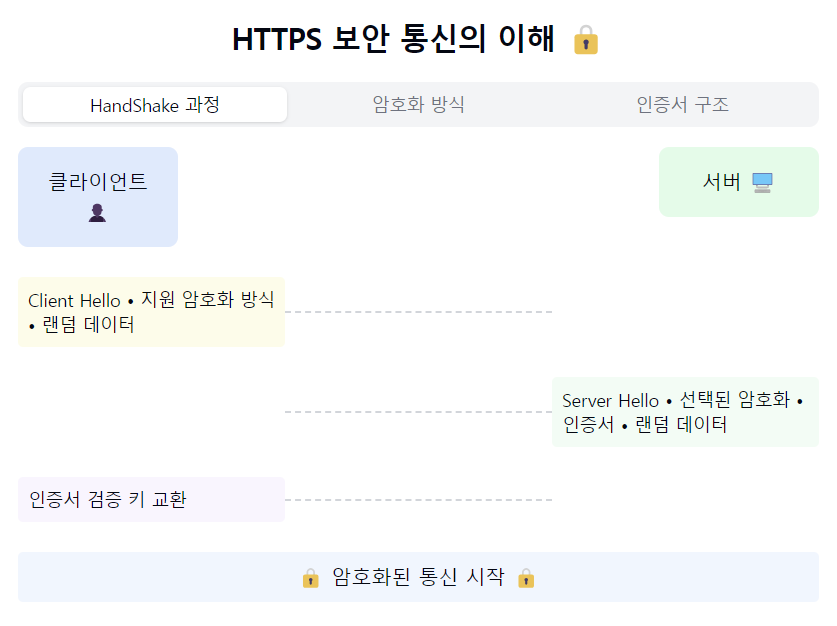
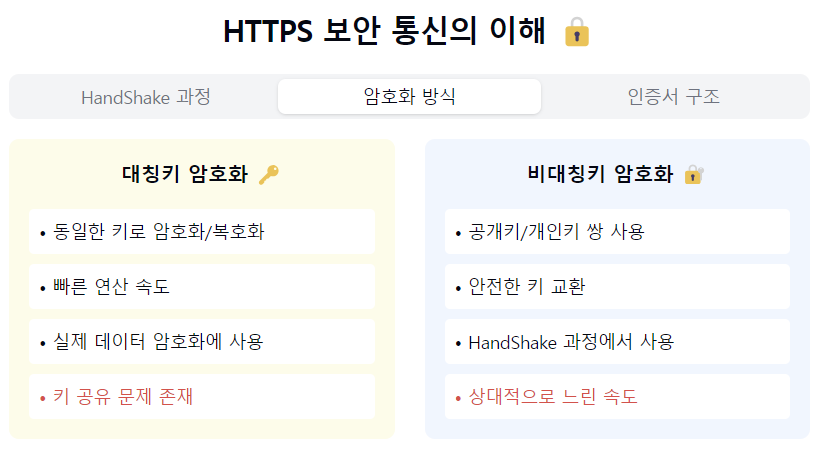
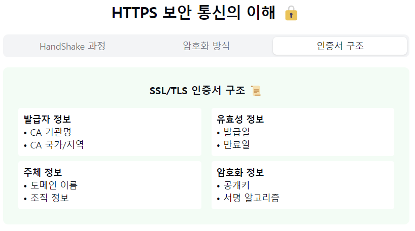

"HTTPS(HyperText Transfer Protocol Secure)의 세계로 들어가볼까요? 🔒"

1. HTTPS란?
- HTTP + SSL/TLS의 결합
- 데이터 암호화 통신 프로토콜
- 기본 포트: 443
- 웹 보안의 표준! 🛡️

2. 주요 특징:
   암호화 3대 요소:
- 기밀성: 데이터 암호화
- 무결성: 데이터 변조 방지
- 인증: 신원 확인

추가 이점:
- SEO 혜택
- 브라우저 호환성
- 사용자 신뢰도 향상

3. 동작 방식 (SSL/TLS Handshake):
   1️⃣ Client Hello
    - 지원하는 암호화 방식 전달
    - 랜덤 데이터 전송

2️⃣ Server Hello
- 암호화 방식 선택
- 인증서 전송
- 랜덤 데이터 전송

3️⃣ 인증서 검증
- 브라우저가 인증서 확인
- CA 신뢰성 검증

4️⃣ 키 교환
- 대칭키 생성
- 비대칭키로 안전하게 전송

5️⃣ 통신 시작
- 대칭키로 데이터 암호화 통신

4. 암호화 방식:
   대칭키 암호화:
- 같은 키로 암/복호화
- 빠른 속도
- 키 공유 문제

비대칭키 암호화:
- 공개키/개인키 쌍 사용
- 안전한 키 교환
- 상대적으로 느림

5. 인증서(Certificate):
   포함 정보:
- 도메인 정보
- 발급자 정보
- 유효 기간
- 공개키
- 디지털 서명

6. 실무 적용 시 고려사항! 💡
   성능:
- OCSP Stapling 적용
- Session Resume 활용
- 적절한 암호화 스위트 선택

보안:
- 최신 TLS 버전 사용
- 인증서 갱신 관리
- 취약점 정기 점검

7. 장단점:
   장점 👍
- 데이터 보안
- 신뢰성 향상
- SEO 이점
- 브라우저 호환성

단점 👎
- 추가 비용 발생
- 약간의 성능 저하
- 인증서 관리 필요

요약: HTTPS는 현대 웹의 '보안 파수꾼' 이에요! 🛡️
암호화를 통해 데이터를 안전하게 주고받을 수 있게 해주죠.
특히 개인정보보호가 중요해진 요즘, HTTPS는 선택이 아닌 필수가 되었답니다!

실무자가 기억할 포인트! 📌
1. "인증서 만료일 체크는 필수!"
2. "성능과 보안의 균형 중요"
3. "정기적인 보안 감사 필요"
4. "최신 TLS 버전 유지하기"
5. "백엔드 전체 HTTPS 적용 권장"

HTTPS의 동작 방식과 보안 특징을 시각적으로 표현해보았어요! 특히 SSL/TLS Handshake 과정과 암호화 방식, 인증서 구조를 탭으로 구분하여 이해하기 쉽게 구성했답니다.
