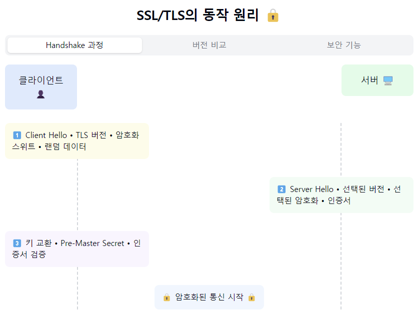
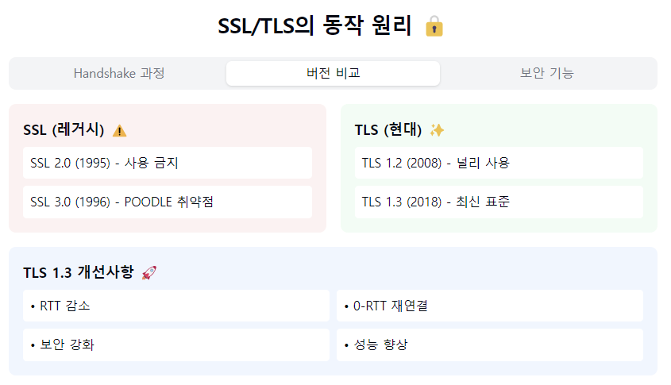
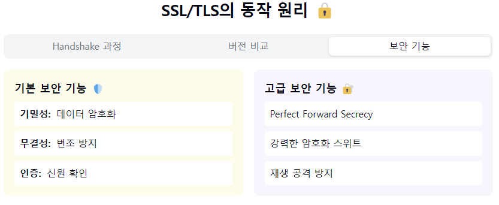

"SSL/TLS의 비밀스러운 세계로 들어가볼까요? 🔐"

1. SSL/TLS란?
- SSL (Secure Sockets Layer)
- TLS (Transport Layer Security)
- 네트워크 통신 보안을 위한 암호화 프로토콜
- SSL은 TLS의 이전 버전! (SSL → TLS로 발전) 🔄

2. 역사와 발전 과정:
   SSL 버전들:
- SSL 1.0: 공개되지 않음
- SSL 2.0 (1995): 보안 취약점
- SSL 3.0 (1996): POODLE 취약점

TLS 버전들:
- TLS 1.0 (1999): SSL 3.0 기반
- TLS 1.1 (2006): IV 처리 개선
- TLS 1.2 (2008): 암호화 강화
- TLS 1.3 (2018): 현재 최신 버전! ⭐

3. 주요 보안 기능:
   핵심 4가지:
- 기밀성: 데이터 암호화
- 무결성: 변조 방지
- 인증: 신원 확인
- 재생 방지: 공격 차단

4. 동작 방식 (Handshake 상세):
   1️⃣ 클라이언트 측:
    - 버전 정보 전송
    - 지원 암호화 스위트
    - 랜덤 데이터

2️⃣ 서버 측:
- 버전 선택
- 암호화 스위트 선택
- 인증서 전송
- 랜덤 데이터

3️⃣ 키 교환:
- Pre-Master Secret 생성
- Master Secret 생성
- 세션 키 생성

5. TLS 1.3의 개선사항! 🚀
- RTT(Round Trip Time) 감소
- 취약한 알고리즘 제거
- Perfect Forward Secrecy 의무화
- 0-RTT 재연결 지원
- 보안 강화

6. 실무 적용 팁! 💡
   보안 설정:
- 최신 TLS 버전 사용
- 강력한 암호화 스위트
- 인증서 체인 관리
- 취약점 정기 점검

성능 최적화:
- 세션 재사용
- OCSP Stapling
- 적절한 캐시 정책
- 조기 데이터 활용

7. 자주 발생하는 이슈들:
   문제상황 & 해결책:
- 인증서 오류 → 체인 확인
- 성능 저하 → 세션 캐시
- 호환성 → 버전 협상
- 설정 오류 → 보안 스캔

요약: SSL/TLS는 웹 보안의 '척추'와 같은 존재예요! 🦴
처음 SSL로 시작해서 현재는 TLS 1.3까지 발전했고,
계속해서 더 안전하고 빠른 통신을 위해 진화하고 있답니다.

실무자의 필수 체크리스트! ✅
1. "최신 TLS 버전 사용하기"
2. "강력한 암호화 스위트 선택"
3. "정기적인 보안 업데이트"
4. "인증서 만료일 모니터링"
5. "성능과 보안의 균형 맞추기"

