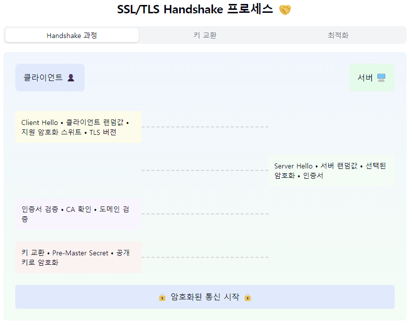
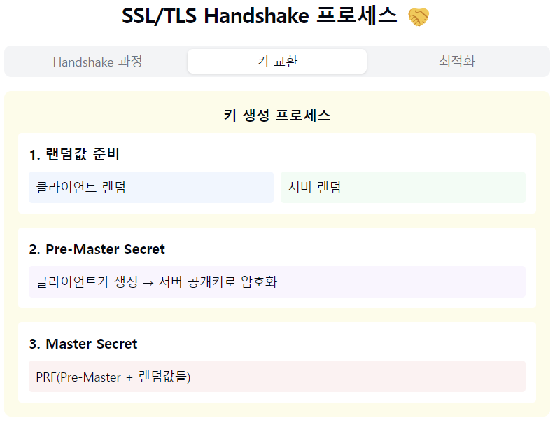
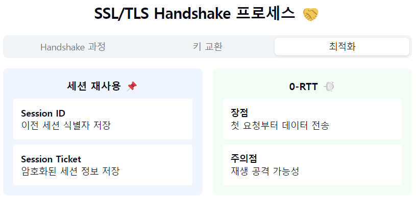

"대칭키 암호화, 비밀스러운 월드에 오신 것을 환영합니다! 🔑"

1. 대칭키 암호화란?
- 동일한 키로 암호화/복호화를 수행
- 비밀키(Secret Key) 암호화라고도 불림
- 고속 암호화가 가능한 방식! ⚡

2. 동작 원리:
   암호화 과정:
- 평문 + 대칭키 = 암호문

복호화 과정:
- 암호문 + 동일한 대칭키 = 평문

키 길이:
- 보통 128비트, 256비트 사용
- 길수록 보안성 향상 (But 성능 ↓)

3. 주요 알고리즘:
   현대적 알고리즘:
- AES (Advanced Encryption Standard)
- ChaCha20
- Blowfish

레거시 알고리즘:
- DES (Data Encryption Standard)
- 3DES (Triple DES)
- RC4 (보안 취약점으로 사용 지양)

4. 장단점:
   장점 👍
- 빠른 암호화/복호화 속도
- 단순한 구현
- 적은 컴퓨팅 파워
- 큰 데이터에 효율적

단점 👎
- 키 공유의 어려움
- 많은 키 관리 필요
- 안전한 키 전달 문제
- 다자간 통신 시 복잡해짐

5. 실제 활용 사례:
- 디스크 암호화
- 세션 데이터 암호화
- 파일 암호화
- VPN 통신
- 데이터베이스 암호화

6. 보안 고려사항! 🛡️
   필수 체크 포인트:
- 안전한 키 생성
- 주기적인 키 교체
- 안전한 키 저장
- 메모리 보안
- 키 백업 관리

7. 구현 시 주의사항!
- 검증된 라이브러리 사용
- 적절한 패딩 방식 선택
- IV(Initial Vector) 관리
- 에러 처리 주의
- 키 관리 정책 수립

요약: 대칭키 암호화는 '빠른 속도'와 '단순함'이 장점이지만,
'키 관리'가 최대 난제예요! 마치 집 열쇠를 나눠 가지는 것처럼,
키를 안전하게 공유하고 관리하는 것이 가장 중요한 포인트랍니다. 🏠

실무자를 위한 골든 팁! 💎
1. "AES-256 사용을 권장해요"
2. "키는 절대 하드코딩하지 마세요"
3. "안전한 난수 생성기(CSPRNG) 사용"
4. "주기적인 키 로테이션은 필수"
5. "키 저장소는 별도로 관리하세요"

