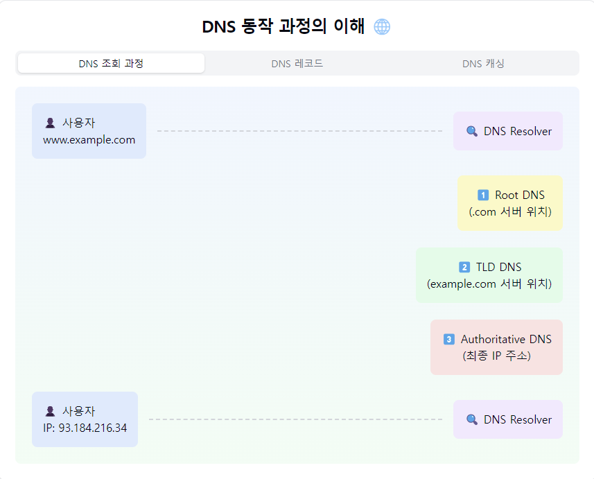
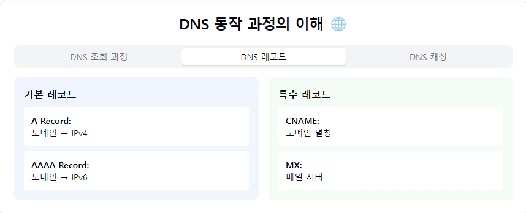
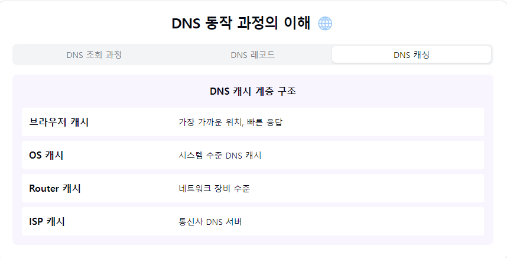

"DNS(Domain Name System)의 마법 같은 세계로 들어가볼까요? 🌐"

1. DNS란?
- 도메인 이름을 IP 주소로 변환하는 시스템
- 인터넷의 '전화번호부' 같은 존재
- 계층적 분산 데이터베이스 구조
- 우리의 웹 서핑을 편하게! 😊

2. 동작 과정 (DNS Resolution):
   1️⃣ 브라우저 요청:
    - www.example.com 입력
    - 로컬 캐시 확인

2️⃣ 재귀적 조회:
- DNS Resolver 동작
- Root DNS 서버 조회
- TLD DNS 서버 조회
- 권한 있는 DNS 서버 조회

3️⃣ 응답 반환:
- IP 주소 획득
- 브라우저에 전달
- 캐시에 저장

3. DNS 레코드 타입:
   A Record:
- 도메인 → IPv4 주소
- 가장 기본적인 레코드

AAAA Record:
- 도메인 → IPv6 주소

CNAME:
- 별칭 레코드
- 도메인 → 도메인

MX:
- 메일 서버 지정

TXT:
- 텍스트 정보 저장
- SPF, DKIM 등에 사용

4. DNS 서버 계층:
   Root DNS:
- 최상위 DNS 서버
- '.' 으로 표시

TLD DNS:
- .com, .net 등 관리
- 최상위 도메인 서버

Authoritative DNS:
- 실제 도메인 정보 보유
- 최종 IP 주소 제공

5. DNS 캐싱:
   브라우저 캐시:
- 가장 가까운 캐시
- TTL 기반 관리

OS 캐시:
- hosts 파일
- 시스템 레벨 캐시

Router 캐시:
- 네트워크 장비 캐시

ISP 캐시:
- DNS Resolver 캐시

6. 보안 고려사항! 🛡️
   주요 위협:
- DNS Spoofing
- Cache Poisoning
- DDoS 공격

대응 방안:
- DNSSEC 사용
- DNS over HTTPS
- DNS over TLS
- 레코드 검증

7. 실무 디버깅 팁! 🔍
   문제 해결:
- nslookup 사용
- dig 명령어
- DNS 전파 시간
- TTL 설정 확인

요약: DNS는 인터넷의 '내비게이션 시스템'이에요! 🗺️
우리가 쉽게 기억할 수 있는 도메인 이름을
컴퓨터가 이해할 수 있는 IP 주소로 변환해주는 고마운 존재죠!

실무자를 위한 체크리스트! ✅
1. "TTL 값 적절히 설정하기"
2. "보조 DNS 구성 고려"
3. "DNSSEC 적용 검토"
4. "모니터링 시스템 구축"
5. "장애 대응 계획 수립"

