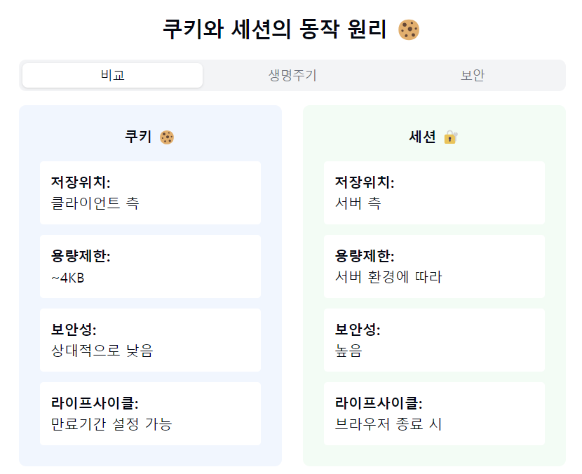
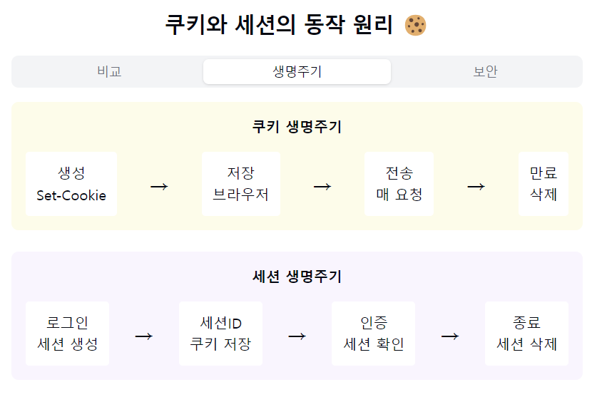
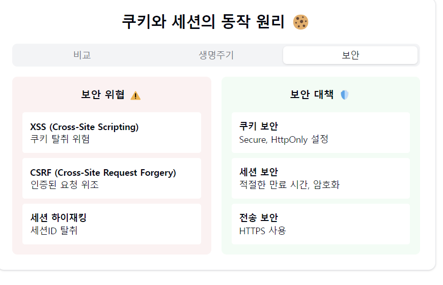

"쿠키(Cookie)와 세션(Session)의 달콤한 세계로 모험을 떠나볼까요? 🍪"

1. 쿠키(Cookie)란?
- 클라이언트 측에 저장되는 작은 텍스트 파일
- 이름-값 쌍으로 구성
- 만료기간 설정 가능
- 도메인별로 관리 🏠

2. 세션(Session)이란?
- 서버 측에서 관리하는 사용자 정보
- 세션ID로 식별
- 메모리 또는 DB에 저장
- 보안성이 높음 🔒

3. 주요 차이점:
   저장 위치:
- 쿠키: 클라이언트
- 세션: 서버

보안성:
- 쿠키: 상대적으로 낮음
- 세션: 높음

용량 제한:
- 쿠키: ~4KB
- 세션: 서버 환경에 따라

라이프사이클:
- 쿠키: 만료기간 설정
- 세션: 브라우저 종료 시

4. 쿠키의 종류:
   Session Cookie:
- 브라우저 종료 시 삭제
- 임시 메모리에 저장

Persistent Cookie:
- 만료기간까지 유지
- 파일로 저장

Secure Cookie:
- HTTPS에서만 전송

HttpOnly Cookie:
- JS 접근 불가
- XSS 방지

5. 세션 관리 방식:
   메모리 세션:
- 빠른 접근
- 서버 재시작 시 삭제

DB 세션:
- 영구 보존 가능
- 확장성 좋음

분산 세션:
- Redis/Memcached 활용
- 고가용성 제공

6. 실제 활용 사례:
   쿠키 활용:
- 자동 로그인
- 장바구니
- 웹 분석
- 광고 추적

세션 활용:
- 로그인 상태 유지
- 사용자 권한 관리
- 장바구니 (민감정보)
- 결제 정보

7. 보안 고려사항! 🛡️
   쿠키 보안:
- Secure 플래그 사용
- HttpOnly 설정
- SameSite 속성 활용
- 민감정보 저장 금지

세션 보안:
- 세션ID 암호화
- 세션 하이재킹 방지
- 적절한 만료 시간
- CSRF 대응

요약: 쿠키와 세션은 웹의 '상태 관리 도구'예요! 🎭
각각의 장단점을 이해하고 적절히 활용하면,
더 안전하고 효율적인 웹 서비스를 만들 수 있답니다!

실무자를 위한 Best Practices! ✨
1. "민감한 정보는 세션에!"
2. "쿠키는 필수 정보만!"
3. "적절한 만료 기간 설정"
4. "보안 플래그 활용하기"
5. "정기적인 세션 정리"

