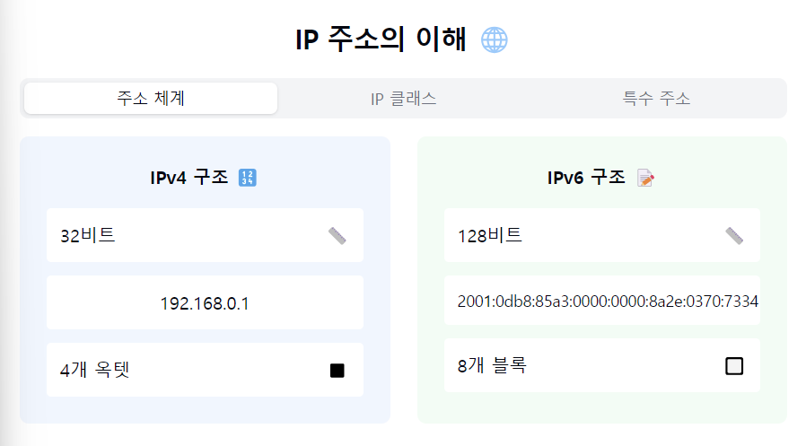
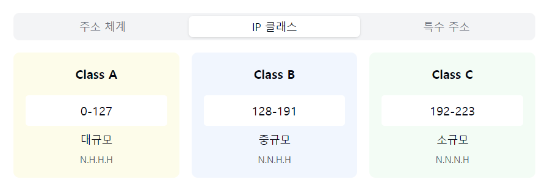
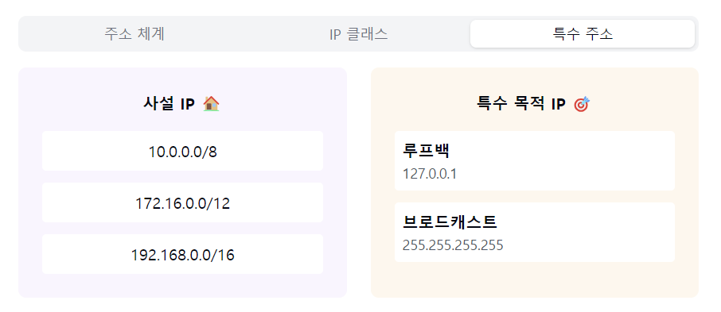

"IP 주소의 세계로 들어가볼까요? 🌐"

1. IP 주소란?:
   "네트워크 상에서 우리는 어떻게 서로를 찾을까요?"

   IPv4 구조:
    - 32비트 주소 체계
    - 4개의 옥텟으로 구성
    - 0~255 사이의 숫자
    - 예: 192.168.0.1

   IPv6 구조:
    - 128비트 주소 체계
    - 16비트씩 8부분으로 구성
    - 16진수 표현
    - 예: 2001:0db8:85a3:0000:0000:8a2e:0370:7334

2. IP 주소 클래스:
   "주소를 어떻게 효율적으로 나눌까요?"

   Class A:
    - 첫 옥텟 0~127
    - 대규모 네트워크
    - 네트워크 ID 1바이트

   Class B:
    - 첫 옥텟 128~191
    - 중규모 네트워크
    - 네트워크 ID 2바이트

   Class C:
    - 첫 옥텟 192~223
    - 소규모 네트워크
    - 네트워크 ID 3바이트

3. 특수 목적 IP:
   "특별한 용도로 예약된 주소들은 무엇일까요?"

   사설 IP:
    - 내부 네트워크용
    - 10.0.0.0/8
    - 172.16.0.0/12
    - 192.168.0.0/16

   루프백:
    - 127.0.0.1
    - localhost
    - 자기 자신 참조

4. 서브네팅:
   "큰 네트워크를 어떻게 효율적으로 분할할까요?"

   서브넷 마스크:
    - 네트워크 영역 구분
    - CIDR 표기법
    - 예: /24는 255.255.255.0

5. 주요 특징! 🎯
   "IP 주소의 핵심 포인트는?"

   계층적 구조:
    - 네트워크 부분
    - 호스트 부분
    - 효율적인 라우팅

   유일성:
    - 고유한 식별자
    - 중복 불가
    - NAT로 해결

6. 실제 활용 예시:
   "어디서 어떻게 사용되나요?"

    - 웹 서버 호스팅
    - 가정용 네트워크
    - 클라우드 서비스
    - IoT 기기 연결
    - VPN 구성

자주 나오는 꼬리 질문! 🤔

Q1: "공인 IP와 사설 IP의 차이점은?"
A1: 공인 IP는 인터넷에서 직접 사용 가능한 고유 주소이고,
사설 IP는 내부 네트워크에서만 사용되는 주소예요.
NAT를 통해 사설 IP가 공인 IP로 변환되어 통신합니다!

Q2: "IPv4와 IPv6의 주요 차이점은?"
A2: IPv6는 더 큰 주소 공간을 제공하고,
보안 기능이 향상되었으며,
자동 설정 기능이 개선되었답니다!

핵심 포인트! 💡

1. "고유한 식별자로서의 역할"
2. "계층적 구조를 통한 효율적 관리"
3. "용도에 따른 주소 분류"
4. "서브네팅을 통한 네트워크 분할"
5. "IPv4에서 IPv6로의 전환 고려"

