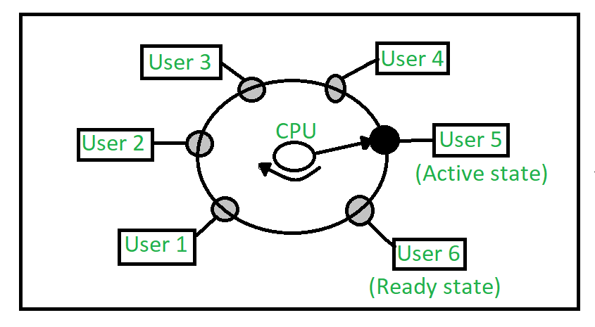

# 시분할 시스템(time-sharing system)에 대해 설명해보세요. (multitasking)

`시분할 시스템`은 여러 사용자가 **동시에 컴퓨터 자원을 공유**할 수 있도록 설계된 운영체제의 한 형태입니다.
이 시스템은 각 사용자에게 **CPU 시간을 일정하게 나누어 주어**, 마치 모든 사용자가 독립적으로 시스템을 사용하는 것처럼 느끼게 합니다.

주요 특징 몇가지 말씀드리겠습니다.

1. **다중 사용자 지원**: 시분할 시스템은 여러 사용자가 **동시에 시스템에 접속하여 작업을 수행할 수 있도록 지원**합니다. 각 사용자는 자신의 작업을 수행하는 동안 다른 사용자와 자원을 공유합니다.

2. **시간 분할**: `CPU`는 각 사용자에게 **짧은 시간 간격(타임 슬라이스)으로 할당**되어, 사용자가 신속하게 반응할 수 있도록 합니다. 이로 인해 사용자 경험이 향상됩니다.

3. **효율적인 자원 관리**: 시분할 시스템은 CPU, 메모리, 입출력 장치 등의 자원을 효율적으로 관리하여, 시스템의 자원을 최대한 활용할 수 있습니다. 예를 들어, CPU가 대기 중인 상태가 되지 않도록 여러 프로세스를 빠르게 전환합니다.

___

### 보충 정리
1. 시분할 시스템은 다음과 같이 돌아간다고 생각하면 쉽게 이해가능하다.

> A 작업 완료 후 B작업, B작업 완료 후 C 작업을 진행할 경우, C는 자신이 응답 받는 시간이 굉장히 느리다고 생각할 것
  BUT, 시분할 시스템은 A -> B -> C -> A -> B -> C -> ... 형태로 처리되므로
  모든 사용자들이 반응시간이 빠르다고 느끼게 될 것