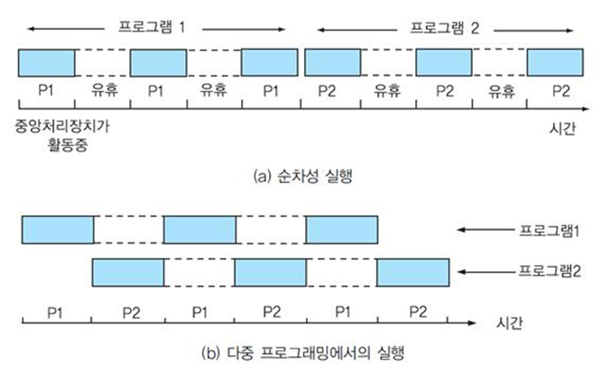
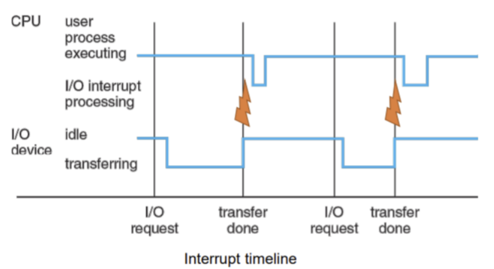

# 다중 프로그래밍 시스템(multi-programming system)에 대해 설명해주세요.

📌 답변 : **CPU 사용률(컴퓨터 처리율)을 최대화**하기 위해 **여러 프로그램을 메모리에 올려놓고 CPU가 항상 사용**되도록 하는 기법.

어떤 프로세스가 CPU를 사용하다가 **I/O 작업 등 CPU를 필요로 하지 않는 순간**이 오면 **다른 프로세스가 CPU를 사용**할 수 있도록 `전환(컨텍스트 스위칭)`하는 방식이다.

- 멀티 프로그래밍 동작 과정

- **CPU는 다른 프로세스를 실행하고 있다가 I/O 장치의 전송이 끝났을 때 전기적 신호가 발생하여 그때만 잠시 intterupt를 처리**하는 것을 확인

___

## 보충 정리

1. 시분할 시스템과 멀티프로그래밍 차이점?

- 목적:
  - `시분할 시스템`은 사용자와의 상호작용을 중시하며, 여러 사용자가 동시에 시스템을 사용하는 환경을 제공합니다.
  - `멀티프로그래밍`은 CPU 자원의 효율적인 활용을 중시하며, 여러 프로그램을 동시에 실행하여 시스템의 처리량을 극대화합니다.

- 상호작용:
  - `시분할 시스템`은 **대화형** 응용 프로그램을 지원하여 실시간으로 사용자와 상호작용합니다.
  - `멀티프로그래밍`은 **비대화형** 배치 작업에 더 적합합니다.

- 공통점:
  - **CPU 자원 활용**: 두 시스템 모두 CPU의 **유휴 시간을 줄이고**, 가능한 한 많은 작업을 처리하기 위해 설계되었습니다. 즉, CPU를 최대한 활용하여 시스템의 전체적인 성능을 향상시키려는 목적이 있습니다.