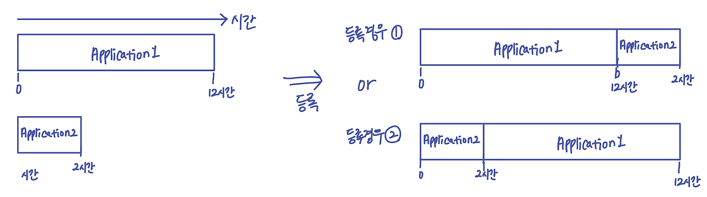

# 일괄처리 시스템(Batch system)이란?

사용자로부터 입력된 **여러 작업을 모아서 일괄로 처리**합니다. 사용자는 **작업 제출 후 결과를 기다리지 않고**, 시스템이 작업을 처리하는 동안 다른 일을 할 수 있습니다.

쉽게 말해,여러 프로그램을 일단 다 등록시켜두고, **끝나면 순차적으로 실행되도록 하게 하는 시스템**입니다.

배치 처리 시스템의 **단점**은
- 앞단에 실행시간이 많이 필요한 응용 프로그램이 실행될 경우 **컴퓨터 응답시간이 오래 걸릴 수** 있다. 

___

- **운영체제의 발전사**

https://libertegrace.tistory.com/entry/%EC%9A%B4%EC%98%81%EC%B2%B4%EC%A0%9C-%EC%9A%B4%EC%98%81%EC%B2%B4%EC%A0%9C%EC%9D%98-%EB%B0%9C%EC%A0%84%EC%82%AC%EB%B0%B0%EC%B9%98-%EC%B2%98%EB%A6%AC-%EC%8B%9C%EC%8A%A4%ED%85%9C-%EC%8B%9C%EB%B6%84%ED%95%A0-%EC%8B%9C%EC%8A%A4%ED%85%9C-%EB%A9%80%ED%8B%B0-%ED%83%9C%EC%8A%A4%ED%82%B9