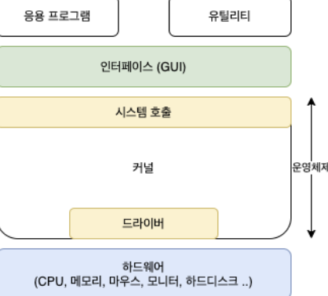

# 시스템 콜(System Call)과 커널(Kernel)

1. **시스템 콜 정의**:
    - 시스템 콜은 **운영체제의 `커널`이 제공하는 서비스**에 대해 응용 프로그램의 **요청을 처리**하는 인터페이스입니다.
    - `사용자 모드`에서 실행되는 프로그램이 **커널 모드의 기능을 사용할 수 있게 해줍**니다.

2. **시스템 콜의 예**:
    - 파일 열기/닫기, 메모리 할당, 프로세스 생성 등이 있습니다.

3. **커널 정의**:
    - 커널은 운영체제의 핵심 부분으로, `하드웨어`와 `소프트웨어` 사이의 **중재자 역할**을 합니다.
    - **시스템 자원을 관리하고 하드웨어를 제어**합니다.

4. **커널의 주요 기능**:
    - 메모리 관리, 프로세스 관리, 장치 드라이버 관리, 파일 시스템 관리 등을 담당합니다.

5. **시스템 콜과 커널의 관계**:
    - `시스템 콜`은 응용 프로그램이 **커널의 기능을 안전하게 사용할 수 있게 해주는** `인터페이스`입니다.
    - 커널은 시스템 콜을 통해 **요청된 작업을 실제로 수행**합니다.

