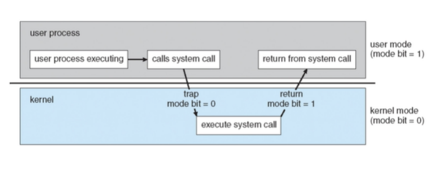

# 커널모드와 유저 모드

1. **커널 모드와 유저 모드의 기본 개념**:
    - 이 두 모드는 운영체제가 **시스템 자원을 보호하고 관리하기 위해** 사용하는 CPU의 실행 모드입니다.

2. **커널 모드 (Kernel Mode)**:
    - 운영체제의 핵심 서비스가 실행되는 모드입니다.
    - 모든 시스템 자원에 대한 **완전한 접근 권한**을 가집니다.
    - 하드웨어 `직접 조작`, `메모리 관리`, `인터럽트 처리` 등의 작업을 수행합니다.

3. **유저 모드 (User Mode)**:
    - **일반적인 사용자** 프로그램이 실행되는 모드입니다.
    - **제한된 시스템 자원에만 접근**할 수 있습니다.
    - 직접적인 하드웨어 접근이나 중요한 메모리 영역 접근이 **제한**됩니다.

4. **모드 전환**:
    - 유저 모드에서 실행 중인 프로그램이 시스템 자원이 필요할 때 **시스템 콜을 통해 커널 모드로 전환**됩니다.
    - **커널이 요청된 작업을 수행한 후 다시 유저 모드로 전환**됩니다.

5. **두 모드의 필요성**:
    - 시스템의 **안정성과 보안을 위해 필요**합니다.
    - 사용자 **프로그램의 오류가 전체 시스템에 영향을 미치는 것을 방지**합니다.

6. **성능과 보안의 균형**:
    - `커널 모드`는 **높은 권한**으로 빠른 실행이 가능하지만, 잘못 사용 시 시스템 전체에 영향을 줄 수 있습니다.
    - `유저 모드`는 **제한된 권한**으로 안전하지만, 시스템 자원 접근 시 오버헤드가 발생할 수 있습니다.

