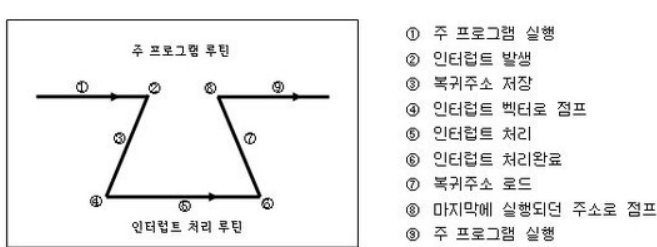

# 폴링이란?

1. **폴링의 정의**:
    - `폴링`은 컴퓨터나 디바이스가 **주기적으로** 다른 디바이스나 프로그램의 상태를 확인하는 기법이다.
    - 주로 입출력 작업이나 이벤트 처리를 위해 사용된다.

2. **폴링의 작동 방식**:
    - 시스템이 **주기적으로 디바이스나 자원의 상태를 체크**한다.
    - **상태 변화가 감지되면 적절한 동작을 수행**한다.

3. **폴링의 장점**:
    - 구현이 간단하고 직관적이다.
    - 예측 가능한 동작을 보장한다.
    - 특정 상황에서는 인터럽트보다 효율적일 수 있다.

4. **폴링의 단점**:
    - 지속적인 상태 확인으로 **CPU 자원을 많이 사용할 수 있다.**
    - **실시간 응답이 중요한 경우 지연이 발생**할 수 있다.
    - 불필요한 체크로 인해 시스템 효율성이 떨어질 수 있다.

5. **폴링 vs 인터럽트**:
    - `폴링`은 **주기적 확인** 방식이고, `인터럽트`는 **이벤트 발생 시 즉시 알림**을 받는 방식이다.
    - 상황에 따라 적절한 방식을 선택해야 한다.

6. **폴링의 사용 예**:
    - 프린터 상태 확인
    - 네트워크 패킷 수신 확인
    - 사용자 입력 대기 등

7. **최신 트렌드**:
    - 현대 시스템에서는 **순수한 폴링보다는 인터럽트나 이벤트 기반 방식을 더 많이 사용하는 추세**이다.
    - 그러나 특정 상황에서는 여전히 폴링이 유용하게 사용된다.

- 요약: 폴링은 **주기적 상태 확인 기법**으로, 간단하지만 CPU 자원을 많이 사용할 수 있다. 장단점이 뚜렷하여 상황에 따라 `인터럽트`와 적절히 선택해 사용해야 한다. 현대 시스템에서는 사용이 줄었지만, 여전히 특정 상황에서 유용하다.

___
### 보충정리 

만약**인터럽트 기능이 없었다면**, 컨트롤러는 특정한 어떤 일을 할 시기를 알기 위해 **계속 체크**를 해야 한다. (이를 **폴링(Polling)**이라고 한다)