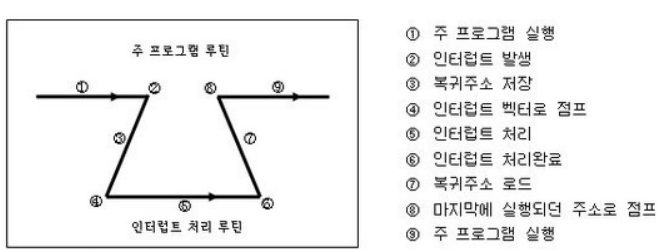

# 인터럽트에 대해서 설명해주세요.

1. **인터럽트의 정의**:
    - `인터럽트`는 **CPU의 현재 작업을 일시 중단**하고 다른 작업을 처리하도록 하는 신호나 이벤트이다.
    - `하드웨어`나 `소프트웨어`에서 발생할 수 있는 **예외적인 상황을 처리하기 위해 사용**된다.

2. **인터럽트의 종류**:
    - **하드웨어 인터럽트**: **외부 장치**에서 발생 (키보드 입력, 타이머 등)
    - **소프트웨어 인터럽트**: **프로그램 실행** 중 발생 (시스템 콜, 예외 상황 등)

3. **인터럽트 처리 과정**:
    - 인터럽트 발생
    - 현재 실행 중인 명령어 완료
    - 현재 상태 저장
    - 인터럽트 처리 루틴 실행
    - 원래 상태로 복귀

4. **인터럽트의 장점**:
    - CPU의 효율적인 사용이 가능하다.
    - **실시간 이벤트 처리**가 가능하다.
    - 우선순위에 따른 작업 처리가 가능하다.

5. **인터럽트의 단점**:
    - 구현이 복잡할 수 있다.
    - 잦은 인터럽트는 **오버헤드를 발생**시킬 수 있다.

6. **인터럽트 우선순위**:
    - 여러 **인터럽트가 동시에 발생할 경우, 우선순위에 따라 처리**한다.
    - 일반적으로 `하드웨어 인터럽트`가 `소프트웨어 인터럽트`보다 **우선순위**가 높다.

7. **인터럽트와 폴링의 비교**:
    - `인터럽트`는 **이벤트 발생 시 즉시 처리**하지만, `폴링`은 **주기적으로 상태를 확인**한다.
    - `인터럽트`는 **실시간 응답에 유리**하고, `폴링`은 **구현이 간단**하다.

📌 **요약**: 인터럽트는 CPU의 **작업을 일시 중단하고 다른 작업을 처리하는 메커니즘**이다. 하드웨어와 소프트웨어 인터럽트가 있으며, CPU 효율성과 실시간 처리에 유리하다. 복잡성과 오버헤드가 단점이지만, 현대 컴퓨팅에서 필수적인 요소이다.