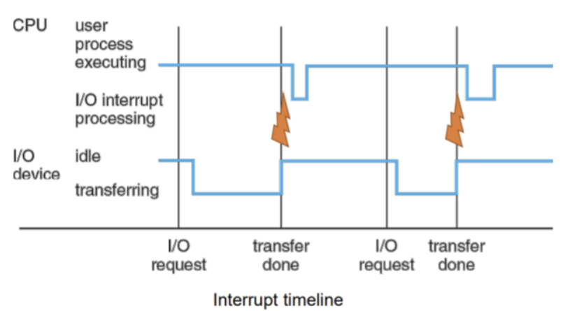
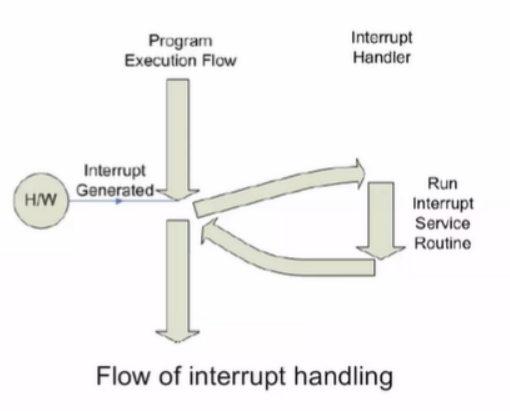
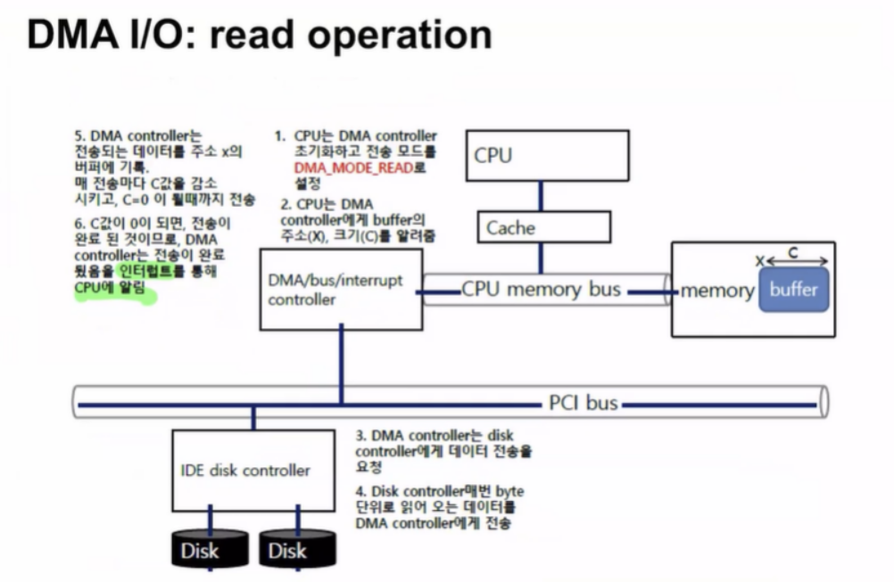

# 입출력 제어 방식에 대해서 설명해주세요.

1. **I/O 제어 방식의 정의**:
    - 컴퓨터 시스템이 **주변 장치와 데이터를 주고받는 방법**을 말한다.
    - `CPU`와 `I/O 장치` 간의 **효율적인 통신**을 위해 사용된다.

2. **주요 I/O 제어 방식**:
    - **프로그램 I/O (Programmed I/O)**
    - **인터럽트 기반 I/O (Interrupt-driven I/O)**
    - **DMA (Direct Memory Access)**

3. **프로그램 I/O**:
    - CPU가 **직접 I/O 작업을 제어**하고 데이터를 전송한다.
    - 간단하지만 CPU **자원을 많이 사용**한다.
    - 소량의 데이터 전송에 적합하다.

4. **인터럽트 기반 I/O**:
    - **I/O 작업 완료 시 인터럽트를 발생**시켜 CPU에 알린다.
    - CPU는 **다른 작업을 수행하다가 인터럽트 발생 시 I/O 처리**를 한다.
    - 프로그램 I/O보다 효율적이지만, 여전히 CPU 개입이 필요하다.

5. **DMA (Direct Memory Access)**:
    - **CPU 개입 없이 I/O 장치와 메모리 간 직접 데이터 전송이 가능**하다.
    - 대용량 데이터 전송에 효율적이다.
    - CPU 부하를 크게 줄일 수 있다.

6. **각 방식의 비교**:
    - **프로그램 I/O**: 구현 간단, CPU 부하 큼
    - **인터럽트 기반 I/O**: 중간 수준의 효율성, 실시간 응답 가능
    - **DMA**: 가장 효율적, 대용량 데이터 전송에 적합

7. **현대 시스템에서의 활용**:
    - 대부분의 현대 시스템은 인터럽트와 DMA를 조합하여 사용한다.
    - 상황에 따라 적절한 방식을 선택하여 사용한다.

요약: I/O 제어 방식은 프로그램 I/O, 인터럽트 기반 I/O, DMA로 나뉜다. 프로그램 I/O는 간단하지만 비효율적이고, 인터럽트 기반 I/O는 중간 수준의 효율성을 제공한다. DMA는 가장 효율적이며 대용량 데이터 전송에 적합하다. 현대 시스템은 이러한 방식들을 조합하여 사용한다.

___
### 보충 정리
- 인터럽트 기반 I/O 처리

`interrupt`는 중요한 개념이므로 좀더 자세한 과정을 확인해 보자.

1. 시스템은 interrupt 발생 전까지 CPU의 **현재 상태를 유지**한다. 즉 핸들링 이후에 다시 돌아오기 위해 **메모리에 현재 레지스터 값과 interrupt 발생직전 주소(PC)를 저장**한다.
2. 이후 HW가 interrupt를 발생시키면 해당 interrupt를 해결하기 위한**interrupt service routine(or interrupt handler)로** 점프한다. 많은 **interrupt handler**들이 존재하는데 이것들은**interrupt vector**라는 곳에서 관리가 된다.
3. interrupt 처리가 끝나면 **레지스터를 복원**하여 **interruput 발생 전 상태**로 돌아간다.

- DMA (Write/Read)

I/O를 전담할 수 있는 특별한 하드웨어를 사용한다.
- 이를 `DMA controller`라 한다.
- 따라서 어떤 I/O operation을 처리해야한다면 **CPU 본인이 처리하는 것이 아니라**
- **DMA controller에게 요청**한다.
- 이는 **DC** 와 **main memory** 사이에 데이터 전달을 수행한다.
- 그렇다면 그 사이에 cpu는 다른 instruction을 수행할 수 있다.
- DMA 또한 I/O연산이 끝나면 CPU에게 다 끝났다고 INTERRUPT를 날린다.

