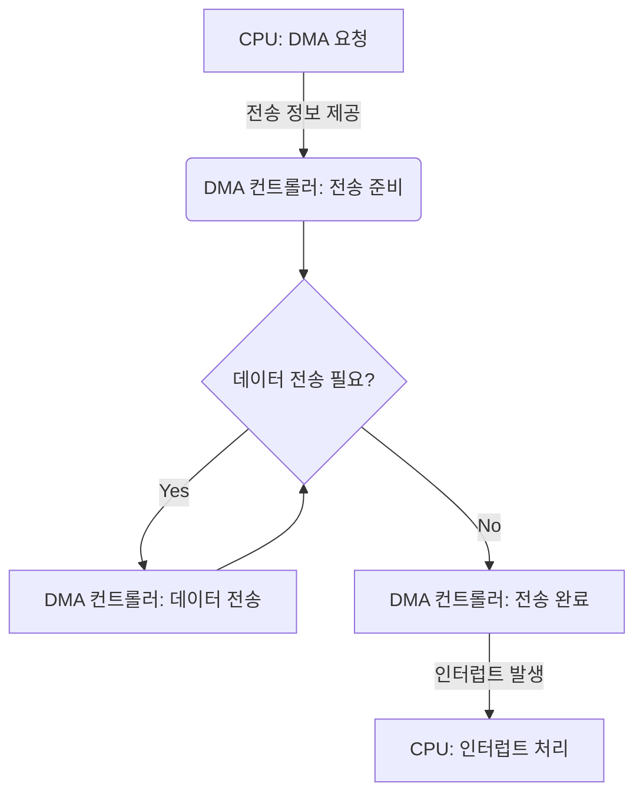

# 직접 메모리 접근(Direct Memory Access, DMA)에 대해서 설명해주세요.

1. **DMA의 정의**:
    - CPU의 개입 없이 **주변장치와 메모리 사이에 직접 데이터를 전송**하는 기능이다.
    - I/O 장치와 시스템 메모리 간의 데이터 전송을 관리하는 하드웨어 메커니즘이다.

2. **DMA의 목적**:
    - **CPU의 부하를 줄이고** 시스템 성능을 향상시킨다.
    - 대용량 데이터 전송의 효율성을 높인다.

3. **DMA 작동 원리**:
    - CPU가 DMA 컨트롤러에 전송 정보(시작 주소, 크기 등)를 제공한다.
    - DMA 컨트롤러가 데이터 전송을 직접 관리한다.
    - 전송 완료 시 DMA 컨트롤러가 CPU에 인터럽트를 발생시킨다.

4. **DMA의 장점**:
    - CPU 사용률을 크게 줄인다.
    - 데이터 전송 속도가 빠르다.
    - 멀티태스킹 환경에서 시스템 효율성을 높인다.

5. **DMA의 단점**:
    - 하드웨어 구현이 복잡하다.
    - 메모리 버스 경합이 발생할 수 있다.

6. **DMA의 응용**:
    - 네트워크 인터페이스 카드(NIC)
    - 하드 디스크 컨트롤러
    - 그래픽 카드

📌 **요약**: **DMA는 CPU 개입 없이 주변장치와 메모리 간 직접 데이터 전송을 가능케 하는 기술**이다. CPU 부하를 줄이고 데이터 전송 효율을 높이지만, 하드웨어 구현이 복잡하다. 다양한 전송 모드를 지원하며, 네트워크 카드, 하드 디스크, 그래픽 카드 등에서 널리 사용된다.

이 다이어그램은 DMA의 기본적인 작동 과정을 보여줍니다. CPU가 DMA 요청을 하고 전송 정보를 제공하면, DMA 컨트롤러가 데이터 전송을 관리합니다. 전송이 완료되면 DMA 컨트롤러가 CPU에 인터럽트를 발생시켜 작업 완료를 알립니다. 이 시각자료를 통해 DMA의 작동 원리를 더 명확히 설명할 수 있습니다.

