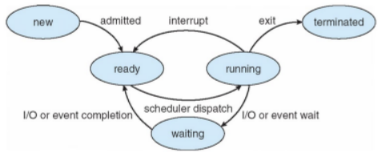

# 프로세스(Process)란 무엇인가요?

1. **프로세스의 정의**:
    - **실행 중인 프로그램**의 `인스턴스`이다.
    - 운영체제에 의해 관리되는 작업의 단위이다.
    - `CPU 시간`, `메모리`, `파일`, `I/O 장치` 등의 **자원을 할당**받는 능동적인 개체이다.

2. **프로세스의 구성 요소**:
    - **코드 세그먼트 (텍스트 섹션)**
    - **데이터 세그먼트 (초기화된 데이터)**
    - **스택 (함수 호출, 로컬 변수)**
    - **힙 (동적 메모리 할당)**

3. **프로세스의 상태** (아래 보충정리 확인):
    - **생성 (New)**
    - **준비 (Ready)**
    - **실행 (Running)**
    - **대기 (Waiting)**
    - **종료 (Terminated)**

4. **프로세스 제어 블록 (PCB)**:
    - 프로세스 ID, 프로세스 상태
    - 프로그램 카운터, 레지스터 값
    - 메모리 관리 정보
    - CPU 스케줄링 정보
    - I/O 상태 정보

5. **프로세스 생성 과정**:
    - `fork()` 시스템 콜로 **새 프로세스 생성**
    - `exec()` 시스템 콜로 **새 프로그램 로드**

6. **프로세스 간 통신 (IPC)**:
    - 파이프, 소켓, 공유 메모리
    - 메시지 큐, 세마포어

7. **멀티프로세싱**:
    - 여러 프로세스의 동시 실행
    - CPU 활용도 증가, 시스템 신뢰성 향상

📌 **요약**: 프로세스는 실행 중인 프로그램의 인스턴스로, 운영체제에 의해 관리되는 작업 단위이다. **코드, 데이터, 스택, 힙으로 구성**되며, **생성부터 종료**까지 여러 상태를 거친다. **PCB를 통해 관리**되고, 다른 프로세스와 통신할 수 있으며, 멀티프로세싱을 통해 시스템 효율성을 높일 수 있다.
___

### 보충정리

- **new**:프로세스 생성 중
- **ready**:프로세스가 프로세서(CPU)에 **할당되기를 기다림**
- **running**:명령이 **실행 중**이다. 모든 프로세서 코어에서 한 번에 하나의 프로세스만 실행할수 있다. 때문에 많은 프로세스가 준비되어 대기 중일 수 있다.
- **waiting**:프로세스가 어떤 이벤트(ex. I/O 완료나 신호 수신)가 발생하기를 기다리고 있다.
- **terminated**:프로세스가 실행을 완료함.

**ready queue**라는 것이 있는데 이 곳에서 프로세서에 할당되기를 기다리는**ready 상태의 프로세스**들이 있다. 스케줄러가 맨 앞의 프로세스를 `pop`하면 cpu가 해당 프로세스를 처리한다. 그러다가 timer가 만료되거나 I/O event를 기다린다음 완료되면 ready queue로 다시 push된다. 여기서**waiting 상태**에서도 프로세스들이 디바이스에 따라**wating queue**라는 곳에 위치하게 되는데 I/O 작업이 완료되거나 하면 다시 ready queue로 이동한다.