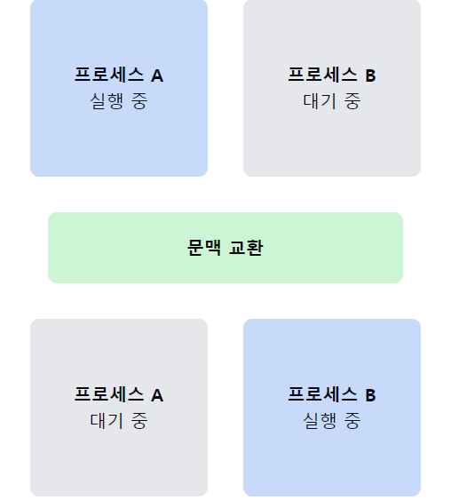

# 프로세스 문맥 (Process Context)에 대해서 설명해주세요.

1. **프로세스 문맥의 정의**
    - **프로세스의 현재 상태**를 나타내는 모든 정보의 집합이다.
    - `CPU`가 해당 **프로세스를 실행하기 위해 필요한 모든 데이터**를 포함한다.
    - 프로세스의 실행을 재개하기 위해 필요한 모든 세부 사항을 담고 있다.

2. **프로세스 문맥의 구성 요소**
    - **CPU 문맥**: 프로그램 카운터, 레지스터 값들
    - **프로세스 메모리 공간**: 코드, 데이터, 스택 영역
    - **프로세스 관련 커널 데이터 구조**: 페이지 테이블, 프로세스 제어 블록(PCB)

3. **프로세스 문맥 교환 (Context Switch)**:
    - **실행 중인 프로세스를 중단**하고 **다른 프로세스를 실행할 때** 발생한다.
    - 현재 프로세스의 문맥을 `저장`하고 새 프로세스의 문맥을 `로드`하는 과정이다.
    - 운영체제의 중요한 기능 중 하나로, **멀티태스킹을 가능**하게 한다.

4. **문맥 교환의 오버헤드**:
    - **CPU 시간 소모**: 문맥 **저장 및 복원**에 시간이 소요된다.
    - **캐시 미스**: 새 프로세스로 전환 시 `캐시가 무효화`될 수 있다.
    - **잦은 문맥 교환**은 시스템 성능 저하를 초래할 수 있다.

5. **프로세스 문맥 저장 위치**:
    - `프로세스 제어 블록 (PCB)`에 저장된다.
    - `PCB`는 운영체제가 관리하는 데이터 구조이다.

6. **문맥 교환 vs 모드 전환**:
    - **문맥 교환**: 프로세스 간 전환으로 오버헤드가 크다.
    - **모드 전환**: **같은 프로세스 내**에서 `사용자 모드`와 `커널 모드` 간 전환으로 상대적으로 오버헤드가 작다.

> 문맥 교환은 프로세스 간 전환, 모드 전환은 같은 프로세스 내에서 실행 권한 레벨의 전환이다.

7. **문맥 교환의 최적화**:
    - 스레드 사용: 같은 프로세스 내 스레드 간 전환은 더 가볍다.
    - 프로세스 우선순위 조정: 불필요한 문맥 교환 최소화
    - 적절한 시간 할당량 설정: 너무 짧으면 문맥 교환이 빈번해진다.

📌 **요약**: 프로세스 문맥은 프로세스의 현재 상태를 나타내는 모든 정보를 포함하며, CPU 문맥, 메모리 공간, 커널 데이터 구조로 구성된다. 문맥 교환은 멀티태스킹을 가능하게 하지만 오버헤드가 발생한다. PCB에 저장되며, 최적화를 통해 성능을 개선할 수 있다.

___
### 보충정리

이 다이어그램은 프로세스 문맥 교환의 기본 과정을 보여줍니다. 처음에는 프로세스 A가 실행 중이고 프로세스 B가 대기 중입니다. 문맥 교환이 발생하면 프로세스 A의 상태가 저장되고 프로세스 B의 상태가 로드됩니다. 그 결과, 프로세스 B가 실행 중이 되고 프로세스 A는 대기 상태가 됩니다. 이 시각자료를 통해 프로세스 문맥 교환의 개념을 더 명확히 설명할 수 있습니다.
