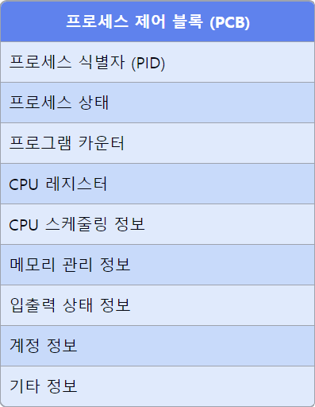

# 프로세스 제어 블록(PCB)에 대해서 설명해주세요.

1. **PCB의 정의**
    - 운영체제가 프로세스를 관리하기 위해 유지하는 자료구조이다.
    - **각 프로세스마다 유일한 PCB가 생성**된다.
    - 프로세스의 상태 정보를 저장하는 저장소 역할을 한다.

2. **PCB의 주요 구성 요소**
    - **프로세스 식별자 (Process ID)**
    - **프로세스 상태 (Process State)**
    - **프로그램 카운터 (Program Counter)**
    - **CPU 레지스터**
    - **CPU 스케줄링 정보**
    - **메모리 관리 정보**
    - **입출력 상태 정보**
    - **계정 정보**

3. **PCB의 역할**
    - 프로세스 생성 시 PCB 생성, 종료 시 PCB 제거
    - 문맥 교환 시 프로세스 상태 정보 **저장 및 복원**
    - **CPU 스케줄링**을 위한 정보 제공
    - 프로세스 간 **동기화** 및 통신 지원

4. **PCB 관리 방식**
    - `연결 리스트`로 구현되는 경우가 많다.
    - `프로세스 상태`에 따라 다른 큐에 PCB를 넣어 관리한다. (예: ready queue, wait queue)

5. **PCB 접근 및 갱신**
    - **운영체제 커널**만이 PCB에 직접 접근할 수 있다.
    - `시스템 호출`이나 `인터럽트` 발생 시 **PCB 정보가 갱신**된다.

6. **PCB와 문맥 교환의 관계**
    - `문맥 교환` 시 현재 프로세스의 상태를 **PCB에 저장**한다.
    - **다음 실행할 프로세스의 PCB로부터 상태 정보를 복원**한다.

7. **PCB 설계 시 고려사항**
    - 빠른 접근과 갱신이 가능해야 한다.
    - 메모리 사용을 최적화해야 한다.
    - 확장성을 고려해야 한다. (새로운 정보 추가 가능성)

📌 **요약**: 프로세스 제어 블록(PCB)은 운영체제가 프로세스를 관리하기 위해 사용하는 핵심 자료구조이다. 프로세스의 상태, 식별자, 스케줄링 정보 등을 포함하며, 문맥 교환 시 중요한 역할을 한다. PCB는 커널에 의해 관리되며, 프로세스 생명주기 동안 지속적으로 갱신된다. 효율적인 PCB 관리는 운영체제의 성능에 직접적인 영향을 미친다.

___
### 보충정리

이 다이어그램은 프로세스 제어 블록(PCB)의 주요 구성 요소를 보여줍니다. PCB에 포함된 각 필드는 프로세스 관리에 필요한 중요한 정보를 나타냅니다. 프로세스 식별자(PID)부터 시작하여 프로세스 상태, CPU 관련 정보, 메모리 및 I/O 정보, 그리고 계정 정보까지 PCB의 구조를 시각적으로 표현했습니다. 이 시각자료를 통해 PCB의 구조와 각 필드의 역할을 더 명확히 설명할 수 있습니다.

