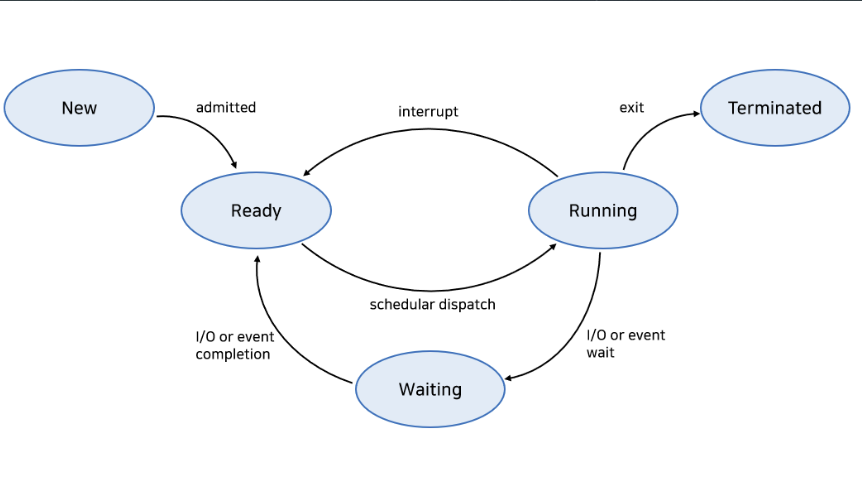

# 프로세스 수행 상태 변화 과정에 대해서 설명해주세요.

1. **프로세스 상태의 정의**
    - 프로세스의 **현재 실행 상황**을 나타내는 속성이다.
    - 운영체제가 프로세스를 관리하는 기준이 된다.

2. **기본적인 프로세스 상태**
    - **생성 (New)**: **프로세스가 생성**된 초기 상태
    - **준비 (Ready)**: 실행을 위해 **대기 중**인 상태
    - **실행 (Running)**: `CPU`에 의해 **실행 중**인 상태
    - **대기 (Waiting)**: `I/O` 등의 **이벤트를 기다리는 상태**
    - **종료 (Terminated)**: 실행이 끝난 상태

3. **상태 변화 과정**
    - **생성 → 준비**: 프로세스가 메모리에 로드되어 실행 준비 완료
    - **준비 → 실행**: 스케줄러에 의해 CPU 할당 받음
    - **실행 → 준비**: 할당 시간 종료(타임 슬라이스 만료)
    - **실행 → 대기**: I/O 요청이나 이벤트 발생으로 대기
    - **대기 → 준비**: I/O 완료나 이벤트 발생으로 다시 실행 가능 상태
    - **실행 → 종료**: 프로세스 실행 완료

4. **상태 변화의 원인**
    - **인터럽트**: `하드웨어`나 `소프트웨어`에 의한 신호
    - **시스템 콜**: 프로세스가 **운영체제에 서비스를 요청**
    - **스케줄러 결정**: **CPU 스케줄링** 알고리즘에 따른 결정

6. **상태 변화와 PCB**
    - 상태 변화 시마다 **PCB(Process Control Block)가 갱신**된다.
    - `PCB`에는 **현재 프로세스 상태 정보가 저장**된다.

7. **상태 변화의 중요성**
    - **CPU 이용률 최적화**: 프로세스 상태에 따른 효율적인 CPU 할당
    - **멀티태스킹 구현**: 여러 프로세스의 동시 실행 관리
    - **시스템 자원 관리**: 각 상태에 따른 적절한 자원 할당

📌 **요약**: 프로세스는 `생성`, `준비`, `실행`, `대기`, `종료`의 기본 상태를 가지며, 시스템 이벤트나 스케줄러 결정에 따라 상태가 변화한다. 이러한 상태 변화는 PCB에 기록되며, 운영체제가 효율적으로 프로세스를 관리하고 시스템 자원을 할당하는 데 중요한 역할을 한다. 상태 변화 과정을 이해하는 것은 멀티태스킹 시스템의 작동 원리를 파악하는 데 필수적이다.

___
### 보충정리

이 다이어그램은 프로세스의 주요 상태와 상태 간 전이를 보여줍니다:

1. **New(생성)**: 프로세스가 생성된 초기 상태
2. **Ready(준비)**: 실행을 위해 대기 중인 상태
3. **Running(실행)**: CPU에 의해 실행 중인 상태
4. **Waiting(대기)**: I/O나 이벤트를 기다리는 상태
5. **Terminated(종료)**: 실행이 끝난 상태

화살표는 각 상태 간의 전이를 나타냅니다. 예를 들어:
- `Ready`에서 `Running`으로의 전이는 'dispatch'(CPU 할당)에 의해 일어납니다.
- `Running`에서 `Ready`로의 전이는 'interrupt'(타임 슬라이스 종료 등)에 의해 발생합니다.
- `Running`에서 `Waiting`으로의 전이는 `I/O 요청`이나 `이벤트 대기`로 인해 발생합니다.

이 시각자료를 통해 프로세스 상태 변화의 동적인 특성과 각 상태 간의 관계를 더 명확히 설명할 수 있습니다.
