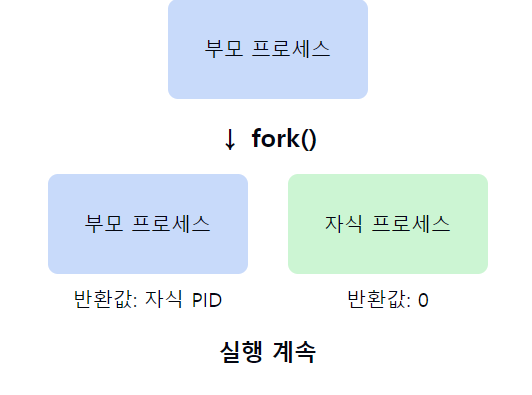
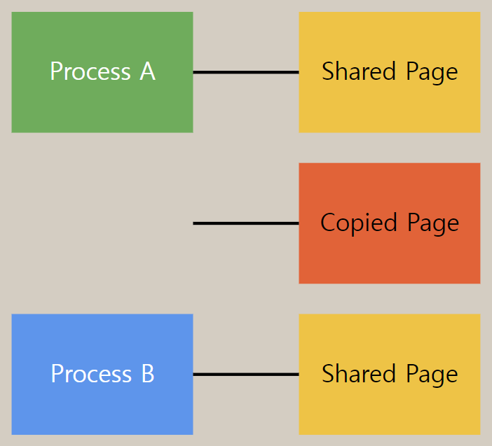

# fork() 명령어

1. **fork()의 정의**
    - 유닉스 계열 운영체제에서 새로운 프로세스를 생성하는 **시스템 콜**이다.
    - 호출한 프로세스(부모 프로세스)의 **복제본인 자식 프로세스를 생성**한다.

2. **fork()의 작동 방식**
    - 호출 시점의 부모 **프로세스 메모리를 그대로 복사**한다.
    - 새로운 프로세스 **ID(PID)를 할당**받는다.
    - `부모 프로세스`의 **파일 디스크립터를 상속**받는다.

3. **fork() 호출 결과**
    - **부모 프로세스**: **자식 프로세스**의 `PID`를 반환받는다.
    - **자식 프로세스**: **0을 반환**받는다.
    - **실패 시**: **-1을 반환**한다.

4. **fork() 후 프로세스 실행**
    - 부모와 자식 프로세스는 **fork() 호출 이후의 코드부터 각자 실행**한다.
    - 운영체제의 **스케줄링에 따라 어느 프로세스가 먼저 실행될지 결정**된다.

5. **fork()의 주요 용도**
    - **멀티프로세싱** 구현
    - **백그라운드 작업** 생성
    - 셸에서의 명령어 실행
    - 데몬 프로세스 생성

6. **fork()와 메모리**
    - **Copy-on-Write (COW) 기법 사용**: **실제 메모리 복사는 쓰기 발생 시에만** 이루어진다.
    - **메모리 효율성 증가**: 불필요한 메모리 복사를 최소화한다.

7. **fork() 사용 시 주의사항**
    - **자원 중복**: 필요 이상의 fork() 호출은 시스템 자원을 과도하게 사용할 수 있다.
    - **좀비 프로세스**: **자식 프로세스가 종료되었을 때** 적절히 처리해야 한다.
    - **동기화 문제**: 공유 자원 접근 시 동기화 메커니즘이 필요할 수 있다.

📌 **요약**: fork()는 새로운 프로세스를 생성하는 시스템 콜로, 호출한 프로세스의 복제본을 만든다. 부모 프로세스에는 자식의 PID를, 자식 프로세스에는 0을 반환한다. Copy-on-Write 기법을 통해 메모리 효율성을 높이며, 멀티프로세싱 구현 등에 주로 사용된다. 하지만 자원 관리와 동기화에 주의가 필요하다. fork()는 유닉스 계열 시스템의 프로세스 생성 모델의 기본이 되는 중요한 시스템 콜이다.
___
### 보충정리




이 다이어그램은 `fork()` 시스템 콜의 기본적인 동작을 보여줍니다:

1. 최초에 부모 프로세스가 존재합니다.
2. 부모 프로세스가 fork()를 호출합니다.
3. fork() 호출 결과로 자식 프로세스가 생성됩니다.
4. 부모 프로세스는 자식 프로세스의 PID를 반환받고, 자식 프로세스는 0을 반환받습니다.
5. 두 프로세스 모두 fork() 호출 이후의 코드부터 실행을 계속합니다.

이 시각자료를 통해 fork()의 기본 개념, 부모와 자식 프로세스의 관계, 그리고 반환값의 차이를 명확히 설명할 수 있습니다. 또한, 두 프로세스가 fork() 이후 동일한 코드를 실행하지만 서로 다른 반환값을 가지고 독립적으로 실행된다는 점을 강조할 수 있습니다.


예를 들어, fork() 시스템 콜에 대해 간단한 코드 예제를 통해 추가 설명을 드릴 수 있습니다:


```c
#include <stdio.h>
#include <unistd.h>

int main() {
    pid_t pid = fork();

    if (pid < 0) {
        // fork 실패
        fprintf(stderr, "Fork failed\n");
        return 1;
    } else if (pid == 0) {
        // 자식 프로세스
        printf("Child process: My PID is %d\n", getpid());
    } else {
        // 부모 프로세스
        printf("Parent process: My PID is %d, child's PID is %d\n", getpid(), pid);
    }

    return 0;
}

```

이 코드 예제는 fork()의 기본적인 사용법을 보여줍니다:

1. `fork()`를 호출하여 새로운 프로세스를 생성합니다.

2. 반환된 `pid` 값을 검사하여 세 가지 경우를 처리합니다:
    - `pid < 0`: fork() 호출이 실패한 경우
    - `pid == 0`: 자식 프로세스인 경우
    - `pid > 0`: 부모 프로세스인 경우

3. 각 프로세스는 자신의 PID를 출력합니다. 부모 프로세스는 추가로 자식 프로세스의 PID도 출력합니다.

이 코드를 실행하면, 부모 프로세스와 자식 프로세스가 각각 다른 메시지를 출력하게 됩니다. 이를 통해 fork() 호출 후 두 프로세스가 독립적으로 실행되는 것을 확인할 수 있습니다.


### Copy on Write?

`Copy-on-Write`는 여러 프로세스가 동일한 리소스(주로 메모리)를 공유할 때, **실제 복사 작업을 최대한 지연시키는 기법**입니다. 리소스에 대한 수정이 필요할 때만 실제 복사가 이루어집니다.

a) 초기 상태:

여러 프로세스가 동일한 메모리 페이지를 공유합니다.
이 페이지들은 읽기 전용으로 마킹됩니다.

b) 수정 시도:

프로세스가 공유 페이지를 수정하려고 하면 페이지 폴트가 발생합니다.

c) 복사 및 수정:

운영체제는 해당 페이지의 복사본을 생성합니다.
복사된 페이지는 수정 가능한 상태로 변경됩니다.
프로세스는 이제 복사된 페이지에 수정을 수행합니다.



**장점**:

- **메모리 사용 효율성**: 실제 수정이 필요할 때까지 메모리 복사를 지연시켜 메모리 사용량을 줄입니다.
- **프로세스 생성 속도 향상**: fork() 시스템 콜 실행 시 전체 메모리를 즉시 복사하지 않아 빠른 프로세스 생성이 가능합니다.
- **리소스 공유 최적화**: 여러 프로세스가 동일한 리소스를 효율적으로 공유할 수 있습니다.

**사용 사례**:

- **프로세스 포크(fork)**: 새로운 프로세스 생성 시 부모 프로세스의 메모리를 즉시 복사하지 않고 공유합니다.
- **가상 메모리 관리**: 가상 메모리 시스템에서 페이지 공유 및 복사에 사용됩니다.
- **데이터베이스 시스템**: 트랜잭션 처리 시 데이터 일관성을 유지하면서 동시성을 높이는 데 활용됩니다.
