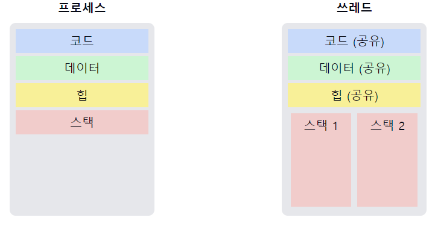

# 스레드(Thread)에 대해서 설명해주세요.

1. **쓰레드의 정의**
    - 프로세스 내에서 실행되는 **여러 실행 흐름의 단위**이다.
    - 프로세스의 **자원을 공유**하면서 **독립적으로 실행되는 단위**이다.


2. **쓰레드의 구성 요소**
    - **스레드 ID**
    - **프로그램 카운터**
    - **레지스터 집합**
    - **스택**


3. **쓰레드 vs 프로세스**
    - **쓰레드**: 같은 프로세스 내의 다른 쓰레드와 `코드`, `데이터`, `열린 파일` 등을 **공유**한다.
    - **프로세스**: 각 프로세스는 **독립된 메모리 공간**을 가진다.


4. **쓰레드의 장점**
    - **자원 공유**: **프로세스의 자원을 효율적으로 사용**할 수 있다.
    - **경량성**: 생성과 **컨텍스트 스위칭이 프로세스보다 빠르다.**
    - **응답성**: 일부 쓰레드가 `블록`되어도 **다른 쓰레드가 실행**될 수 있다.


5. **쓰레드의 단점**
    - **동기화 문제**: 공유 자원에 대한 **동시 접근 시** 동기화가 필요하다.
    - **디버깅의 어려움**: 멀티쓰레드 프로그램은 **디버깅이 복잡**할 수 있다.


6. **쓰레드의 종류**
    - **사용자 수준 쓰레드**: 사용자 공간에서 관리되는 쓰레드
    - **커널 수준 쓰레드**: 운영체제 커널에 의해 관리되는 쓰레드


7. **쓰레드 동기화 메커니즘**
    - **뮤텍스 (Mutex)**
    - **세마포어 (Semaphore)**
    - **조건 변수 (Condition Variable)**


📌 **요약**: 쓰레드는 프로세스 내의 실행 단위로, 프로세스의 자원을 공유하면서 독립적으로 실행된다. 프로세스보다 경량화되어 있어 생성과 컨텍스트 스위칭이 빠르며, 자원을 효율적으로 사용할 수 있다. 그러나 공유 자원에 대한 동기화 문제에 주의해야 한다. 멀티쓰레딩을 통해 프로그램의 성능과 응답성을 향상시킬 수 있지만, 적절한 동기화 메커니즘의 사용이 중요하다.

___
### 보충정리




이 다이어그램은 프로세스와 쓰레드의 메모리 구조 차이를 보여줍니다:

1. **프로세스**:
    - 각 프로세스는 독립적인 메모리 공간을 가집니다.
    - 코드, 데이터, 힙, 스택 영역이 모두 독립적입니다.

2. **쓰레드**:
    - 같은 프로세스 내의 쓰레드들은 코드, 데이터, 힙 영역을 공유합니다.
    - 각 쓰레드는 독립적인 스택을 가집니다.

추가로, 간단한 멀티쓰레드 프로그램의 예제 코드 제시

```c
#include <stdio.h>
#include <pthread.h>

void *print_message(void *ptr) {
    char *message;
    message = (char *) ptr;
    printf("%s\n", message);
    return NULL;
}

int main() {
    pthread_t thread1, thread2;
    char *message1 = "Thread 1";
    char *message2 = "Thread 2";
    int iret1, iret2;

    iret1 = pthread_create(&thread1, NULL, print_message, (void*) message1);
    iret2 = pthread_create(&thread2, NULL, print_message, (void*) message2);

    pthread_join(thread1, NULL);
    pthread_join(thread2, NULL);

    printf("Thread 1 returns: %d\n", iret1);
    printf("Thread 2 returns: %d\n", iret2);
    return 0;
}

```

이 코드는 `POSIX 쓰레드(pthread)`를 사용한 **간단한 멀티쓰레드 프로그램**입니다:

1. `print_message` 함수는 각 쓰레드에서 실행될 함수입니다.
2. `main` 함수에서 두 개의 쓰레드를 생성합니다 (`pthread_create`).
3. 각 쓰레드는 서로 다른 메시지를 출력합니다.
4. `pthread_join`을 사용하여 두 쓰레드가 종료될 때까지 기다립니다.