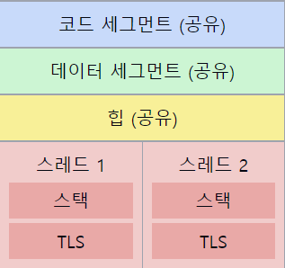

# 스레드의 메모리 공간

1. **스레드 메모리 구조의 특징**
    - 프로세스 내의 다른 스레드와 **일부 메모리 영역을 공유**한다.
    - `독립적인 실행 흐름`을 위한 **고유한 메모리 영역**도 가진다.

2. **공유되는 메모리 영역**
    - **코드 세그먼트**: 프로그램의 실행 코드
    - **데이터 세그먼트**: 전역 변수, 정적 변수
    - **힙(Heap)**: 동적으로 할당되는 메모리

3. **스레드 고유의 메모리 영역**
    - **스택(Stack)**: 지역 변수, 함수 호출 정보
    - **스레드 로컬 스토리지(Thread Local Storage, TLS)**: 스레드별 전역 변수

4. **스택의 특징**
    - `각 스레드`마다 **독립적인 스택**을 가진다.
    - **함수 호출, 지역 변수 저장**에 사용된다.
    - LIFO(Last In First Out) 구조로 동작한다.

5. **메모리 공유의 장단점**

    **장점**:
    - 메모리 사용의 **효율성 증가**
    - 스레드 간 **통신의 용이성**
   
    **단점**:
    - **동시성 문제** 발생 가능성 (race condition)
    - **동기화 메커니즘 필요**

6. **스레드 안전성(Thread Safety)**
    - `공유 자원`에 대한 **동시 접근 시 데이터 일관성 보장이 필요**하다.
    - `뮤텍스`, `세마포어` 등의 동기화 기법을 사용한다.

7. **메모리 모델과 캐시 일관성**
    - 멀티코어 시스템에서는 각 코어의 **캐시 일관성 문제**가 발생할 수 있다.
    - `메모리 배리어(Memory Barrier)` 등을 통해 일관성을 보장한다.

📌 **요약**: 스레드는 `코드`, `데이터`, `힙` 영역을 다른 스레드와 공유하며, 독립적인 `스택`과 `TLS`를 가진다. 이러한 구조는 메모리 효율성과 통신 용이성을 제공하지만, 동시성 문제에 대한 주의가 필요하다. 스레드 안전성 확보와 적절한 동기화 기법 적용이 중요하며, 멀티코어 환경에서는 캐시 일관성에도 주의해야 한다.

___
### 보충정리

이 다이어그램은 스레드의 메모리 구조를 상세히 보여줍니다:
- 상단의 `청색`, `녹색`, `황색` 영역은 모든 스레드가 **공유하는 영역**입니다.
- 하단의 `적색` 영역은 각 **스레드의 고유한 영역**을 나타냅니다.

👋 면접관에게 가산점을 받을 수 있는 답변 방식

1. 메모리 구조에 대한 명확한 이해 제시:
   "스레드의 메모리 구조는 공유 영역과 고유 영역으로 나눌 수 있습니다. 공유 영역에는 코드, 데이터, 힙이 포함되며, 고유 영역에는 스택과 TLS가 있습니다."

2. 실제 개발 경험과 연계:
   "멀티스레드 애플리케이션 개발 시, 공유 데이터 접근에 뮤텍스를 사용하여 race condition을 방지한 경험이 있습니다."

3. 성능 최적화 관점 언급:
   "스레드 간 데이터 공유로 인한 캐시 일관성 문제를 해결하기 위해 메모리 배리어를 적용한 적이 있습니다."

4. 최신 트렌드 언급:
   "최근에는 스레드 로컬 스토리지를 활용하여 전역 변수 사용을 최소화하고, 스레드 안전성을 향상시키는 방법에 관심을 가지고 있습니다."

5. 문제 해결 능력 강조:
   "스레드 스택 오버플로우 문제를 해결하기 위해 스택 크기를 동적으로 조절하는 기법을 구현한 경험이 있습니다."

6. 깊이 있는 이해 표현:
   "스레드의 메모리 모델은 언어와 운영체제에 따라 세부적인 차이가 있습니다. 예를 들어, Java의 메모리 모델은 JVM에 의해 관리되며, C++11 이후로는 표준화된 메모리 모델을 제공합니다."